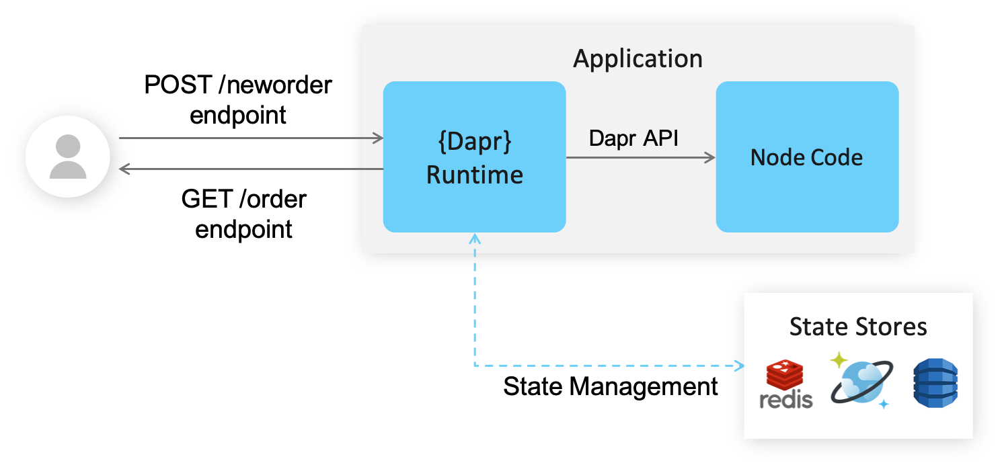
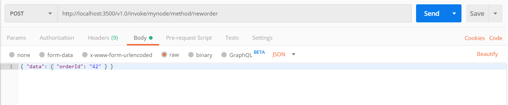
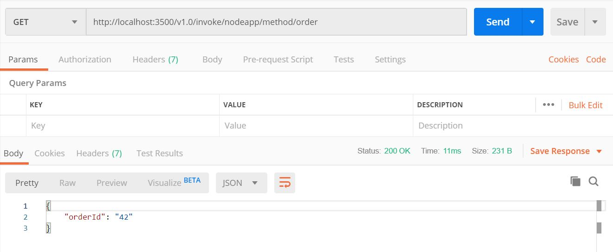

# Hello World

This tutorial will demonstrate how to get Dapr running locally on your machine. We'll be deploying a Node.js app that subscribes to order messages and persists them. The following architecture diagram illustrates the components that make up the first part sample: 



Later on, we'll deploy a Python app to act as the publisher. The architecture diagram below shows the addition of the new component:


## Prerequisites
This sample requires you to have the following installed on your machine:
- [Docker](https://docs.docker.com/)
- [Node.js version 8 or greater](https://nodejs.org/en/) 
- [Python 3.x](https://www.python.org/downloads/)
- [Postman](https://www.getpostman.com/) [Optional]

## Step 1 - Setup Dapr 

Follow [instructions](https://github.com/dapr/docs/blob/master/getting-started/environment-setup.md#environment-setup) to download and install the Dapr CLI and initialize Dapr.

## Step 2 - Understand the Code

Now that we've locally set up Dapr, clone the repo, then navigate to the Hello World sample: 

```bash
git clone https://github.com/dapr/samples.git
cd samples/1.hello-world
```


In the `app.js` you'll find a simple `express` application, which exposes a few routes and handlers. First, let's take a look at the `stateUrl` at the top of the file: 

```js
const stateUrl = `http://localhost:${daprPort}/v1.0/state/${stateStoreName}`;
```
When we use the Dapr CLI, it creates an environment variable for the Dapr port, which defaults to 3500. We'll be using this in step 3 when we POST messages to our system. The `stateStoreName` is the name of the state store being used which is configured in the yaml file under components.

```yml
apiVersion: dapr.io/v1alpha1
kind: Component
metadata:
  # The name of state store is configured here
  name: statestore
spec:
...
```

Next, let's take a look at the ```neworder``` handler:

```js
app.post('/neworder', (req, res) => {
    const data = req.body.data;
    const orderId = data.orderId;
    console.log("Got a new order! Order ID: " + orderId);

    const state = [{
        key: "order",
        value: data
    }];

    fetch(stateUrl, {
        method: "POST",
        body: JSON.stringify(state),
        headers: {
            "Content-Type": "application/json"
        }
    }).then((response) => {
        if (!response.ok) {
            throw "Failed to persist state.";
        }

        console.log("Successfully persisted state.");
        res.status(200).send();
    }).catch((error) => {
        console.log(error);
        res.status(500).send({message: error});
    });
});
```

Here we're exposing an endpoint that will receive and handle `neworder` messages. We first log the incoming message, and then persist the order ID to our Redis store by posting a state array to the `/state/<state-store-name>` endpoint.

Alternatively, we could have persisted our state by simply returning it with our response object:

```js
res.json({
        state: [{
            key: "order",
            value: order
        }]
    })
```

We chose to avoid this approach, as it doesn't allow us to verify if our message successfully persisted.

We also expose a GET endpoint, `/order`:

```js
app.get('/order', (_req, res) => {
    fetch(`${stateUrl}/order`)
        .then((response) => {
            if (!response.ok) {
                throw "Could not get state.";
            }

            return response.text();
        }).then((orders) => {
            res.send(orders);
        }).catch((error) => {
            console.log(error);
            res.status(500).send({message: error});
        });
});
```

This calls out to our Redis cache to grab the latest value of the "order" key, which effectively allows our Node.js app to be _stateless_. 

> **Note**: If we only expected to have a single instance of the Node.js app, and didn't expect anything else to update "order", we instead could have kept a local version of our order state and returned that (reducing a call to our Redis store). We would then create a `/state` POST endpoint, which would allow Dapr to initialize our app's state when it starts up. In that case, our Node.js app would be _stateful_.

## Step 3 - Run the Node.js App with Dapr

1. Install dependencies: `npm install`. This will install `express` and `body-parser`, dependencies that are shown in our `package.json`.

2. Run Node.js app with Dapr: `dapr run --app-id nodeapp --app-port 3000 --port 3500 node app.js`. 

The command should output text that looks like the following, along with logs:

```
Starting Dapr with id nodeapp. HTTP Port: 3500. gRPC Port: 9165
You're up and running! Both Dapr and your app logs will appear here.
...
```
> **Note**: the `--app-port` (the port the app runs on) is configurable. Our Node app happens to run on port 3000, but we could configure it to run on any other port. Also note that the Dapr `--port` parameter is optional, and if not supplied, a random available port is used.

## Step 4 - Post Messages to your Service

Now that Dapr and our Node.js app are running, let's POST messages against it, using different tools. **Note**: here we're POSTing against port 3500 - if you used a different port, be sure to update your URL accordingly.

First, let's POST the message by using Dapr cli in a new command line terminal:

Windows Command Prompt
```sh
dapr invoke --app-id nodeapp --method neworder --payload "{\"data\": { \"orderId\": \"41\" } }"
```

Windows PowerShell
```sh
dapr invoke --app-id nodeapp --method neworder --payload '{\"data\": { \"orderId\": \"41\" } }'
```

Linux or MacOS
```sh
dapr invoke --app-id nodeapp --method neworder --payload '{"data": { "orderId": "41" } }'
```

Now, we can also do this using `curl` with:

```sh
curl -XPOST -d @sample.json http://localhost:3500/v1.0/invoke/nodeapp/method/neworder
```

Or, we can also do this using the Visual Studio Code [Rest Client Plugin](https://marketplace.visualstudio.com/items?itemName=humao.rest-client)

[sample.http](sample.http)
```http
POST http://localhost:3500/v1.0/invoke/nodeapp/method/neworder

{
  "data": {
    "orderId": "42"
  } 
}
```

Last but not least, we can use the Postman GUI.

Open Postman and create a POST request against `http://localhost:3500/v1.0/invoke/nodeapp/method/neworder`

In your terminal window, you should see logs indicating that the message was received and state was updated:
```bash
== APP == Got a new order! Order ID: 42
== APP == Successfully persisted state.
```

## Step 5 - Confirm Successful Persistence

Now, let's just make sure that our order was successfully persisted to our state store. Create a GET request against: `http://localhost:3500/v1.0/invoke/nodeapp/method/order`. **Note**: Again, be sure to reflect the right port if you chose a port other than 3500.

```sh
curl http://localhost:3500/v1.0/invoke/nodeapp/method/order
```

or using the Visual Studio Code [Rest Client Plugin](https://marketplace.visualstudio.com/items?itemName=humao.rest-client)

[sample.http](sample.http)
```http
GET http://localhost:3500/v1.0/invoke/nodeapp/method/order
```

or use the Postman GUI



This invokes the `/order` route, which calls out to our Redis store for the latest data. Observe the expected result!

## Step 6 - Run the Python App with Dapr

Let's take a look at our Python App to see how another application can invoke the Node App via Dapr without being aware of the destination's hostname or port. In the `app.py` file we can find the endpoint definition to call the Node App via Dapr.

```python
dapr_port = os.getenv("DAPR_HTTP_PORT", 3500)
dapr_url = "http://localhost:{}/v1.0/invoke/nodeapp/method/neworder".format(dapr_port)
```
It is important to notice the Node App's name (`nodeapp`) in the URL, it will allow Dapr to redirect the request to the right API endpoint. This name needs to match the name used to run the Node App earlier in this exercise.

The code block below shows how the Python App will incrementally post a new orderId every second, or print an exception if the post call fails.
```python
n = 0
while True:
    n += 1
    message = {"data": {"orderId": n}}

    try:
        response = requests.post(dapr_url, json=message)
    except Exception as e:
        print(e)

    time.sleep(1)
```

Now we can open a **new** command line terminal and go to the `1.hello-world` directory.

1. Install dependencies via `pip install requests` or `pip3 install requests`, depending on your local setup.

2. Start the Python App with Dapr: `dapr run --app-id pythonapp python app.py` or `dapr run --app-id pythonapp python3 app.py`

3. If all went well, the **other** terminal, running the Node App, should log entries like these:

```
Got a new order! Order ID: 1
Successfully persisted state
Got a new order! Order ID: 2
Successfully persisted state
Got a new order! Order ID: 3
Successfully persisted state
```

4. Now, we perform a GET request a few times and see how the orderId changes every second (enter it into the web browser, use Postman, or curl):

```http
GET http://localhost:3500/v1.0/invoke/nodeapp/method/order
```
```json
{
    "orderId": 3
}
```

> **Note**: we did not run `dapr init` in the **second** command line terminal because dapr was already setup on your local machine initially, running this command again would fail.

## Step 7 - Cleanup

To stop your services from running, simply stop the "dapr run" process. Alternatively, you can spin down each of your services with the Dapr CLI "stop" command. For example, to spin down both services, run these commands in a new command line terminal: 

```bash
dapr stop --app-id nodeapp
dapr stop --app-id pythonapp
```

To see that services have stopped running, run `dapr list`, noting that your services no longer appears!

## Next Steps

Now that you've gotten Dapr running locally on your machine, see the [Hello Kubernetes](../2.hello-kubernetes) to get set up in Kubernetes!
