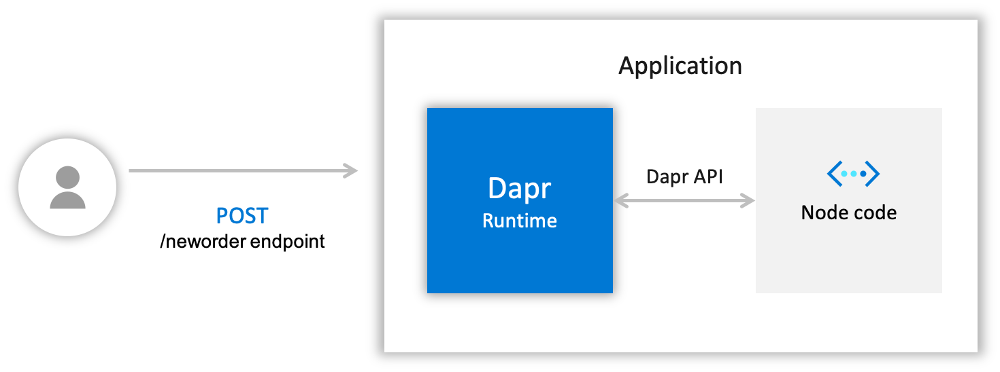

# Hello World(without docker)

This tutorial will demonstrate how to get Dapr running locally on your machine without docker. We'll be deploying a Node.js app that subscribes to order messages demostrating service invocation capability of Dapr. The following architecture diagram illustrates the components that make up the first part sample: 



## Prerequisites
This sample requires you to have the following installed on your machine:
- [Node.js version 8 or greater](https://nodejs.org/en/) 
- [Postman](https://www.getpostman.com/) [Optional]

## Step 1 - Setup Dapr 

Follow [instructions](https://github.com/dapr/docs/blob/master/getting-started/environment-setup.md#environment-setup) to download and install the Dapr CLI and initialize Dapr.

## Step 2 - Understand the Code

Now that we've locally set up Dapr, clone the repo, then navigate to the Hello World sample: 

```bash
git clone https://github.com/dapr/samples.git
cd samples/1.hello-world
```


In the `app.js` you'll find a simple `express` application, which exposes a single route and handler. First, let's take a look at the top of the file: 

Let's take a look at the ```neworder``` handler:

```js
app.post('/neworder', bodyParser.json(), (req, res) => {
    const data = req.body.data;
    const orderId = data.orderId;
    console.log("Got a new order! Order ID: " + orderId);
    res.status(200).send("Got a new order! Oredr ID: " + orderId);
});
```

Here we're exposing an endpoint that will receive and handle `neworder` messages. We log the incoming message, and respond with the same log.

## Step 3 - Run the Node.js App with Dapr

1. Install dependencies: 

    ```sh
    npm install
    ```

    This will install `express` and `body-parser`, dependencies that are shown in our `package.json`.

2. Run Node.js app with Dapr: 

    ```sh
    dapr run --app-id nodeapp --app-port 3000 --port 3500 node app.js
    ```

The command should output text that looks like the following, along with logs:

```
Starting Dapr with id nodeapp. HTTP Port: 3500. gRPC Port: 9165
You're up and running! Both Dapr and your app logs will appear here.
...
```
> **Note**: the `--app-port` (the port the app runs on) is configurable. Our Node app happens to run on port 3000, but we could configure it to run on any other port. Also note that the Dapr `--port` parameter is optional, and if not supplied, a random available port is used.

The `dapr run` command looks for the default components directory which for Linux/MacOS is `$HOME/.dapr/components` and for Windows is `%USERPROFILE%\.dapr\components`. On initializing in self hosted mode without docker, the components folder is empty. 

While in this sample we do not use any components for defining state stores or pubsub, usually a developer would modify them or create custom yaml definitions depending on the application and scenario.

## Step 4 - Post Messages to your Service

Now that Dapr and our Node.js app are running, let's POST messages against it, using different tools. **Note**: here we're POSTing against port 3500 - if you used a different port, be sure to update your URL accordingly.

First, let's POST the message by using Dapr cli in a new command line terminal:

Windows Command Prompt
```sh
dapr invoke --app-id nodeapp --method neworder --payload "{\"data\": { \"orderId\": \"41\" } }"
```

Windows PowerShell
```sh
dapr invoke --app-id nodeapp --method neworder --payload '{\"data\": { \"orderId\": \"41\" } }'
```

Linux or MacOS
```sh
dapr invoke --app-id nodeapp --method neworder --payload '{"data": { "orderId": "41" } }'
```

Now, we can also do this using `curl` with:

```sh
curl -XPOST -d @sample.json -H "Content-Type:application/json" http://localhost:3500/v1.0/invoke/nodeapp/method/neworder
```

Or, we can also do this using the Visual Studio Code [Rest Client Plugin](https://marketplace.visualstudio.com/items?itemName=humao.rest-client)

[sample.http](sample.http)
```http
POST http://localhost:3500/v1.0/invoke/nodeapp/method/neworder

{
  "data": {
    "orderId": "42"
  } 
}
```

Last but not least, we can use the Postman GUI.

Open Postman and create a POST request against `http://localhost:3500/v1.0/invoke/nodeapp/method/neworder`

In your terminal window, you should see logs indicating that the message was received and state was updated:
```bash
== APP == Got a new order! Order ID: 42
== APP == Successfully persisted state.
```

## Step 5 - Confirm Successful Service Invocation

Now, let's just make sure that our method definition was successfully invoked. The response should be 

```
Got a new order! Oredr ID: 41
```

Additionally the log in the node application started with Dapr should be 

```
== APP == Got a new order! Order ID: 41
```

## Step 6 - Cleanup

To stop your service from running, simply stop the "dapr run" process. Alternatively, you can spin down your service with the Dapr CLI "stop" command. For example, to spin down the service, run this command in a new command line terminal: 

```bash
dapr stop --app-id nodeapp
```

To see that services have stopped running, run `dapr list`, noting that your services no longer appears!

## Next Steps

Now that you've gotten Dapr running locally on your machine, consider these next steps:
- Learn more about Dapr in the [Dapr overview](https://github.com/dapr/docs/blob/master/overview/README.md) documentation.
- Explore Dapr concepts such as building blocks and components in the [Dapr concepts](https://github.com/dapr/docs/blob/master/concepts/README.md) documentation.
