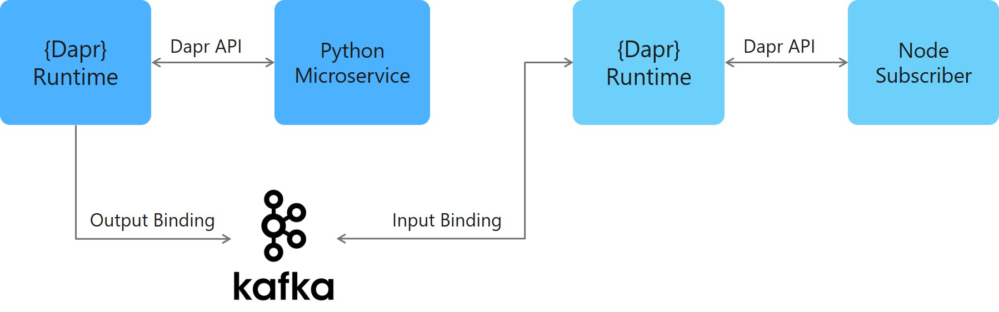

# Dapr Bindings Sample

In this sample, we'll create two microservices, one with an input binding and another with an output binding. We'll bind to Kafka and Event Hubs, but note that there are a myriad of components that Dapr can bind to - see Dapr components <INSERT_LINK_HERE>. 

This sample includes two microservices:
- Node.js microservice that utilizes an input binding
- Python microservice that utilizes an output binding

The bindings connect to Kafka, allowing us to push messages into a Kafka instance (from our Python microservice) and receive message from that instance (from our Node microservice) without having to know where the instance is hosted. Instead, we connect through our sidecars using the Dapr API. See architecture diagram to see how our components interconnect locally:



This sample also includes a manifest for using Azure Event Hubs to demonstrate how we can simply swap one component out for another.

Dapr allows us to deploy the same microservices from our local machines to Kubernetes. Correspondingly, this sample has instructions for deploying this project [locally](#Run-Locally) or in [Kubernetes](#Run-in-Kubernetes).

## Prerequisites

### Prerequisites to Run Locally

- [Dapr CLI with Dapr initialized](https://github.com/dapr/dapr#install-as-standalone)
- [Node.js version 8 or greater](https://nodejs.org/en/)
- [Python 3.4 or greater](https://www.python.org/)

### Prerequisites to Run in Kubernetes

- [Dapr enabled Kubernetes cluster](https://github.com/dapr/actions#install-on-kubernetes)

## Run Locally

### Run Kafka Docker Container Locally

In order to run the bindings sample locally, we'll need to run a Kafka container. We'll do this by following instructions on [this repo](https://github.com/wurstmeister/kafka-docker) to run Kafka in a docker container on your machine. We'll clone that repo, make a couple changes to a docker `yaml` file, and run `docker-compose` to run the container:

1. Clone `kafka-docker` repo: `git clone https://github.com/wurstmeister/kafka-docker`
2. Open the `docker-compose-single-broker.yml` file and update `KAFKA_ADVERTISED_HOST_NAME` to be 127.0.0.1 and `KAFKA_CREATE_TOPICS` to be "sample:1:1":

```yaml
version: '2'
services:
  zookeeper:
    image: wurstmeister/zookeeper
    ports:
      - "2181:2181"
  kafka:
    build: .
    ports:
      - "9092:9092"
    environment:
      KAFKA_ADVERTISED_HOST_NAME: 127.0.0.1
      KAFKA_CREATE_TOPICS: "sample:1:1"
      KAFKA_ZOOKEEPER_CONNECT: zookeeper:2181
    volumes:
      - /var/run/docker.sock:/var/run/docker.sock
```

3. Run `docker-compose -f ./docker-compose-single-broker.yml up -d` to run the container locally
4. Run `docker ps` to see the container running locally: 

```bash
342d3522ca14        kafka-docker_kafka                      "start-kafka.sh"         14 hours ago        Up About
a minute   0.0.0.0:9092->9092/tcp                               kafka-docker_kafka_1
0cd69dbe5e65        wurstmeister/zookeeper                  "/bin/sh -c '/usr/sb…"   8 days ago          Up About
a minute   22/tcp, 2888/tcp, 3888/tcp, 0.0.0.0:2181->2181/tcp   kafka-docker_zookeeper_1
```

### Run Node Microservice with Input Binding

Now that you have Kafka running locally on your machine, we'll need to run our microservices. We'll start by running the Node microservice that uses input bindings:

1. Navigate to Node subscriber directory in your CLI: `cd node`
2. Install dependencies: `npm install`
3. Run Node subscriber app with Dapr: `actions run --app-id node --app-port 3000 node app.js`

### Run Python Microservice with Output Binding

Next, we'll run the Python microservice that uses output bindings

1. Open a new CLI window and navigate to Python subscriber directory in your CLI: `cd python`
2. Run Python subscriber app with Dapr: `actions run --app-id python-subscriber --app-port 5000 python app.py`
    
### Observe Logs

1. Observe the Python logs, which demonstrate our successful output binding with Kafka:

```bash
[0m?[94;1m== APP == {'data': {'orderId': 1}}
[0m?[94;1m== APP == <Response [200]>
[0m?[94;1m== APP == {'data': {'orderId': 2}}
[0m?[94;1m== APP == <Response [200]>
[0m?[94;1m== APP == {'data': {'orderId': 3}}
[0m?[94;1m== APP == <Response [200]>
```

2. Observe the Node logs, which demonstrate our successful input bining with Kafka: 

```bash
[0m?[94;1m== APP == { orderId: 1 }
[0m?[94;1m== APP == Hello from Kafka!
[0m?[94;1m== APP == { orderId: 2 }
[0m?[94;1m== APP == Hello from Kafka!
[0m?[94;1m== APP == { orderId: 3 }
[0m?[94;1m== APP == Hello from Kafka!
```

## Run in Kubernetes

### Setting up a Kafka in Kubernetes

### Deploy Assets

### Observe Logs

### Cleanup

Once you're done using the sample, you can spin down your Kubernetes resources by navigating to the `./deploy` directory and running:

```bash
kubectl delete -f .
```

This will spin down each resource defined by the .yaml files in the `deploy` directory, including the state component.

## How it Works

Now that you've run the sample locally and/or in Kubernetes, let's unpack how this all works. Our app is broken up into two subscribers and one publisher:

### Node Input Binding Microservice


### Python Output Binding Microservice

