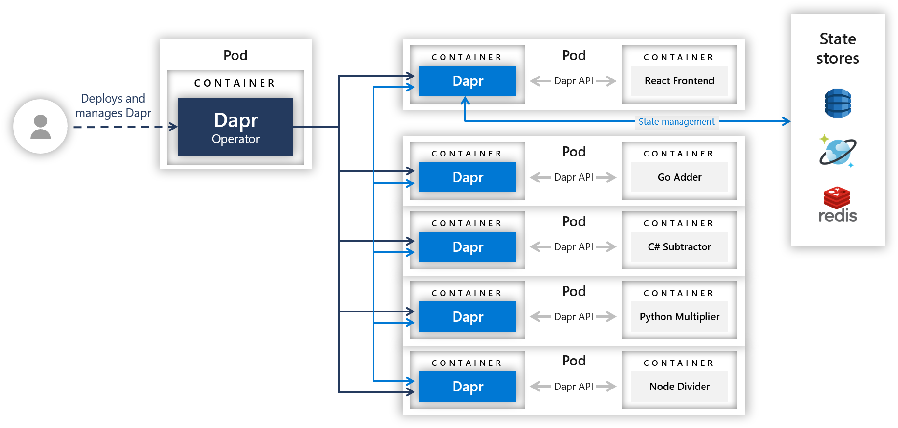
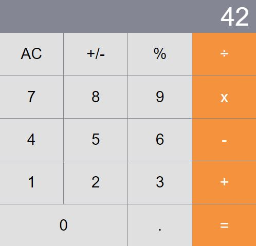

# Distributed calculator

This quickstart shows method invocation and state persistent capabilities of Dapr through a distributed calculator where each operation is powered by a different service written in a different language/framework:

- **Addition**: Go [mux](https://github.com/gorilla/mux) application
- **Multiplication**: Python [flask](https://flask.palletsprojects.com/en/1.0.x/) application
- **Division**: Node [Express](https://expressjs.com/) application
- **Subtraction**: [.NET Core](https://docs.microsoft.com/en-us/dotnet/core/) application

The front-end application consists of a server and a client written in [React](https://reactjs.org/). 
Kudos to [ahfarmer](https://github.com/ahfarmer) whose [React calculator](https://github.com/ahfarmer/calculator) 

The following architecture diagram illustrates the components that make up this quickstart: 



## Prerequisites for running the quickstart
Clone the quickstarts repository
   ```bash
   git clone [-b <dapr_version_tag>] https://github.com/dapr/quickstarts.git
   ```
> **Note**: See https://github.com/dapr/quickstarts#supported-dapr-runtime-version for supported tags. Use `git clone https://github.com/dapr/quickstarts.git` when using the edge version of dapr runtime.

### - Run locally
1. Install [Docker](https://www.docker.com/products/docker-desktop)
2. Install [.Net Core SDK 3.1](https://dotnet.microsoft.com/download)
3. Install [Dapr CLI](https://github.com/dapr/cli)
4. Install [Go](https://golang.org/doc/install)
5. Install [Python3](https://www.python.org/downloads/)
6. Install [Npm](https://www.npmjs.com/get-npm)
7. Install [Node](https://nodejs.org/en/download/)

### - Run in Kubernetes environment
1. Dapr-enabled Kubernetes cluster. Follow [these instructions](https://docs.dapr.io/getting-started/install-dapr/#install-dapr-on-a-kubernetes-cluster) to set this up.


## Running the quickstart locally

These instructions start the four calculator operator apps (add, subtract, multiply and divide) along with the dapr sidecar locally and then run the front end app which persists the state in a local redis state store.


1. Add App - Open a terminal window and navigate to the go directory and follow the steps below:

<!-- STEP
name: "Build go app"
working_dir: "./go"
-->

- Install the gorilla/mux package: Run:
   ```bash
   go get -u github.com/gorilla/mux
   ```
- Build the app. Run:
   ```bash
   go build app.go
   ```

<!-- END_STEP -->

<!-- STEP
expected_stdout_lines:
- "✅  You're up and running! Both Dapr and your app logs will appear here."
- "== APP == Adding 56.000000 to 3.000000"
- "✅  Exited Dapr successfully"
- "✅  Exited App successfully"
expected_stderr_lines:
name: "Run go app"
working_dir: "./go"
background: true
sleep: 2
-->

- Run dapr using the command:
   ```bash
   dapr run --app-id addapp --app-port 6000 --dapr-http-port 3503 ./app
   ```

<!-- END_STEP -->

2. Subtract App - Open a terminal window and navigate to the csharp directory and follow the steps below:

- Set environment variable to use non-default app port 7000
   ```bash
   #Linux/Mac OS:
   export ASPNETCORE_URLS="http://localhost:7000"

   #Windows:
   set ASPNETCORE_URLS=http://localhost:7000
   ```

<!-- STEP
name: "Build dotnet app"
working_dir: "./csharp"
-->

- Build the app. Run:
   ```bash
   dotnet build
   ```

<!-- END_STEP -->

<!-- STEP
expected_stdout_lines:
  - "✅  You're up and running! Both Dapr and your app logs will appear here."
  - "== APP == Subtracting 34 from 52"
  - "✅  Exited Dapr successfully"
  - "✅  Exited App successfully"
expected_stderr_lines:
name: "Run dotnet app"
working_dir: "./csharp/bin/Debug/netcoreapp3.1"
background: true
env: 
  ASPNETCORE_URLS: 'http://localhost:7000'
sleep: 2
-->

- Navigate to ./bin/Debug/netcoreapp3.1 and start Dapr using command:
   ```bash
   dapr run --app-id subtractapp --app-port 7000 --dapr-http-port 3504 dotnet Subtract.dll
   ```


<!-- END_STEP -->

3. Divide App - Open a terminal window and navigate to the node directory and follow the steps below:

<!-- STEP
name: "Build node app"
working_dir: "./node"
timeout_seconds: 300
-->

- Install dependencies by running the command:
   ```bash
   npm install
   ```

<!-- END_STEP -->

<!-- STEP
expected_stdout_lines:
  - "✅  You're up and running! Both Dapr and your app logs will appear here."
  - "== APP == Dividing 144 by 12"
  - "✅  Exited Dapr successfully"
  - "✅  Exited App successfully"
expected_stderr_lines:
name: "Run node app"
working_dir: "./node"
background: true
sleep: 2
-->

- Start Dapr using the command below
   ```bash
   dapr run --app-id divideapp --app-port 4000 --dapr-http-port 3502 node app.js
   ```

<!-- END_STEP -->

4. Multiply App - Open a terminal window and navigate to the python directory and follow the steps below:

<!-- STEP
name: "Build ptyhon app"
working_dir: "./python"
-->

- Install required packages
   ```bash
   pip3 install wheel python-dotenv flask_cors flask
   ```

<!-- END_STEP -->

- Set environment variable to use non-default app port 5000
   ```bash
   #Linux/Mac OS:
   export FLASK_RUN_PORT=5000
   
   #Windows:
   set FLASK_RUN_PORT=5000
   ```

<!-- STEP
expected_stdout_lines:
  - "✅  You're up and running! Both Dapr and your app logs will appear here."
  - "== APP == Calculating 52.0 * 34.0"
  - "✅  Exited Dapr successfully"
  - "✅  Exited App successfully"
expected_stderr_lines:
name: "Run python app"
working_dir: "./python"
background: true
env:
  FLASK_RUN_PORT: "5000"
sleep: 2
-->

- Start dapr using the command:
   ```bash
   dapr run --app-id multiplyapp --app-port 5000 --dapr-http-port 3501 flask run
   ```

<!-- END_STEP -->

5. Frontend Calculator app - Open a terminal window and navigate to the react-calculator directory and follow the steps below:


<!-- STEP
name: "Build frontend app"
working_dir: "./react-calculator"
timeout_seconds: 600
-->

- Install the required modules
   ```bash
   npm install
   npm run buildclient
   ```

<!-- END_STEP -->


<!-- STEP
expected_stdout_lines:
  - "✅  You're up and running! Both Dapr and your app logs will appear here."
  - "✅  Exited Dapr successfully"
  - "✅  Exited App successfully"
expected_stderr_lines:
name: "Run frontent app"
working_dir: "./react-calculator"
background: true
sleep: 15
-->

- Start Dapr using command below:
   ```bash
   dapr run --app-id frontendapp --app-port 8080 --dapr-http-port 3500 node server.js
   ```

<!-- END_STEP -->


6. Open a browser window and go to http://localhost:8080/. From here, you can enter the different operations.

    

7. Open your browser's console window (using F12 key) to see the logs produced as you use the calculator. Note that each time you click a button, you see logs that indicate state persistence and the different apps that are contacted to perform the operation. 

<!-- STEP
name: Pause for manual validation
manual_pause_message: "Calculator APP running on http://localhost:8080. Please open in your browser and test manually."
-->

<!-- We will pause here and print the above message when mm.py is run with '-m'. Otherwise, this step does nothing -->

<!-- END_STEP -->

8. **Optional:** Curl Validate

<!-- STEP
expected_stdout_lines:
  - "59"
  - "18"
  - "12"
  - "1768.0"
  - '    "total": "54"'
name: "Curl test"
-->

- To make sure all the apps are working, you can run the following curl commands which will test all the operations:
   ```bash
   curl -w "\n" -s 'http://localhost:8080/calculate/add' -H 'Content-Type: application/json' --data '{"operandOne":"56","operandTwo":"3"}'
   curl -w "\n" -s 'http://localhost:8080/calculate/subtract' -H 'Content-Type: application/json' --data '{"operandOne":"52","operandTwo":"34"}'
   curl -w "\n" -s 'http://localhost:8080/calculate/divide' -H 'Content-Type: application/json' --data '{"operandOne":"144","operandTwo":"12"}'
   curl -w "\n" -s 'http://localhost:8080/calculate/multiply' -H 'Content-Type: application/json' --data '{"operandOne":"52","operandTwo":"34"}'
   curl -w "\n" -s 'http://localhost:8080/persist' -H 'Content-Type: application/json' --data '[{"key":"calculatorState","value":{"total":"54","next":null,"operation":null}}]'
   curl -s 'http://localhost:8080/state' | python -m json.tool
   ```

<!-- END_STEP -->

- You should get the following output:
   ```bash
   59
   18
   12
   1768.0
   
   {
       "next": null,
       "operation": null,
       "total": "54"
   }   
   ```

<!-- STEP
expected_stdout_lines:
  - '✅  app stopped successfully: addapp'
  - '✅  app stopped successfully: subtractapp'
  - '✅  app stopped successfully: divideapp'
  - '✅  app stopped successfully: multiplyapp'
  - '✅  app stopped successfully: frontendapp'
name: Cleanup local
-->

9. Cleanup

- Cleanup microservices

   ```bash
   dapr stop --app-id addapp
   dapr stop --app-id subtractapp
   dapr stop --app-id divideapp
   dapr stop --app-id multiplyapp
   dapr stop --app-id frontendapp
   ```

<!-- END_STEP -->

<!-- STEP
name: "cleanup node app"
working_dir: "./node"
timeout_seconds: 300
-->

- Uninstall node modules by navigating to the node directory and run:
  ```
  npm uninstall
  ```

<!-- END_STEP -->

## Running the quickstart in a Kubernetes environment
1. Navigate to the deploy directory in this quickstart directory: `cd deploy`
   > **Note**: `appconfig.yaml` is not used directly for this quickstart but is present for the [observability quickstart](../observability).
2. Follow [these instructions](https://docs.dapr.io/getting-started/configure-redis/) to create and configure a Redis store
3. Deploy all of your resources: 


<!-- STEP
name: "Deploy Kubernetes"
working_dir: "./deploy"
sleep: 60
expected_stdout_lines:
  - "configuration.dapr.io/appconfig created"
  - "deployment.apps/subtractapp created"
  - "deployment.apps/addapp created"
  - "deployment.apps/divideapp created"
  - "deployment.apps/multiplyapp created"
  - "service/calculator-front-end created"
  - "deployment.apps/calculator-front-end created"
  - "component.dapr.io/statestore created"
-->

```bash 
kubectl apply -f .
``` 

<!-- END_STEP -->

   > **Note**: Services could also be deployed one-by-one by specifying the .yaml file: `kubectl apply -f go-adder.yaml`.

Each of the services will spin up a pod with two containers: one for your service and one for the Dapr sidecar. It will also configure a service for each sidecar and an external IP for the front-end, which allows us to connect to it externally.

4. Wait until your pods are in a running state: `kubectl get pods -w`

```bash

NAME                                    READY     STATUS    RESTARTS   AGE
dapr-operator-775c97497c-p92mf          1/1       Running   0          134m
dapr-placement-58c7d5f9cf-l9wcv         1/1       Running   0          134m
dapr-sidecar-injector-5879986bdc-nwdps  1/1       Running   0          134m
calculator-front-end-7c549cc84d-m24cb   2/2       Running   0          3m
divideapp-6d85b88cb4-vh7nz              2/2       Running   0          1m
multiplyapp-746588586f-kxpx4            2/2       Running   0          1m
subtractapp-7bbdfd5649-r4pxk            2/2       Running   0          2m
```

5. Next, take a look at the services and wait until you have an external IP configured for the front-end: `kubectl get svc -w`

    ```bash
    NAME                          TYPE           CLUSTER-IP     EXTERNAL-IP     PORT(S)            AGE
    dapr-api                      ClusterIP      10.103.71.22   <none>          80/TCP             135m
    dapr-placement                ClusterIP      10.103.53.127  <none>          80/TCP             135m
    dapr-sidecar-injector         ClusterIP      10.104.220.35  <none>          443/TCP            135m
    addapp-dapr                   ClusterIP      10.0.1.170     <none>          80/TCP,50001/TCP   2m
    calculator-front-end          LoadBalancer   10.0.155.131   40.80.152.125   80:32633/TCP       3m
    calculator-front-end-dapr     ClusterIP      10.0.230.219   <none>          80/TCP,50001/TCP   3m
    divideapp-dapr                ClusterIP      10.0.240.3     <none>          80/TCP,50001/TCP   1m
    kubernetes                    ClusterIP      10.0.0.1       <none>          443/TCP            33d
    multiplyapp-dapr              ClusterIP      10.0.217.211   <none>          80/TCP,50001/TCP   1m
    subtractapp-dapr              ClusterIP      10.0.146.253   <none>          80/TCP,50001/TCP   2m
    ```

    Each service ending in "-dapr" represents your services respective sidecars, while the `calculator-front-end` service represents the external load balancer for the React calculator front-end.

    > **Note:** Minikube users cannot see the external IP. Instead, you can use `minikube service [service_name]` to access loadbalancer without external IP.

6. Take the external IP address for `calculator-front-end` and drop it in your browser and voilà! You have a working distributed calculator!

    **For Minikube users**, execute the below command to open calculator on your browser
    ```
    $ minikube service calculator-front-end
    ```

<!-- STEP
name: Pause for manual validation
manual_pause_message: "Calculator APP running on http://<service_ip>:80. Please open in your browser and test manually."
-->

<!-- We will pause here and print the above message when mm.py is run with '-m'. Otherwise, this step does nothing -->

<!-- END_STEP -->


7. Open your browser's console window (using F12 key) to see the logs produced as you use the calculator. Note that each time you click a button, you see logs that indicate state persistence: 

```js
Persisting State:
{total: "21", next: "2", operation: "x"}
```

`total`, `next`, and `operation` reflect the three pieces of state a calculator needs to operate. The app persists these to a Redis store (see [Simplified State Management](#simplified-state-management) section below). By persisting these, you can refresh the page or take down the front-end pod and still jump right back where you were. Try it! Enter something into the calculator and refresh the page. The calculator should have retained the state, and the console should read: 

```js
Rehydrating State:
{total: "21", next: "2", operation: "x"}
```

Also note that each time you enter a full equation (e.g. "126 ÷ 3 =") the logs indicate that a call is made to the service: 

```js
Calling divide service
```

The client code calls to an Express server, which routes the calls through Dapr to the back-end services. In this case the divide endpoint is called on the nodejs application.

8. **Optional:** As with the local steps above, you can validate that all the individual calculator apps are working:

Port forwarding is another way you can access a kubernetes service:

<!-- STEP
name: Port forward
background: true
sleep: 2
timeout_seconds: 1
expected_return_code:
-->

```bash
kubectl port-forward service/calculator-front-end 8000:80
```

<!-- END_STEP -->

Then you can use the following curl commands to make sure each one of the microservies is working:

<!-- STEP
expected_stdout_lines:
  - "59"
  - "18"
  - "12"
  - "1768.0"
  - '    "total": "54"'
name: "Curl test"
-->

```bash 
curl -w "\n" -s 'http://localhost:8000/calculate/add' -H 'Content-Type: application/json' --data '{"operandOne":"56","operandTwo":"3"}'
curl -w "\n" -s 'http://localhost:8000/calculate/subtract' -H 'Content-Type: application/json' --data '{"operandOne":"52","operandTwo":"34"}'
curl -w "\n" -s 'http://localhost:8000/calculate/divide' -H 'Content-Type: application/json' --data '{"operandOne":"144","operandTwo":"12"}'
curl -w "\n" -s 'http://localhost:8000/calculate/multiply' -H 'Content-Type: application/json' --data '{"operandOne":"52","operandTwo":"34"}'
curl -w "\n" -s 'http://localhost:8000/persist' -H 'Content-Type: application/json' --data '[{"key":"calculatorState","value":{"total":"54","next":null,"operation":null}}]'
curl -s 'http://localhost:8000/state' | python -m json.tool
```

<!-- END_STEP -->

You should get the following output:

   ```bash
   59
   18
   12
   1768.0
   
   {
       "next": null,
       "operation": null,
       "total": "54"
   }   
   ```

## Cleanup

### Kubernetes environment cleanup
- Once you're done, you can spin down your Kubernetes resources by navigating to the `./deploy` directory and running:

<!-- STEP
name: Cleanup kubernetes
expected_stdout_lines:
  - 'configuration.dapr.io "appconfig" deleted'
  - 'deployment.apps "subtractapp" deleted'
  - 'deployment.apps "addapp" deleted'
  - 'deployment.apps "divideapp" deleted'
  - 'deployment.apps "multiplyapp" deleted'
  - 'service "calculator-front-end" deleted'
  - 'deployment.apps "calculator-front-end" deleted'
  - 'component.dapr.io "statestore" deleted'
working_dir: "./deploy"
-->

  ```bash
  kubectl delete -f .
  ```

<!-- END_STEP -->

This will spin down each resource defined by the .yaml files in the `deploy` directory, including the state component.

## The Role of Dapr

This quickstart demonstrates how to use Dapr as a programming model for simplifying the development of distributed systems. In this quickstart, Dapr is enabling polyglot programming, service discovery and simplified state management.

### Polyglot programming

Each service in this quickstart is written in a different programming language, but they're used together in the same larger application. Dapr itself is language agnostic - none of the services have to include any dependency in order to work with Dapr. This empowers developers to build each service however they want, using the best language for the job or for a particular dev team.

### Service invocation

When the front-end server calls the respective operation services (see `server.js` code below), it doesn't need to know what IP address they live at or how they were built. Instead it calls their local dapr side-car by name, which knows how to invoke the method on the service, taking advantage of the platform’s service discovery mechanism, in this case Kubernetes DNS resolution.

The code below shows calls to the “add” and “subtract” services via the Dapr URLs:
```js
const daprUrl = `http://localhost:${daprPort}/v1.0/invoke`;

app.post('/calculate/add', async (req, res) => {
  const addUrl = `${daprUrl}/addapp/method/add`;
  req.pipe(request(addUrl)).pipe(res);
});

app.post('/calculate/subtract', async (req, res) => {
  const subtractUrl = `${daprUrl}/subtractapp/method/subtract`;
  req.pipe(request(subtractUrl)).pipe(res);
});
...
```

Microservice applications are dynamic with scaling, updates and failures causing services to change their network endpoints. Dapr enables you to call service endpoints with a consistent URL syntax, utilizing the hosting platform’s service discovery capabilities to resolve the endpoint location.

Learn more about Dapr [service invocation](https://docs.dapr.io/developing-applications/building-blocks/service-invocation/).

### Simplified state management

Dapr sidecars provide [state management](https://docs.dapr.io/developing-applications/building-blocks/state-management/). In this quickstart, the calculator's state is persisted each time a new button is clicked. This means a user can refresh the page, close the page or even take down the `calculator-front-end` pod, and still retain the same state when they next open it. Dapr adds a layer of indirection so that the app doesn't need to know where it's persisting state. It doesn't have to keep track of keys, handle retry logic or worry about state provider specific configuration. All it has to do is GET or POST against its Dapr sidecar's state endpoint: `http://localhost:3500/v1.0/state/${stateStoreName}`.

Take a look at `server.js` in the `react-calculator` directory. Note that it exposes two state endpoints for the React client to get and set state: the GET `/state` endpoint and the POST `/persist` endpoint. Both forward client calls to the Dapr state endpoint: 

```js
const stateUrl = `http://localhost:${daprPort}/v1.0/state/${stateStoreName}`;
```

Our client persists state by simply POSTing JSON key-value pairs (see `react-calculator/client/src/component/App.js`): 

```js
    const state = [{ 
      key: "calculatorState", 
      value 
    }];
    
    fetch("/persist", {
      method: "POST",
      body: JSON.stringify(state),
      headers: {
        "Content-Type": "application/json"
      }
    });
```

## Next Steps

- Explore additional [quickstarts](../README.md#quickstarts).
