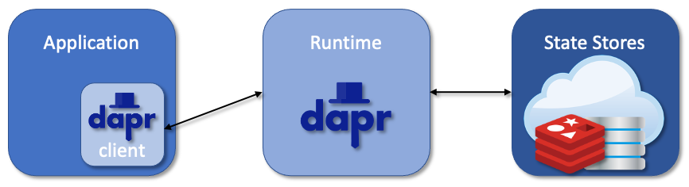
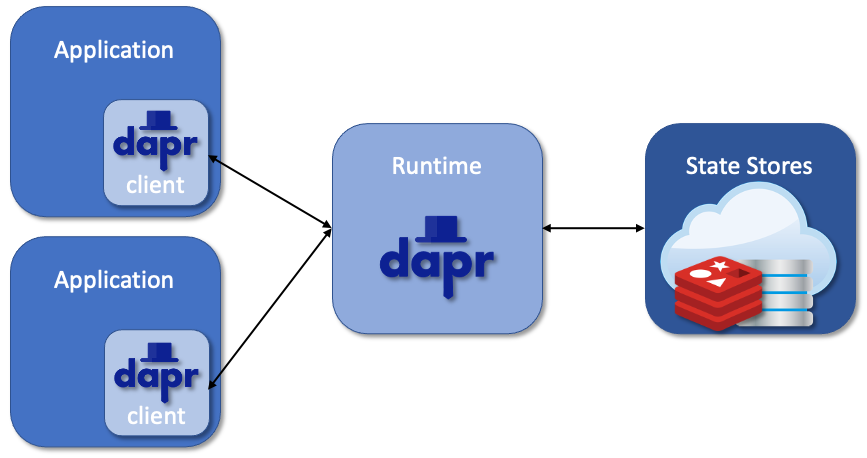
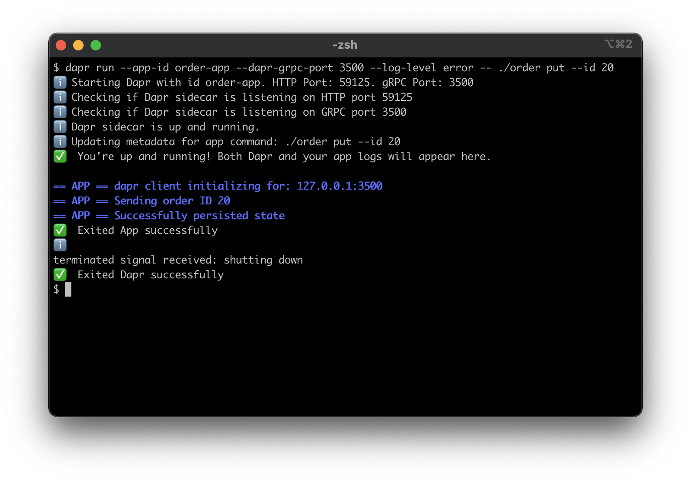
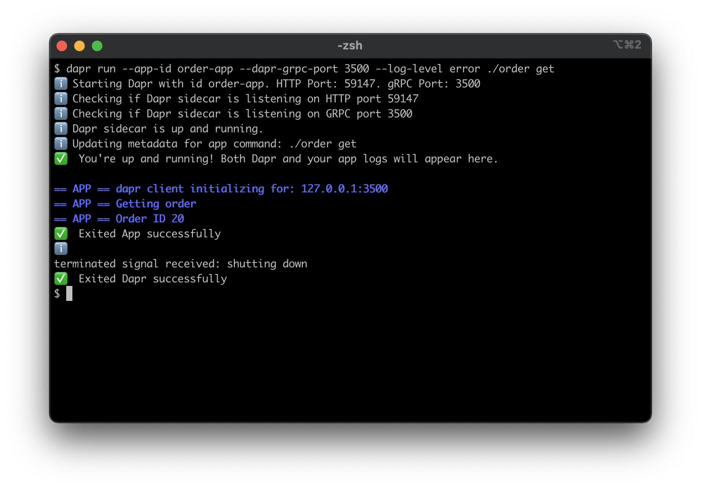
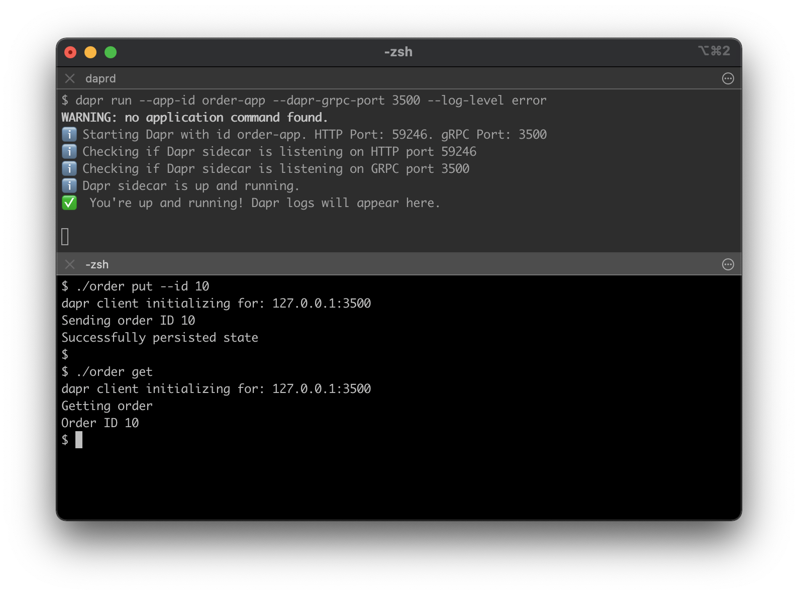
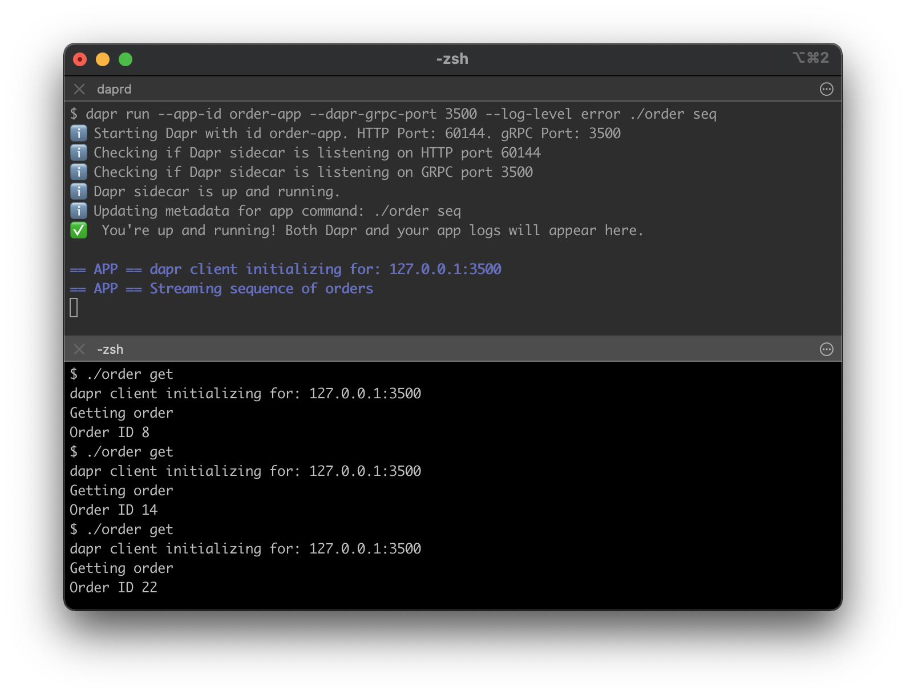

# Hello World SDK

This tutorial will demonstrate how to instrument your application with Dapr, and run it locally on your machine.
You will be using [Dapr SDK for Go](https://github.com/dapr/go-sdk) and deploying `order` applications with the flow identical to [Hello World](../hello-world).

The application invokes Dapr API via Dapr client, which, in turn, calls Dapr runtime.

The following architecture diagram illustrates the components that make up this quickstart:



Dapr runtime supports multiple applications that could communicate with one another.
In a later example, you'll deploy two instances of the `order` app - one will update the state store, while another will read from it.

The architecture diagram below shows the addition of the new component:



> **Note**: For more SDK examples please refer to the corresponding repositories:
> * [Dapr SDK for PHP](https://github.com/dapr/php-sdk)
> * [Dapr SDK for .NET](https://github.com/dapr/dotnet-sdk)
> * [Dapr SDK for Python](https://github.com/dapr/python-sdk)
> * [Dapr SDK for Java](https://github.com/dapr/java-sdk)
> * [Dapr SDK for Go](https://github.com/dapr/go-sdk)
> * [Dapr SDK for Rust](https://github.com/dapr/rust-sdk)
> * [Dapr SDK for Javascript](https://github.com/dapr/js-sdk)
> * [Dapr SDK for C++](https://github.com/dapr/cpp-sdk)


## Prerequisites
This quickstart requires you to have the following installed on your machine:
- [Docker](https://docs.docker.com/)
- [Go](https://golang.org/)
- [Postman](https://www.getpostman.com/) [Optional]

## Step 1 - Setup Dapr

Follow [instructions](https://docs.dapr.io/getting-started/install-dapr/) to download and install the Dapr CLI and initialize Dapr.

## Step 2 - Understand the code

Now that Dapr is set up locally, clone the repo, then navigate to the Hello World SDK quickstart:

```sh
git clone [-b <dapr_version_tag>] https://github.com/dapr/quickstarts.git
cd quickstarts/hello-world-sdk
```

> **Note**: See https://github.com/dapr/quickstarts#supported-dapr-runtime-version for supported tags. Use `git clone https://github.com/dapr/quickstarts.git` when using the edge version of dapr runtime.

The [order.go](./order.go) is a simple command line application, that implements four commands:
* `put` sends an order with configurable order ID.
* `get` return the current order number.
* `del` deletes the order.
* `seq` streams a sequence of orders with incrementing order IDs.

First, the app instantiates Dapr client:

```go
    client, err := dapr.NewClientWithPort(port)
    if err != nil {
        panic(err)
    }
    defer client.Close()
```

Then, depending on the command line argument, the app invokes corresponding method:

Persist the state:
```go
    err := client.SaveState(ctx, stateStoreName, "order", []byte(strconv.Itoa(orderID)))
```
Retrieve the state:
```go
    item, err := client.GetState(ctx, stateStoreName, "order")
```
Delete the state:
```go
    err := client.DeleteState(ctx, stateStoreName, "order")
```

## Step 3 - Run the app with Dapr

1. Build the app

<!-- STEP
expected_stdout_lines:
expected_stderr_lines:
name: make
-->

```bash
go mod vendor
go build -o order order.go
```

<!-- END_STEP -->

2. Run the app

There are two ways to launch Dapr applications. You can pass the app executable to the Dapr runtime:

<!-- STEP
expected_stdout_lines:
  - "You're up and running! Both Dapr and your app logs will appear here."
  - "== APP == dapr client initializing for: 127.0.0.1:3500"
  - "== APP == Sending order ID 20"
  - "== APP == Successfully persisted state"
expected_stderr_lines:
output_match_mode: substring
name: order put
-->

```bash
dapr run --app-id order-app --dapr-grpc-port 3500 --log-level error -- ./order put --id 20
```

<!-- END_STEP -->

<!-- STEP
expected_stdout_lines:
  - "You're up and running! Both Dapr and your app logs will appear here."
  - "== APP == dapr client initializing for: 127.0.0.1:3500"
  - "== APP == Getting order"
  - "== APP == Order ID 20"
expected_stderr_lines:
output_match_mode: substring
name: order get
-->

```bash
dapr run --app-id order-app --dapr-grpc-port 3500 --log-level error ./order get
```

<!-- END_STEP -->




Alternatively, you can start a standalone Dapr runtime, and call the app from another shell:

<!-- STEP
expected_stdout_lines:
  - "You're up and running! Dapr logs will appear here."
expected_stderr_lines:
name: dapr start
output_match_mode: substring
background: true
sleep: 5
-->

```bash
dapr run --app-id order-app --dapr-grpc-port 3500 --log-level error
```
<!-- END_STEP -->

<!-- STEP
expected_stdout_lines:
  - "dapr client initializing for: 127.0.0.1:3500"
  - "Sending order ID 10"
  - "Successfully persisted state"
  - "dapr client initializing for: 127.0.0.1:3500"
  - "Getting order"
  - "Order ID 10"
expected_stderr_lines:
output_match_mode: substring
name: order put get
-->

```bash
./order put --id 10

./order get
```

<!-- END_STEP -->

<!-- STEP
expected_stdout_lines:
  - 'app stopped successfully: order-app'
expected_stderr_lines:
output_match_mode: substring
name: dapr stop
-->

To terminate your services, simply stop the "dapr run" process, or use the Dapr CLI "stop" command:

```bash
dapr stop --app-id order-app
```
<!-- END_STEP -->



3. Run multiple apps

You can run more than one app in Dapr runtime. In this example you will call `order seq` which sends a sequence of orders.
Another instance of the `order` app will read the state.

```sh
dapr run --app-id order-app --dapr-grpc-port 3500 --log-level error ./order seq
```

```sh
./order get

./order get
```



## Next steps

Now that you've gotten Dapr running locally on your machine, consider these next steps:
- Explore additional quickstarts such as [pub-sub](../pub-sub), [bindings](../bindings) or the [distributed calculator app](../distributed-calculator).
- Run this hello world application in Kubernetes via the [Hello Kubernetes](../hello-kubernetes) quickstart.
- Learn more about Dapr in the [Dapr overview](https://docs.dapr.io/concepts/overview/) documentation.
- Explore [Dapr concepts](https://docs.dapr.io/concepts/) such as building blocks and components in the Dapr documentation.
