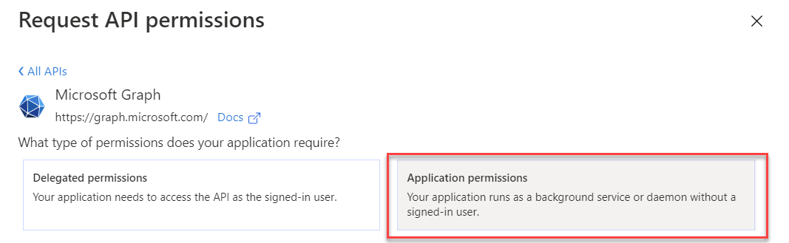

# OAuth Authorization to external service (non interactive)

This tutorial walks you through the steps of setting up the OAuth middleware to enable a service to interact with external services requiring authentication. This design seperates the concerns authentication/authorization concerns from the application.


> **NOTE**: This quickstart uses Microsoft Identity Platform/Azure Active Directory and Microsoft Graph as an example. 

## Prerequisites

- [Dapr enabled Kubernetes cluster](https://github.com/dapr/docs/blob/master/getting-started/environment-setup.md#installing-dapr-on-a-kubernetes-cluster)
- [Node.js version 8 or greater](https://nodejs.org/en/)
- [Docker](https://docs.docker.com/)
- [kubectl](https://kubernetes.io/docs/tasks/tools/install-kubectl/)
- [Helm](https://github.com/helm/helm)
- A working [Azure Active Directory] with Administrator rights, alternatively you can [create one](https://docs.microsoft.com/en-us/azure/active-directory/fundamentals/active-directory-access-create-new-tenant)


## Step 1 - Clone the quickstart repository

1. Clone the quickstart repo, then navigate to the middleware quickstart:
```bash
git clone [-b <dapr_version_tag>] https://github.com/dapr/quickstarts.git
cd quickstarts/middleware-clientcredentials/msgraphapp
```
> **Note**: See https://github.com/dapr/quickstarts#supported-dapr-runtime-version for supported tags. Use `git clone https://github.com/dapr/quickstarts.git` when using the edge version of dapr runtime.

2. Examine the ```app.js``` file. You'll see this is a simple Node.js Express web server with a single ```/users``` route that returns the Microsoft Graph API result based on the input query parameter ```displayName```. Also you can see that we will forward the token saved in the request header called `msgraph-token` as the `Authorization` header in the request towards the MS Graph API.

```javascript
app.get('/users', (req, res) => {
    var displayName = req.query.displayName;    

    // Calling Microsoft Graph API

    // request headers
    var args = {
        parameters: { $filter: `displayName eq '${displayName}'` },
        headers: { "Authorization": req.headers["msgraph-token"] } 
    };
     
    // calling API
    client.get("https://graph.microsoft.com/v1.0/users", args,
        function (data) {
            // parsed response body as js object
            res.send(data);  
        });

});
```

## Step 2 - Register your application with the authorization server

In order for Dapr to acquire access token on your application's behalf, your application needs to be registered with your Azure Active Directory.

1. Login to [Azure Portal](https://portal.azure.com)

2. Navigate to `Azure Active Directory`

3. Go to `App Registrations` in the menu

4. Click on `New Registration`


5. Enter a name for your application e.g. `daprmsgraph`, select `single tenant` and click `Register`


6. Copy the values for `Application (client) ID` and `Directory (tenant) ID` into the corresponding placeholders in [oauth2clientcredentials.yaml](./deploy/oauth2clientcredentials.yaml)


7. Click on `Certificates & Secrets` in the menu

8. Click on `New Client Secret`, give it a `Description`, select `In 1 year`, click `Add`


9. Click on the `copy button` next to the secret, use the value for the  placeholder `<Client secret>` in [oauth2clientcredentials.yaml](./deploy/oauth2clientcredentials.yaml)


10. Click on `API Permissions` in the menu


11. Click on `Add a permission` and select `Microsoft Graph`


12. Click on `Application Permissions`


13. Search for `User.Read.All` and select it and click `Add Permissions`


14. Last but not least click on `Grant admin consent for <yourtenant>` and confirm with `OK` (because of this step you need to be administrator for the AAD)


Now we are ready to deploy.

## Step 3 - Define custom pipeline

To define a custom pipeline with the OAuth middleware, you need to create a middleware component definition as well as a configuration that defines the custom pipeline.

1. Edit ```deploy\oauth2clientcredentials.yaml``` file to enter your ```Client ID``` and ```Client Secret```, ```Token URL```. You can leave everything else unchanged.
2. Change the directory to root and apply the manifests - ```oauth2clientcredentials.yaml``` defines the OAuth middleware and ```msgraphpipeline.yaml``` defines the custom pipeline:
```bash
cd ..
kubectl apply -f deploy/oauth2clientcredentials.yaml
kubectl apply -f deploy/msgraphpipeline.yaml
```

## Step 4 - Deploy the application
Next, you'll deploy the application. This example has no public ingress endpoint due to the confidentiallity of the returned data by the service. 

> **NOTE:** In general this middleware component should be used to inject external service authentication tokens to your services, in order to use/pass them to the called external services. It is not meant for public endpoint authentication. Please see quickstart [middleware](../middleware/README.md) for intractive public endpoint authentication flow. 

1. Deploy the application:
```bash
kubectl apply -f deploy/msgraphapp.yaml
```

## Step 5 - Test

1. Start and attach to a container with curl installed in your k8s cluster
```bash
kubectl run -i -t curlbox --image=curlimages/curl --restart=Never --command -- /bin/sh
```

2. Run the following command, exchange display name with an existing user in your AAD
```bash
curl http://msgraphapp-dapr:3500/v1.0/invoke/msgraphapp/method/users?displayName=gildong%20hong
```

3. You should get a result similar to this
```json
{"@odata.context":"https://graph.microsoft.com/v1.0/$metadata#users","value":[{"businessPhones":[],"displayName":"Gildong Hong","givenName":null,"jobTitle":null,"mail":null,"mobilePhone":null,"officeLocation":null,"preferredLanguage":null,"surname":null,"userPrincipalName":"gildong.hong@yourdomain.com","id":"9392214b-c472-4c29-b59f-3efcb6051f50"}]}
```

## Step 6 - Cleanup

1. Spin down kunernetes resources:
```bash
kubectl delete -f deploy/.
```
2. Delete the curlbox pod
```bash
kubectl delete pod curlbox
```
3. Delete the credential created in the AAD.

4. [Optional] Delete the AAD (if you created one just for this quickstart)