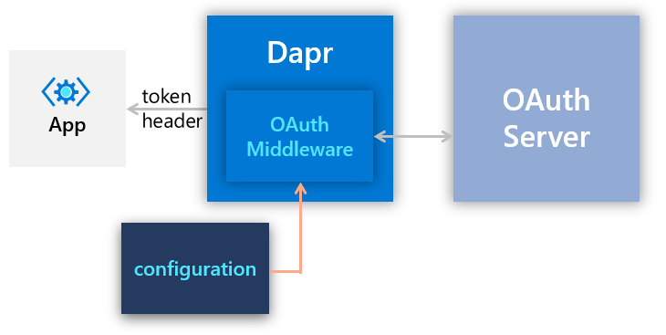
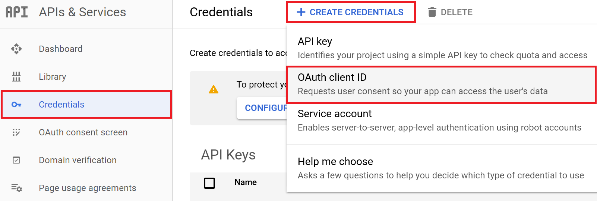
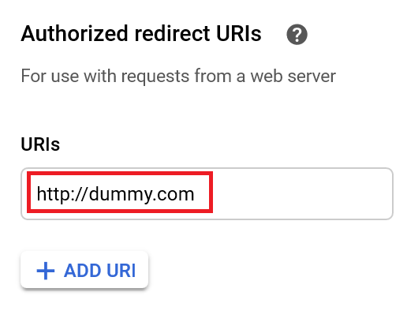
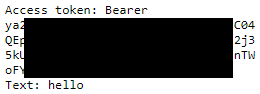

# Dapr Middleware (OAuth Authorization)

This tutorial shows a real use case of the Dapr [middleware](https://docs.dapr.io/concepts/middleware-concept/) building block. It walks you through the steps of setting up the OAuth middleware to enable OAuth authorization on a Web API without modifying the application. This design separates authentication/authorization concerns from the application, so that application operators can adopt and configure authentication/authorization providers without impacting the application code.



> **NOTE**: This quickstart uses Google Account as an example.

## Prerequisites

- [Dapr enabled Kubernetes cluster](https://docs.dapr.io/operations/hosting/kubernetes/kubernetes-deploy/)
- [Node.js version 8 or greater](https://nodejs.org/en/)
- [Docker](https://docs.docker.com/)
- [kubectl](https://kubernetes.io/docs/tasks/tools/install-kubectl/)
- [Helm](https://github.com/helm/helm)
- A working [Google Account](https://accounts.google.com)

This quickstart uses Nginx as the ingress controller. You can use the following Helm chart to add Nginx to your cluster:

```bash
helm repo add ingress-nginx https://kubernetes.github.io/ingress-nginx
helm install my-release ingress-nginx/ingress-nginx
```

## Step 1 - Clone the sample repository

1. Clone the quickstarts repo, then navigate to the middleware quickstart:

```bash
git clone [-b <dapr_version_tag>] https://github.com/dapr/quickstarts.git
cd quickstarts/middleware
```

> **Note**: See <https://github.com/dapr/quickstarts#supported-dapr-runtime-version> for supported tags. Use `git clone https://github.com/dapr/quickstarts.git` when using the edge version of dapr runtime.

1. Examine the ```echoapp/app.js``` file. You'll see this is a simple Node.js Express web server with a single ```/echo``` route that returns the ```authorization``` header and the ```text``` parameter client passes in:

```javascript
app.get('/echo', (req, res) => {
    var text = req.query.text;
    console.log("Echoing: " + text);
    res.send("Access token: " + req.headers["authorization"] + " Text: " + text)
});

```

## Step 2 - Register your application with the authorization server

In order for Dapr to acquire access token on your application's behalf, your application needs to be registered with the authorization server of your choice.

For example, to register with Google APIs, you should visit [Google APIs Console](https://console.developers.google.com) to register your application:

1. Log in to [Google APIs Console](https://console.developers.google.com) using your Google account.
2. If you don't have a project yet, you need to create a project first.
3. On Google API Console, click on the **Credentials** link to the left. Then, click on the **CREATE CREDENTIAL** link at the top. And finally, click on the **OAuth client ID** option:
   
4. Select the **Web application** type. Give a name to your account, and click on the **Create** button to create the client ID.
5. Once the client ID is created, note down the **Client ID** and **Client Secret** - you'll need to enter these into the middleware configuration later.
6. Edit the client ID settings and make sure <http://dummy.com> is added as one of the authorized redirect URIs:
  
  
> **NOTE:** For this exercise, you'll set the ```Redirect URL``` to ```http://dummy.com```. This requires you to add a hostname entry to the computer on which you'll test out the scenario. In a production environment, you need to set the ```Redirect URL``` to the proper DNS name associated with your load balancer or ingress controller.

## Step 3 - Define custom pipeline

To define a custom pipeline with the OAuth middleware, you need to create a middleware component definition as well as a configuration that defines the custom pipeline.

1. Edit ```deploy\oauth2.yaml``` file to enter your ```client ID``` and ```client Secret```. You can leave everything else unchanged.
2. Change the directory to root and apply the manifests - ```oauth2.yaml``` defines the OAuth middleware and ```pipeline.yaml``` defines the custom pipeline:

```bash
cd ..
kubectl apply -f deploy/oauth2.yaml
kubectl apply -f deploy/pipeline.yaml
```

## Step 4 - Deploy the application

Next, you'll deploy the application and define an ingress rule that routes to the ```-dapr``` service that gets automatically created when you deploy your pod. In this case, all traffic is routed to the Dapr sidecar, which can reinforce various policies through middleware.

>**Note:** 'dapr.io/sidecar-listen-addresses' annotation is added to echoapp deployment to allow external connections. Be cautious of using it in a production environment. To read more on this annotation see [Dapr arguments and annotations for daprd, CLI, and Kubernetes](https://docs.dapr.io/reference/arguments-annotations-overview/)

1. Deploy the application and the ingress rule:

```bash
kubectl apply -f deploy/echoapp.yaml
kubectl apply -f deploy/ingress.yaml
```

>**Note:** minikube users have to enable ingress as it's not supported by default.

```bash
minikube addons enable ingress
```

## Step 5 - Test

1. Add a hostname entry to your local hosts file(`/etc/hosts` in linux and `c:\windows\system32\drivers\etc\hosts` in windows) to allow the ```dummy.com``` to be resolved to the public IP associated with your ingress controller:

```bash
<External IP of your ingress controller> dummy.com
```

2. Open a browser and try to invoke the ```/echo``` API through Dapr:

```
http://dummy.com/v1.0/invoke/echoapp/method/echo?text=hello
```

3. If you haven't logged on to Google, you'll be redirected to the login page. Then, you'll be redirected to the consent screen to confirm access.

4. The browser redirects back to your application with the access token extracted from a (configurable) ```authorization``` header:



## Step 6 - Cleanup

1. Spin down kunernetes resources:

```bash
kubectl delete -f deploy/.
```

2. Delete Nginx ingress from the cluster:

```bash
helm uninstall my-release
```

3. Disable ingress addon:

```bash
minikube addons disable ingress
```

4. Delete the credential created in the authorization server.

## Related links
- Learn more about [Dapr middleware](https://docs.dapr.io/concepts/middleware-concept/)
- How to [configure API authorization with OAuth](https://docs.dapr.io/operations/security/oauth/)

## Next steps
- Explore additional [quickstarts](../README.md#quickstarts)
