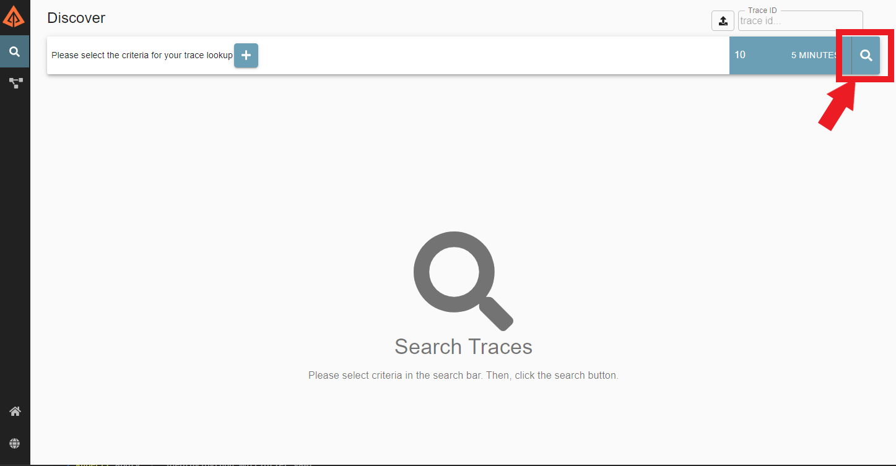
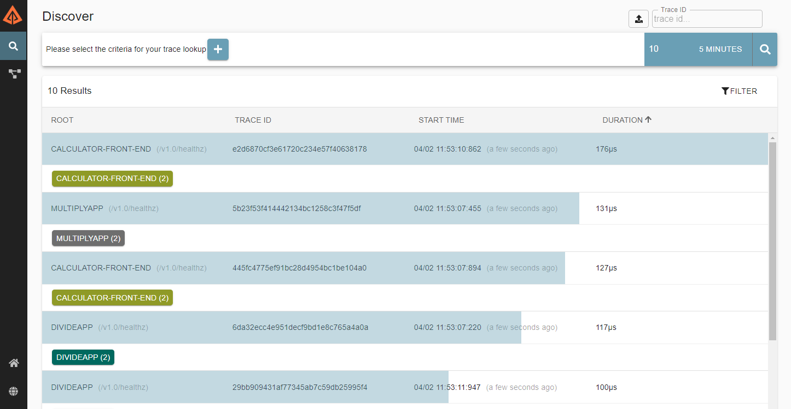
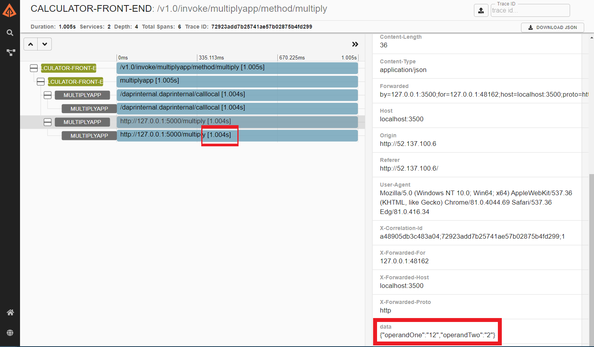

# Observability with Dapr

This quickstart explores the [observability](https://docs.dapr.io/concepts/observability-concept/) capabilities of Dapr. Observability includes metric collection, tracing, logging and health checks. In this quickstart you'll be enabling [distributed tracing](https://docs.dapr.io/developing-applications/building-blocks/observability/tracing/) on an application without changing any application code or creating a dependency on any specific tracing system. Since Dapr uses [OpenCensus](https://opencensus.io/), a variety of observability tools can be used to view and capture the traces.

In this quickstart you will:

- Deploy [Zipkin](https://zipkin.io/) and configure it as a tracing provider for Dapr in self hosted mode and in Kubernetes.
- Configure an application for tracing and then deploy it.
- Troubleshoot a performance issue.

## Configure self hosted mode
For self hosted mode, first run `dapr init`. When you run `dapr init`:

1. The following YAML file is created by default in `$HOME/dapr/config.yaml` (on Linux/Mac) or `%USERPROFILE%\dapr\config.yaml` (on Windows) and it is referenced by default on `dapr run` calls unless otherwise overridden:

* config.yaml

```yaml
apiVersion: dapr.io/v1alpha1
kind: Configuration
metadata:
  name: daprConfig
  namespace: default
spec:
  tracing:
    samplingRate: "1"
    zipkin:
      endpointAddress: "http://localhost:9411/api/v2/spans"
```

2. The [openzipkin/zipkin](https://hub.docker.com/r/openzipkin/zipkin/) docker container is launched.

3. The applications launched with `dapr run` will by default reference the config file in `$HOME/dapr/config.yaml` or `%USERPROFILE%\dapr\config.yaml` and can be overridden with the Dapr CLI using the `--config` param. For example, the following command will launch the hello-world quickstart app using the default config.yaml:

4. Clone this repo using `git clone [-b <dapr_version_tag>] https://github.com/dapr/quickstarts.git` and go to the repo's directory via `cd quickstarts/observability`.

<!-- STEP
name: Run app with tracing
expected_stdout_lines:
  - "✅  You're up and running! Both Dapr and your app logs will appear here."
  - "✅  Exited Dapr successfully"
  - "✅  Exited App successfully"
expected_stderr_lines:
background: true
sleep: 5
-->

```bash
cd ../hello-world && dapr run --app-id hello-tracing --app-port 3000 node app.js && cd ../observability
```

<!-- END_STEP -->

5. Once the app is running, you can make a request, which will populate at least one trace:


<!-- STEP
expected_stdout_lines:
  - "✅  App invoked successfully"
expected_stderr_lines:
name: dapr invoke
sleep: 2
-->

```bash
dapr invoke --app-id hello-tracing --method neworder --data '{"data": { "orderId": "42" } }'
```

<!-- END_STEP -->

<!-- STEP
name: Pause for manual validation
manual_pause_message: "Zipkin tracing running on http://localhost:9411. Please open in your browser and test manually."
-->

<!-- We will pause here and print the above message when mm.py is run with '-m'. Otherwise, this step does nothing -->

<!-- END_STEP -->

### Viewing Traces
Tracing is set up out of the box when running `dapr init`. To
view traces, in your browser go to http://localhost:9411 and you will
see the Zipkin UI.

### Zipkin API

Zipkin also has an API available. See [Zipkin API](https://zipkin.io/zipkin-api/) for more details.

To see traces collected through the API:

<!-- STEP
expected_stdout_lines:
  - '                "dapr.api": "POST /v1.0/invoke/hello-tracing/method/neworder",'
expected_stderr_lines:
name: Curl validate
-->


```bash
curl -s "http://localhost:9411/api/v2/traces?serviceName=hello-tracing&spanName=calllocal%2Fhello-tracing%2Fneworder&limit=10" -H  "accept: application/json" | python -m json.tool
```
<!-- END_STEP -->

You should see output like the following:

```
[
    [
        {
            "traceId": "4c480d57b0e6d96b7150b46d027c5904",
            "id": "90d58917274e180a",
            "kind": "CLIENT",
            "name": "calllocal/hello-tracing/neworder",
            "timestamp": 1613170216016911,
            "duration": 93671,
            "localEndpoint": {
                "serviceName": "hello-tracing",
                "ipv4": "127.0.0.1"
            },
            "tags": {
                "dapr.api": "POST /v1.0/invoke/hello-tracing/method/neworder",
                "dapr.protocol": "http",
                "dapr.status_code": "200",
                "net.peer.name": "hello-tracing",
                "opencensus.status_description": "OK",
                "rpc.service": "ServiceInvocation"
            }
        }
    ]
]
```

### Cleanup

<!-- STEP
expected_stdout_lines: 
  - '✅  app stopped successfully: hello-tracing'
expected_stderr_lines:
name: Shutdown dapr
-->

```bash
dapr stop --app-id hello-tracing
```

<!-- END_STEP -->

## Configure Kubernetes
### Prerequisites

This quickstart builds on the [distributed calculator](../distributed-calculator/README.md) quickstart and requires Dapr to be installed on a Kubernetes cluster along with a state store. It is suggested to go through the distributed calculator quickstart before this one. If you have not done this then:

1. Clone this repo using `git clone [-b <dapr_version_tag>] https://github.com/dapr/quickstarts.git` and go to the directory via `cd quickstarts/obervability`.
2. [Install Dapr on Kubernetes](https://docs.dapr.io/getting-started/install-dapr/#install-dapr-on-a-kubernetes-cluster).
3. [Configure Redis](https://docs.dapr.io/getting-started/configure-redis/) as a state store for Dapr.
4. Configure host and password for Redis state store Component in `../distributed-calculator/deploy/redis.yaml`.

> **Note**: See https://github.com/dapr/quickstarts#supported-dapr-runtime-version for supported tags. Use `git clone https://github.com/dapr/quickstarts.git` when using the edge version of dapr runtime.
## Configure Dapr tracing in the cluster

Review the Dapr configuration file `./deploy/appconfig.yaml` below:

```yaml
apiVersion: dapr.io/v1alpha1
kind: Configuration
metadata:
  name: appconfig
spec:
  tracing:
    samplingRate: "1"
    zipkin:
      endpointAddress: "http://zipkin.default.svc.cluster.local:9411/api/v2/spans"
```

* `samplingRate` is used to enable or disable the tracing. To disable the sampling rate ,
set `samplingRate : "0"` in the configuration. The valid range of samplingRate is between 0 and 1 inclusive. The sampling rate determines whether a trace span should be sampled or not based on value. `samplingRate : "1"` will always sample the traces. By default, the sampling rate is 1 in 10,000.
* `zipkin.endpointAddress` is used to specify the trace backend to receive trace using the Zipkin format. Any backend that understands the Zipkin trace format, like Zipkin, Jaeger, New Relic, etc can be used. In this sample, we use the address of the Zipkin server that we will deploy in the next step.

This configuration file enables Dapr tracing. Deploy the configuration by running:

<!-- STEP
name: Apply tracting config
expected_stdout_lines: 
  - 'configuration.dapr.io/appconfig created'
expected_stderr_lines:
-->

```bash
kubectl apply -f ./deploy/appconfig.yaml
```

You can see that now a new Dapr configuration which enables tracing has been added. Run the command:

```bash
dapr configurations --kubernetes
```

<!-- END_STEP -->

You should see output that looks like this:

```bash
  NAME       TRACING-ENABLED  METRICS-ENABLED  AGE  CREATED
  appconfig  true             true             1h   2020-12-10 22:01.59
```

You can see that `appconfig` has `TRACING-ENABLED` set to `true`.

### Deploy Zipkin to the cluster and set it as the tracing provider

In this quickstart Zipkin is used for tracing. Examine [*./deploy/zipkin.yaml*](./deploy/zipkin.yaml) and see how it includes three sections:

1. A **Deployment** for Zipkin using the *openzipkin/zipkin* docker image.
2. A **Service** which will expose Zipkin internally as a ClusterIP in Kubernetes.

Deploy Zipkin to your cluster by running:

<!-- STEP
name: Apply tracting config
expected_stdout_lines: 
  - deployment.apps/zipkin created
  - service/zipkin created
-->

```bash
kubectl apply -f ./deploy/zipkin.yaml
```

<!-- END_STEP -->

Now that Zipkin is deployed, you can access the Zipkin UI by creating a tunnel to the internal Zipkin service you just created by running:

```bash
kubectl port-forward svc/zipkin 9411:9411
```

On your browser go to [http://localhost:9411](http://localhost:9411). You should be able to see the Zipkin dashboard.

### Instrument the application for tracing and deploy it

To instrument a service for tracing with Dapr, no code changes are required, Dapr handles all of the tracing using the Dapr side-car. All that is needed is to add the Dapr annotation for the configuration you deployed earlier (which enables tracing) in the application deployment yaml along with the other Dapr annotations. The configuration annotation looks like this:

```yaml
...
annotations:
...
    dapr.io/config: "appconfig"
...
 ```

For this quickstart, a configuration has already been enabled for every service in the distributed calculator app. You can find the annotation in each one of the calculator yaml files. For example review the yaml file for the calculator front end service [here](https://github.com/dapr/quickstarts/blob/master/distributed-calculator/deploy/react-calculator.yaml#L36).

Note you did not introduce any dependency on Zipkin into the calculator app code or deployment yaml files. The Zipkin Dapr component is configured to read tracing events and write these to a tracing backend.

Now deploy the distributed calculator application to your cluster:

<!-- STEP
name: Deploy Calculator Kubernetes
sleep: 60
expected_stdout_lines:
  - "deployment.apps/subtractapp created"
  - "deployment.apps/addapp created"
  - "deployment.apps/divideapp created"
  - "deployment.apps/multiplyapp created"
  - "service/calculator-front-end created"
  - "deployment.apps/calculator-front-end created"
  - "component.dapr.io/statestore created"
-->

```bash 
kubectl apply -f ../distributed-calculator/deploy
``` 

<!-- END_STEP -->

Then, open the distributed calculator UI.

If this is the first time trying the distributed calculator, find more detailed instructions in the [distributed-calculator](https://github.com/dapr/quickstarts/blob/master/distributed-calculator/README.md) quickstart.

> **Note:** If the distributed calculator is already running on your cluster you will need to restart it for the tracing to take effect. You can do so by running:

> `kubectl rollout restart deployment addapp calculator-front-end divideapp multiplyapp subtractapp`

<!-- STEP
name: Port forward
background: true
sleep: 2
timeout_seconds: 1
expected_return_code:
-->

**Optional:** if you don't have easy public browser access, you can always use port forwarding

```bash
kubectl port-forward service/calculator-front-end 8000:80
```

<!-- END_STEP -->

### Discover and troubleshoot a performance issue using Zipkin

To show how observability can help discover and troubleshoot issues on a distributed application, you'll update one of the services in the calculator app. This updated version simulates a performance degradation in the multiply operation of the calculator that you can then investigate using the traces emitted by the Dapr sidecar. Run the following to apply a new version of the python-multiplier service:

<!-- STEP
name: Deploy mmdified multiply app
sleep: 60
expected_stdout_lines:
  - 'deployment.apps/multiplyapp configured'
-->

```bash
kubectl apply -f ./deploy/python-multiplier.yaml
```

<!-- END_STEP -->

Now go to the calculator UI and perform several calculations. Make sure to use all operands. For example, do the following:

`9 + 3 * 2 / 4 - 1 =`

**Optional:** You can also use the following curl commands to execute all operations:

<!-- STEP
expected_stdout_lines:
  - "59"
  - "18"
  - "12"
  - "1768.0"
name: "Curl test"
-->

```bash 
curl -w "\n" -s 'http://localhost:8000/calculate/add' -H 'Content-Type: application/json' --data '{"operandOne":"56","operandTwo":"3"}'
curl -w "\n" -s 'http://localhost:8000/calculate/subtract' -H 'Content-Type: application/json' --data '{"operandOne":"52","operandTwo":"34"}'
curl -w "\n" -s 'http://localhost:8000/calculate/divide' -H 'Content-Type: application/json' --data '{"operandOne":"144","operandTwo":"12"}'
curl -w "\n" -s 'http://localhost:8000/calculate/multiply' -H 'Content-Type: application/json' --data '{"operandOne":"52","operandTwo":"34"}'
```

<!-- END_STEP -->


Now go to the Zipkin dashboard by running. (Note: if you are running Dapr locally, be sure to use a different local port for Zipkin):

<!-- STEP
name: Port forward
background: true
sleep: 2
timeout_seconds: 1
expected_return_code:
-->

```bash
kubectl port-forward svc/zipkin 19411:9411
```

<!-- END_STEP -->

<!-- STEP
name: Pause for manual validation
manual_pause_message: "Zipkin tracing running on http://localhost:19411. Please open in your browser and test manually."
-->

<!-- We will pause here and print the above message when mm.py is run with '-m'. Otherwise, this step does nothing -->

<!-- END_STEP -->

And browsing to [http://localhost:19411](http://localhost:19411). Click the search button to view tracing coming from the application:



Dapr adds a HTTP/gRPC middleware to the Dapr sidecar. The middleware intercepts all Dapr and application traffic and automatically injects correlation IDs to trace events. You can see a lot of transactions are being captured including the regular health checks done by Kubernetes:



Now look for any performance issues by filtering on any requests that have taken longer than 250 ms using the `minDuration` criteria:


You can quickly see that the multiply method invocation is unusually slow (takes over 1 second). Since the problem may be either at the calculator-frontend service or the python-multiplier service you can dig further by clicking on the entry:



Now you can see which specific call was delayed via the `data` field (here it's the 12 * 2 operation) and confirm that it is the multiplier service which you updated that is causing the slowdown (You can find the code for the slow multiplier under the python directory).

### Zipkin API

As before, you can also access traces through the Zipkin API. The following will give you the same traces as the UI search above:

<!-- STEP
expected_stdout_lines:
  - '            "name": "calllocal/multiplyapp/multiply",'
expected_stderr_lines:
name: Curl validate
-->

```bash
curl -s "http://localhost:19411/api/v2/traces?minDuration=250000&limit=10" -H  "accept: application/json" | python -m json.tool
```

<!-- END_STEP -->

You should get output like this:
```
[
    [
        {
            "duration": 1009084,
            "id": "ff0bf110ca88f770",
            "kind": "SERVER",
            "localEndpoint": {
                "ipv4": "10.244.4.225",
                "serviceName": "multiplyapp"
            },
            "name": "calllocal/multiplyapp/multiply",
            "parentId": "733a1812e839dcfb",
            "tags": {
                "dapr.api": "/dapr.proto.internals.v1.ServiceInvocation/CallLocal",
                "dapr.invoke_method": "multiply",
                "dapr.protocol": "grpc",
                "rpc.service": "ServiceInvocation"
            },
            "timestamp": 1613177766316506,
            "traceId": "926f1a5a6c63ae6f5167c29b3ddf4271"
        },
...
```


### Clean up

<!-- STEP
name: Cleanup kubernetes
expected_stdout_lines:
  - 'configuration.dapr.io "appconfig" deleted'
  - 'deployment.apps "subtractapp" deleted'
  - 'deployment.apps "addapp" deleted'
  - 'deployment.apps "divideapp" deleted'
  - 'deployment.apps "multiplyapp" deleted'
  - 'service "calculator-front-end" deleted'
  - 'deployment.apps "calculator-front-end" deleted'
  - 'component.dapr.io "statestore" deleted'
-->

1. To remove the distributed calculator application from your cluster run:

```bash
kubectl delete -f ../distributed-calculator/deploy
```

2. To remove the Zipkin installation and tracing configuration run:

```bash
kubectl delete -f deploy/zipkin.yaml
```

<!-- END_STEP -->

## Additional Resources

- Learn more about [observability](https://docs.dapr.io/concepts/observability-concept/).
- Learn more on how Dapr does [distributed tracing](https://docs.dapr.io/developing-applications/building-blocks/observability/tracing/).

## Next steps

- Explore additional [quickstarts](../README.md#quickstarts)

## Troubleshooting

If you see an error with the following message:
```txt
time="2021-02-13T00:39:00.48769561Z" level=fatal msg="process component zipkin error: incorrect type exporters.zipkin" app_id=addapp instance=addapp-59f447d8b6-w48jt scope=dapr.runtime type=log ver=1.0.0-rc.4
```

It means there is an old exporter Component in your Kubernetes cluster. First, list Components:

```bash
kubectl get components
```

```txt
NAME         AGE
zipkin       71d
statestore   43m
```

Then, identify which Component is the exporter (usually named `zipkin`) and delete it:
```bash
kubectl delete component zipkin
```
