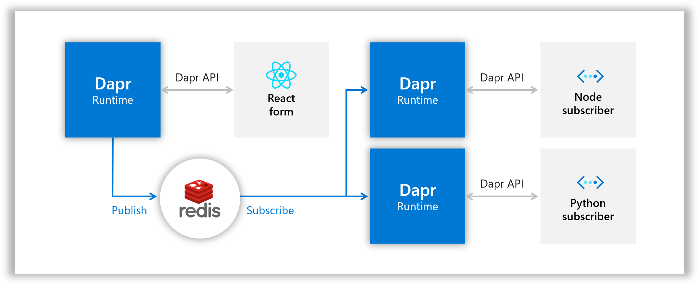
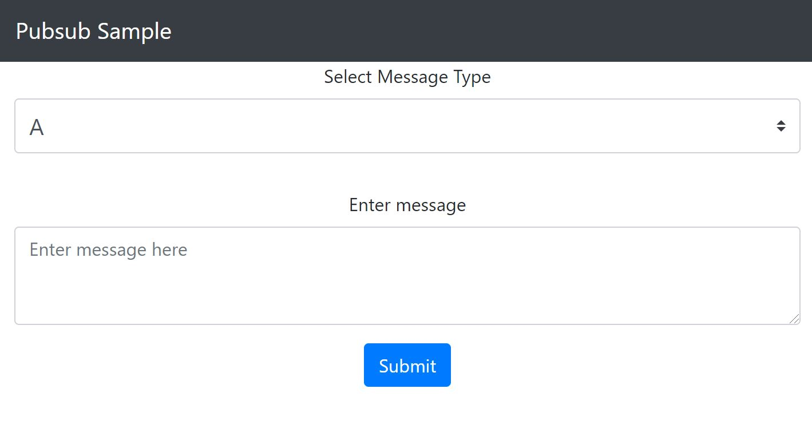

# Dapr Pub-Sub

In this quickstart, you'll create a publisher microservice and two subscriber microservices to demonstrate how Dapr enables a publish-subcribe pattern. The publisher will generate messages of a specific topic, while subscribers will listen for messages of specific topics. See [Why Pub-Sub](#why-pub-sub) to understand when this pattern might be a good choice for your software architecture.

Visit [this](https://docs.dapr.io/developing-applications/building-blocks/pubsub/) link for more information about Dapr and Pub-Sub.

This quickstart includes one publisher:

- React front-end message generator

And two subscribers: 
 
- Node.js subscriber
- Python subscriber

Dapr uses pluggable message buses to enable pub-sub, and delivers messages to subscribers in a [Cloud Events](https://github.com/cloudevents/spec) compliant message envelope. in this case you'll use Redis Streams (enabled in Redis versions => 5). The following architecture diagram illustrates how components interconnect locally:



Dapr allows you to deploy the same microservices from your local machines to the cloud. Correspondingly, this quickstart has instructions for deploying this project [locally](#Run-Locally) or in [Kubernetes](#Run-in-Kubernetes). 

## Prerequisites

### Prerequisites to run locally

- [Dapr CLI with Dapr initialized](https://docs.dapr.io/getting-started/install-dapr)
- [Node.js version 8 or greater](https://nodejs.org/en/) and/or [Python 3.4 or greater](https://www.python.org/): You can run this quickstart with one or both microservices

### Prerequisites to Run in Kubernetes

- [Dapr enabled Kubernetes cluster](https://docs.dapr.io/getting-started/install-dapr/#install-dapr-on-a-kubernetes-cluster)

## Run locally

In order to run the pub/sub quickstart locally, each of the microservices need to run with Dapr. Start by running message subscribers. 

> **Note**: These instructions deploy a Node subscriber and a Python subscriber, but if you don't have either Node or Python, feel free to run just one.

### Clone the quickstarts repository
Clone this quickstarts repository to your local machine:
```bash
git clone [-b <dapr_version_tag>] https://github.com/dapr/quickstarts.git
```
> **Note**: See https://github.com/dapr/quickstarts#supported-dapr-runtime-version for supported tags. Use `git clone https://github.com/dapr/quickstarts.git` when using the edge version of dapr runtime.

### Run Node message subscriber with Dapr

1. Navigate to Node subscriber directory in your CLI:

```bash
cd node-subscriber
```

<!-- STEP
name: Install node dependencies
working_dir: ./node-subscriber
-->

2. Install dependencies: 

```bash
npm install
```

<!-- END_STEP -->

3. Run the Node subscriber app with Dapr: 

<!-- STEP
name: Run node subscriber
expected_stdout_lines:
  - "✅  You're up and running! Both Dapr and your app logs will appear here."
  - "== APP == A:  {"
  - "== APP ==   source: 'react-form',"
  - "== APP ==   type: 'com.dapr.event.sent',"
  - "== APP ==   specversion: '1.0',"
  - "== APP ==   datacontenttype: 'application/json',"
  - "== APP ==   data: { message: 'This is a test' },"
  - "== APP ==   topic: 'A',"
  - "== APP ==   pubsubname: 'pubsub'"
  - "== APP == }"
  - "== APP == B:  {"
  - "== APP ==   source: 'react-form',"
  - "== APP ==   type: 'com.dapr.event.sent',"
  - "== APP ==   specversion: '1.0',"
  - "== APP ==   datacontenttype: 'application/json',"
  - "== APP ==   data: { messageType: 'B', message: 'Message on B' },"
  - "== APP ==   topic: 'B',"
  - "== APP ==   pubsubname: 'pubsub'"
  - "== APP == }"
  - "✅  Exited Dapr successfully"
  - "✅  Exited App successfully"
expected_stderr_lines:
working_dir: ./node-subscriber
background: true
sleep: 5
-->

```bash
dapr run --app-id node-subscriber --app-port 3000 node app.js
```

<!-- END_STEP -->
    
`app-id` which can be any unique identifier for the microservice. `app-port`, is the port that the Node application is running on. Finally, the command to run the app `node app.js` is passed last.

### Run Python message subscriber with Dapr

1. Open a new CLI window and navigate to Python subscriber directory in your CLI: 

```bash
cd python-subscriber
```

2. Install dependencies: 

<!-- STEP
name: Install python dependencies
working_dir: ./python-subscriber
-->

```bash
pip3 install -r requirements.txt 
```
or

<!-- END_STEP -->

```bash
python -m pip install -r requirements.txt
```


3. Run the Python subscriber app with Dapr: 

<!-- STEP
name: Run python subscriber
expected_stdout_lines:
  - "✅  You're up and running! Both Dapr and your app logs will appear here."
  - '== APP == Received message "This is a test" on topic "A"'
  - '== APP == Received message "Message on C" on topic "C"'
  - "✅  Exited Dapr successfully"
  - "✅  Exited App successfully"
expected_stderr_lines:
working_dir: ./python-subscriber
background: true
sleep: 10
-->
    
```bash
dapr run --app-id python-subscriber --app-port 5000 python3 app.py
```

<!-- END_STEP -->

### Run the React front end with Dapr

Now, run the React front end with Dapr. The front end will publish different kinds of messages that subscribers will pick up.

1. Open a new CLI window and navigate to the react-form directory:

```bash
cd react-form
```

2. Run the React front end app with Dapr: 

<!-- STEP
name: Run react frontent
working_dir: ./react-form
expected_stdout_lines:
  - "✅  You're up and running! Both Dapr and your app logs will appear here."
  - "== APP == Listening on port 8080!"
  - "== APP == Publishing:  { messageType: 'B', message: 'Message on B' }"
  - "== APP == Publishing:  { messageType: 'C', message: 'Message on C' }"
  - "✅  Exited Dapr successfully"
  - "✅  Exited App successfully"
expected_stderr_lines:
background: true
sleep: 60
env:
  CI: "false"
-->

```bash
dapr run --app-id react-form --app-port 8080 npm run buildandstart
```

<!-- END_STEP -->

This may take a minute, as it downloads dependencies and creates an optimized production build. You'll know that it's done when you see `== APP == Listening on port 8080!` and several Dapr logs.

3. Open the browser and navigate to "http://localhost:8080/". You should see a form with a dropdown for message type and message text: 



<!-- STEP
name: Pause for manual validation
manual_pause_message: "Pubsub APP running on http://localhost:8080. Please open in your browser and test manually."
-->

<!-- We will pause here and print the above message when mm.py is run with '-m'. Otherwise, this step does nothing -->

<!-- END_STEP -->

4. Pick a topic, enter some text and fire off a message! Observe the logs coming through your respective Dapr. Note that the Node.js subscriber receives messages of type "A" and "B", while the Python subscriber receives messages of type "A" and "C". Note that logs are showing up in the console window where you ran each one: 

```bash
[0m?[94;1m== APP == Topic A: { id: '5780e2ca-f526-4839-92e5-a0a30aff829a', source: 'react-form', type: 'com.dapr.event.sent', specversion: '0.3',data: { message: 'this is a test' } }
```

### Use the CLI to publish messages to subscribers

The Dapr CLI provides a mechanism to publish messages for testing purposes.

1. Use Dapr CLI to publish a message:
   
  * Linux/Mac:

<!-- STEP
expected_stdout_lines:
  - "✅  Event published successfully"
expected_stderr_lines:
name: Publish with dapr CLI
-->

```bash

dapr publish --publish-app-id react-form --pubsub pubsub --topic A --data '{ "message": "This is a test" }'
```

<!-- END_STEP -->
    
  * Windows CMD

```bash
dapr publish --publish-app-id react-form --pubsub pubsub --topic A --data "{ \"message\": \"This is a test\" }"
```
    
  * Windows Powershell

```ps
dapr publish --publish-app-id react-form --pubsub pubsub --topic A --data "{ message: This is a test }"
```

2. **Optional**: Try publishing a message of topic B. You'll notice that only the Node app will receive this message. The same is true for topic 'C' and the python app.

<!-- STEP
name: Curl validation
expected_stdout_lines:
  - "OK"
  - "OK"
expected_stderr_lines:
-->

> **Note:** If you are running in an environment without easy access to a web browser, the following curl commands will simulate a browser request to the node server.

```bash
curl -w "\n" -s 'http://localhost:8080/publish' -H 'Content-Type: application/json' --data '{"messageType":"B","message":"Message on B"}'
curl -s 'http://localhost:8080/publish' -H 'Content-Type: application/json' --data '{"messageType":"C","message":"Message on C"}'
```

<!-- END_STEP -->

3. Cleanup

<!-- STEP
expected_stdout_lines: 
  - '✅  app stopped successfully: node-subscriber'
  - '✅  app stopped successfully: python-subscriber'
  - '✅  app stopped successfully: react-form'
expected_stderr_lines:
name: Shutdown dapr
-->

```bash
dapr stop --app-id node-subscriber
dapr stop --app-id python-subscriber
dapr stop --app-id react-form
```

<!-- END_STEP -->

4. If you want to deploy this same application to Kubernetes, move onto the next step. Otherwise, skip ahead to the [How it Works](#How-it-Works) section to understand the code!


## Run in Kubernetes

To run the same code in Kubernetes, first set up a Redis store and then deploy the microservices. You'll be using the same microservices, but ultimately the architecture is a bit different: 


### Set up a Redis store

Dapr uses pluggable message buses to enable pub-sub, in this case Redis Streams (enabled in Redis version 5 and above) is used. You'll install Redis into the cluster using helm, but keep in mind that you could use whichever Redis host you like, as long as the version is greater than 5.

1. Follow [these steps](https://docs.dapr.io/getting-started/configure-redis/#create-a-redis-store) to create a Redis store using Helm. 
   > **Note**: Currently the version of Redis supported by Azure Redis Cache is less than 5, so using Azure Redis Cache will not work.
2. Once your store is created, add the keys to the `redis.yaml` file in the `deploy` directory. Don't worry about applying the `redis.yaml`, as it will be covered in the next step. 
   > **Note:** the `redis.yaml` file provided in this quickstart takes plain text secrets. In a production-grade application, follow [secret management](https://docs.dapr.io/developing-applications/building-blocks/secrets/) instructions to securely manage your secrets.

### Deploy assets

Now that the Redis store is set up, you can deploy the assets.

1. In your CLI window, navigate to the deploy directory
2. To deploy the publisher and two subscriber microservices, as well as the redis configuration you set up in the last step, run:

```bash
kubectl apply -f .
```

3. To see each pod being provisioned run:

```bash
kubectl get pods
```

4. To get the external IP exposed by the `react-form` microservice, run 

```bash
kubectl get svc -w
```

This may take a few minutes.

> **Note:** Minikube users cannot see the external IP. Instead, you can use `minikube service [service_name]` to access loadbalancer without external IP.

### Use the app

1. Copy the external IP from the last step into a browser and observe the same React form that you saw locally.

**For Minikube users**, execute the below command to open `react-form` in a browser
```
minikube service react-form
```

2. Create and submit messages of different types.
3. To see the logs generated from your subscribers: 

```bash
kubectl logs --selector app=node-subscriber -c node-subscriber
kubectl logs --selector app=python-subscriber -c python-subscriber
```

4. Note that the Node.js subscriber receives messages of type "A" and "B", while the Python subscriber receives messages of type "A" and "C".

### Cleanup

Once you're done, you can spin down your Kubernetes resources by navigating to the `./deploy` directory and running:

```bash
kubectl delete -f .
```

This will spin down each resource defined by the .yaml files in the `deploy` directory, including the state component.

## How it works

Now that you've run the quickstart locally and/or in Kubernetes, let's unpack how this all works. the app is broken up into two subscribers and one publisher:

### Node message subscriber

Navigate to the `node-subscriber` directory and open `app.js`, the code for the Node.js subscriber. Here three API endpoints are exposed using `express`. The first is a GET endpoint: 

```js
app.get('/dapr/subscribe', (_req, res) => {
    res.json([
        {
            pubsubname: "pubsub",
            topic: "A",
            route: "A"
        },
        {
            pubsubname: "pubsub",
            topic: "B",
            route: "B"
        }
    ]);
});
```

This tells Dapr what topics in which pubsub component to subscribe to. When deployed (locally or in Kubernetes), Dapr will call out to the service to determine if it's subscribing to anything. The other two endpoints are POST endpoints:

```js
app.post('/A', (req, res) => {
    console.log("A: ", req.body);
    res.sendStatus(200);
});

app.post('/B', (req, res) => {
    console.log("B: ", req.body);
    res.sendStatus(200);
});
```

These handle messages of each topic type coming through. Note that this simply logs the message. In a more complex application this is where you would include topic-specific handlers. 

### Python message subscriber

Navigate to the `python-subscriber` directory and open `app.py`, the code for the Python subscriber. As with the Node.js subscriber, we're exposing three API endpoints, this time using `flask`. The first is a GET endpoint: 

```python
@app.route('/dapr/subscribe', methods=['GET'])
def subscribe():
    subscriptions = [{'pubsubname': 'pubsub', 'topic': 'A', 'route': 'A'}, {'pubsubname': 'pubsub', 'topic': 'C', 'route': 'C'}]
    return jsonify(subscriptions)
```
Again, this is how you tell Dapr what topics in which pubsub component to subscribe to. In this case, subscribing to topics "A" and "C" of pubsub component named 'pubsub'. Messages of those topics are handled with the other two routes:

```python
@app.route('/A', methods=['POST'])
def a_subscriber():
    print(f'A: {request.json}', flush=True)
    return json.dumps({'success':True}), 200, {'ContentType':'application/json'} 

@app.route('/C', methods=['POST'])
def c_subscriber():
    print(f'C: {request.json}', flush=True)
    return json.dumps({'success':True}), 200, {'ContentType':'application/json'}
```

Note: if `flush=True` is not set, logs will not appear when running `kubectl get logs...`. This is a product of Python's output buffering.

### React front end

Our publisher is broken up into a client and a server:

#### Client

The client is a simple single page React application that was bootstrapped with [Create React App](https://github.com/facebook/create-react-app). The relevant client code sits in `react-form/client/src/MessageForm.js` where a form is presented to the users. As users update the form, React state is updated with the latest aggregated JSON data. By default the data is set to:

```js
{
    messageType: "A",
    message: ""
};
```
Upon submission of the form, the aggregated JSON data is sent to the server:

```js
fetch('/publish', {
    headers: {
        'Accept': 'application/json',
        'Content-Type': 'application/json'
    },
    method:"POST",
    body: JSON.stringify(this.state),
});
```

#### Server

The server is a basic express application that exposes a POST endpoint: `/publish`. This takes the requests from the client and publishes them against Dapr. `body-parser` is used to parse the JSON out of the incoming requests:

```js
app.use(bodyParser.json());
```

This allows us to determine which topic to publish the message with. To publish messages against Dapr, the URL needs to look like: `http://localhost:<DAPR_URL>/publish/<PUBSUB_NAME>/<TOPIC>`, so the `publish` endpoint builds a URL and posts the JSON against it: 

```js
const publishUrl = `${daprUrl}/publish/${pubsubName}/${req.body.messageType}`;
request( { uri: publishUrl, method: 'POST', json: req.body } );
```

Note how the `daprUrl` determines what port Dapr live on: 

```js
const daprUrl = `http://localhost:${process.env.DAPR_HTTP_PORT || 3500}/v1.0`;
```

By default, Dapr live on 3500, but if we're running Dapr locally and set it to a different port (using the `--app-port` flag in the CLI `run` command), then that port will be injected into the application as an environment variable.

The server also hosts the React application itself by forwarding all other requests to the built client code:

```js
app.get('*', function (_req, res) {
  res.sendFile(path.join(__dirname, 'client/build', 'index.html'));
});
```

## Why Pub-Sub?

Developers use a pub-sub messaging pattern to achieve high scalability and loose coupling.

### Scalability

Pub-sub is generally used for large applications that need to be highly scalable. Pub-sub applications often scale better than traditional client-server applications.

### Loose coupling

Pub-sub allows us to completely decouple the components. Publishers need not be aware of any of their subscribers, nor must subscribers be aware of publishers. This allows developers to write leaner microservices that don't take an immediate dependency on each other.

## Related links:

- How to [setup a Dapr pub/sub](https://docs.dapr.io/developing-applications/building-blocks/pubsub/)
- How to [use Pub/Sub to publish a message to a topic](https://docs.dapr.io/developing-applications/building-blocks/pubsub/howto-publish-subscribe/)

## Next steps:

- Explore additional [quickstarts](../README.md#quickstarts).
