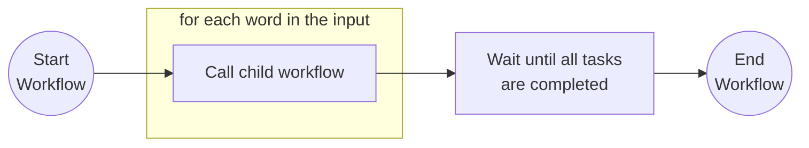
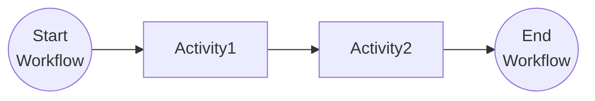

# Child Workflows

This tutorial demonstrates how a workflow can call child workflows that are part of the same application. Child workflows can be used to break up large workflows into smaller, reusable parts. For more information about child workflows see the [Dapr docs](https://docs.dapr.io/developing-applications/building-blocks/workflow/workflow-features-concepts/#child-workflows).

## Inspect the code

Open the `ParentWorkflow.cs` file in the `tutorials/workflow/csharp/child-workflows/ChildWorkflows` folder. This file contains the definition for the workflow.

The parent workflow iterates over the input array and schedules an instance of the `ChildWorkflow` for each of the input elements. The `ChildWorkflow` is a basic task-chaining workflow that contains a sequence of two activities. When all of the instances of the `ChildWorkflow` complete, then the parent workflow finishes.

### Parent workflow



### Child workflow



## Run the tutorial

1. Use a terminal to navigate to the `tutorials/workflow/csharp/child-workflows` folder.
2. Build the project using the .NET CLI.

    ```bash
    dotnet build ./ChildWorkflows/
    ```

3. Use the Dapr CLI to run the Dapr Multi-App run file

    <!-- STEP
    name: Run multi app run template
    expected_stdout_lines:
    - 'Started Dapr with app id "childworkflows"'
    expected_stderr_lines:
    working_dir: .
    output_match_mode: substring
    background: true
    sleep: 15
    timeout_seconds: 30
    -->
    ```bash
    dapr run -f .
    ```
    <!-- END_STEP -->

4. Use the POST request in the [`childworkflows.http`](./childworkflows.http) file to start the workflow.

    The input of the workflow is an array with two strings:

    ```json
    [
        "Item 1",
        "Item 2"
    ]
    ```

    The app logs should show both the items in the input values array being processed by each activity in the child workflow as follows:

    ```
== APP - childworkflows == Activity1: Received input: Item 1.
== APP - childworkflows == Activity2: Received input: Item 1 is processed.
== APP - childworkflows == Activity1: Received input: Item 2.
== APP - childworkflows == Activity2: Received input: Item 2 is processed.

5. Use the GET request in the [`childworkflows.http`](./childworkflows.http) file to get the status of the workflow.

    The expected serialized output of the workflow is an array with two strings:

    ```txt
    "[\"Item 1 is processed as a child workflow.\",\"Item 2 is processed as a child workflow.\"]"
    ```

6. Stop the Dapr Multi-App run process by pressing `Ctrl+C`.
