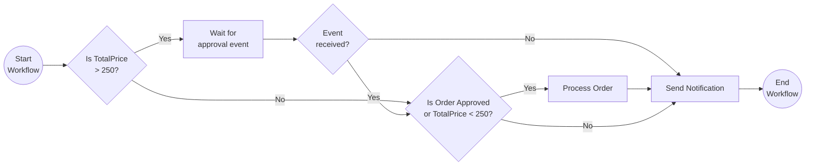

# External Events

This tutorial demonstrates how to author a workflow where the workflow will wait until it receives an external event. This pattern is often applied in workflows that require an approval step. For more information about the external system interaction pattern see the [Dapr docs](https://docs.dapr.io/developing-applications/building-blocks/workflow/workflow-patterns/#external-system-interaction).

## Inspect the code

Open the `ExternalEventsWorkflow.cs` file in the `tutorials/workflow/csharp/external-system-interaction/ExternalEvents` folder. This file contains the definition for the workflow.



## Run the tutorial

1. Use a terminal to navigate to the `tutorials/workflow/csharp/external-system-interaction` folder.
2. Build the project using the .NET CLI.

    ```bash
    dotnet build ./ExternalEvents/
    ```

3. Use the Dapr CLI to run the Dapr Multi-App run file

    ```bash
    dapr run -f .
    ```

4. Use the POST request in the [`externalevents.http`](./externalevents.http) file to start the workflow.
5. Use the GET request in the [`externalevents.http`](./externalevents.http) file to get the status of the workflow.
6. Stop the Dapr Multi-App run process by pressing `Ctrl+C`.
