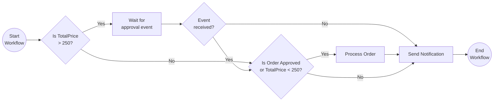

# External Events

This tutorial demonstrates how to author a workflow where the workflow will wait until it receives an external event. This pattern is often applied in workflows that require an approval step. For more information about the external system interaction pattern see the [Dapr docs](https://docs.dapr.io/developing-applications/building-blocks/workflow/workflow-patterns/#external-system-interaction).

## Inspect the code

Open the `ExternalEventsWorkflow.cs` file in the `tutorials/workflow/csharp/external-system-interaction/ExternalEvents` folder. This file contains the definition for the workflow. It is an order workflow that requests an external approval if the order has a total price greater than 250 dollars. 



## Run the tutorial

1. Use a terminal to navigate to the `tutorials/workflow/csharp/external-system-interaction` folder.
2. Build the project using the .NET CLI.

    ```bash
    dotnet build ./ExternalEvents/
    ```

3. Use the Dapr CLI to run the Dapr Multi-App run file

    <!-- STEP
    name: Run multi app run template
    expected_stdout_lines:
    - 'Started Dapr with app id "externalevents"'
    expected_stderr_lines:
    working_dir: .
    output_match_mode: substring
    background: true
    sleep: 15
    timeout_seconds: 30
    -->
    ```bash
    dapr run -f .
    ```
    <!-- END_STEP -->

4. Use the POST request in the [`externalevents.http`](./externalevents.http) file to start the workflow.

    The input for the workflow is an `Order` object:

    ```json
    {
        "id": "{{orderId}}",
        "description": "Rubber ducks",
        "quantity": 100,
        "totalPrice": 500
    }
    ```

5. Use the GET request in the [`externalevents.http`](./externalevents.http) file to get the status of the workflow.

    The workflow should still be running since it is waiting for an external event.
    
    The app logs should look similar to the following:
    
    ```
   == APP - externalevents == Received order: Order { Id = ef4c1a3b-7eb5-4fc3-90e9-3bd606044b3a, Description = Rubber ducks, Quantity = 100, TotalPrice = 500 }.
    ```

6. Use the POST request in the [`externalevents.http`](./externalevents.http) file to send an `approval-event` to the workflow.

    The payload for the event is an `ApprovalStatus` object:

    ```json
    {
        "OrderId": "{{instanceId}}",
        "IsApproved": true
    }
    ```
*The workflow will only wait for the external approval event for 2 minutes before timing out. In this case you will need to start a new order workflow instance.*

7. Again use the GET request in the [`externalevents.http`](./externalevents.http) file to get the status of the workflow. The workflow should now be completed.

    The expected serialized output of the workflow is:

    ```txt
    "\"Order 15b18587-86d6-4cb2-8496-8d60ab350a43 has been approved.\""
    ```

    *The Order ID is generated when making the request and is different each time.*

8. Stop the Dapr Multi-App run process by pressing `Ctrl+C`.
