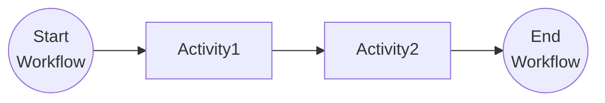

# Workflow Basics

This tutorial covers the fundamentals of authoring Dapr Workflows. For more information about the fundamentals of Dapr Workflows, see the [Dapr docs](https://docs.dapr.io/developing-applications/building-blocks/workflow/workflow-features-concepts/).

## Inspect the code

Open the `BasicWorkflow.cs` file in the `tutorials/workflow/csharp/fundamentals/Basic` folder. This file contains the definition for the workflow.

The workflow consists of two activities: `Activity1` and `Activity2`, which are called in sequence, where the result of Activity1 is used as an input for Activity2. You can find the Activity definitions in the `Activities` folder.



## Run the tutorial

1. Use a terminal to navigate to the `tutorials/workflow/csharp/fundamentals` folder.
2. Build the project using the .NET CLI.

    ```bash
    dotnet build ./Basic/
    ```

3. Use the Dapr CLI to run the Dapr Multi-App run file

    <!-- STEP
    name: Run multi app run template
    expected_stdout_lines:
    - 'Started Dapr with app id "basic"'
    expected_stderr_lines:
    working_dir: .
    output_match_mode: substring
    background: true
    sleep: 15
    timeout_seconds: 30
    -->
    ```bash
    dapr run -f .
    ```
    <!-- END_STEP -->

4. Use the POST request in the [`basics.http`](./basics.http) file to start the workflow.

The input for the workflow is a string with the value `One`. The expected app logs are as follows:

5. Use the GET request in the [`basics.http`](./basics.http) file to get the status of the workflow.

    The expected serialized output of the workflow is:

    ```txt
    "\"One Two Three\""
    ```

6. Stop the Dapr Multi-App run process by pressing `Ctrl+C`.
