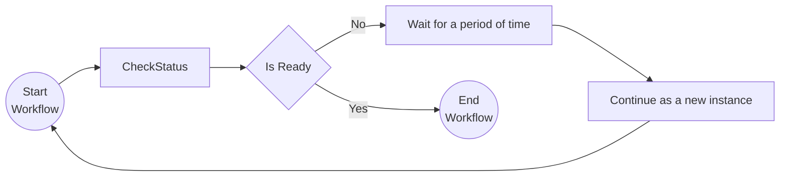

# Monitor Pattern

This tutorial demonstrates how to run a workflow in a loop. This can be used for recurring tasks that need to be executed on a certain frequency (e.g. a clean-up job that runs every hour). For more information on the monitor pattern see the [Dapr docs](https://docs.dapr.io/developing-applications/building-blocks/workflow/workflow-patterns/#monitor).

## Inspect the code

Open the `MonitorWorkflow.cs` file in the `tutorials/workflow/csharp/monitor-pattern/Monitor` folder. This file contains the definition for the workflow.



## Run the tutorial

1. Use a terminal to navigate to the `tutorials/workflow/csharp/monitor-pattern` folder.
2. Build the project using the .NET CLI.

    ```bash
    dotnet build ./Monitor/
    ```

3. Use the Dapr CLI to run the Dapr Multi-App run file

    ```bash
    dapr run -f .
    ```

4. Use the POST request in the [`monitor.http`](./monitor.http) file to start the workflow.
5. Use the GET request in the [`monitor.http`](./monitor.http) file to get the status of the workflow.
6. Stop the Dapr Multi-App run process by pressing `Ctrl+C`.
