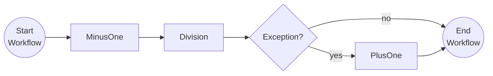

# Resiliency & Compensation

This tutorial demonstrates how to improve resiliency when activities are executed and how to include compensation actions when activities return an error.

## Inspect the code

Open the `ResiliencyAndCompensationWorkflow.cs` file in the `tutorials/workflow/csharp/resiliency-and-compensation/ResiliencyAndCompensation` folder. This file contains the definition for the workflow.



## Run the tutorial

1. Use a terminal to navigate to the `tutorials/workflow/csharp/resiliency-and-compensation` folder.
2. Build the project using the .NET CLI.

    ```bash
    dotnet build ./ResiliencyAndCompensation/
    ```

3. Use the Dapr CLI to run the Dapr Multi-App run file

    ```bash
    dapr run -f .
    ```

4. Use the POST request in the [`resiliency-compensation.http`](./resiliency-compensation.http) file to start the workflow with a workflow input value of `1`.

    When the workflow input is `1`, the `MinusOne` activity will substract `1` resulting in a `0`. This value is passed to the `Division` activity, which will throw an error because the divisor is `0`. The `Division` activity will be retried but all will fail. Finally the compensation action `PlusOne` will be executed.

    ```txt
    == APP - resiliency == MinusOne: Received input: 1.
    == APP - resiliency == Division: Received divisor: 0.
    == APP - resiliency == Division: Received divisor: 0.
    == APP - resiliency == Division: Received divisor: 0.
    == APP - resiliency == PlusOne: Received input: 0.
    ```

5. Use the GET request in the [`resiliency-compensation.http`](./resiliency-compensation.http) file to get the status of the workflow.

    Then `1` is used as the input, the expected serialized output of the workflow is:

    ```txt
    "1"
    ```

6. Stop the Dapr Multi-App run process by pressing `Ctrl+C`.
