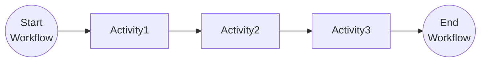

# Task Chaining Pattern

This tutorial demonstrates how to chain multiple tasks together as a sequence in a workflow. For more information about the task chaining pattern see the [Dapr docs](https://docs.dapr.io/developing-applications/building-blocks/workflow/workflow-patterns/#task-chaining).

## Inspect the code

Open the `ChainingWorkflow.cs` file in the `tutorials/workflow/csharp/task-chaining/TaskChaining` folder. This file contains the definition for the workflow.




## Run the tutorial

1. Use a terminal to navigate to the `tutorials/workflow/csharp/task-chaining` folder.
2. Build the project using the .NET CLI.

    ```bash
    dotnet build ./TaskChaining/
    ```

3. Use the Dapr CLI to run the Dapr Multi-App run file

    <!-- STEP
    name: Run multi app run template
    expected_stdout_lines:
    - 'Started Dapr with app id "chaining"'
    expected_stderr_lines:
    working_dir: .
    output_match_mode: substring
    background: true
    sleep: 15
    timeout_seconds: 30
    -->
    ```bash
    dapr run -f .
    ```
    <!-- END_STEP -->

4. Use the POST request in the [`chaining.http`](./chaining.http) file to start the workflow.

    The input for the workflow is a string with the value `This`.

5. Use the GET request in the [`chaining.http`](./chaining.http) file to get the status of the workflow.

    The expected serialized output of the workflow is:

    ```txt
    "\"This is task chaining\""
    ```

6. Stop the Dapr Multi-App run process by pressing `Ctrl+C`.
