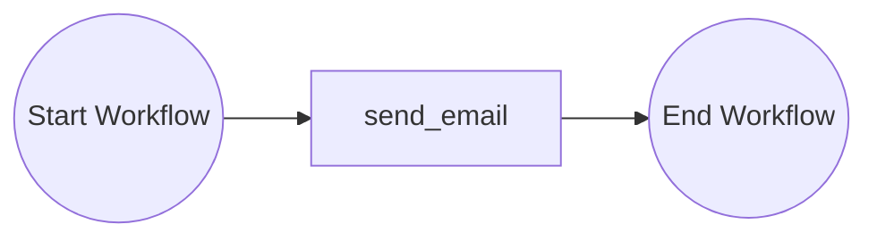
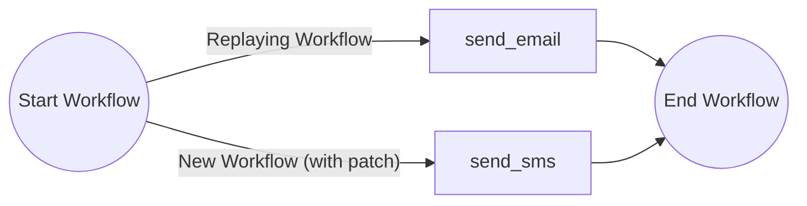
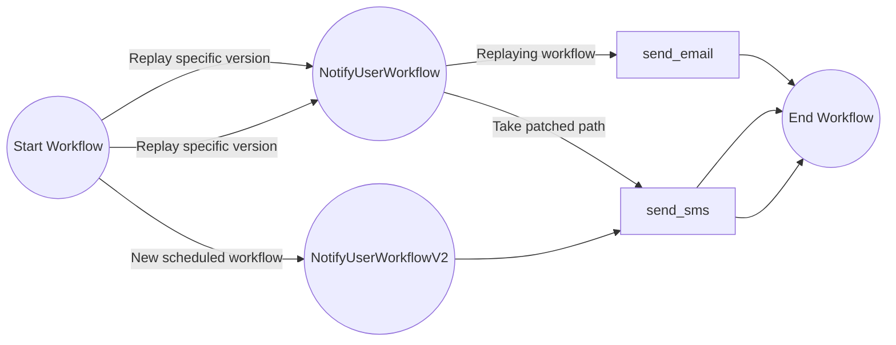

# Versioning Workflows

This tutorial demonstrates how to version your workflows. For more information about workflow versioning in general,
see the 
[Dapr docs](https://docs.dapr.io/developing-applications/building-blocks/workflow/workflow-features-concepts/#versioning) 
and to learn more about your options using the .NET SDK, refer to the [SDK docs](https://docs.dapr.io/developing-applications/sdks/dotnet/).

## Inspect the starting workflow

Open the `NotifyUserWorkflow.cs` file. This file contains a workflow that sends an email to a user:



Requirements have changed thouugh and the workflow should instead send an SMS. Uncomment lines 19 though 25 and 28 to
add a "patch" to the class named `send_sms`. If the workflow was interrupted when it last ran and is replaying, it will
again stick with the original `send_email` activity, but when a new workflow instance is run, it will take the patched
path instead and instead send an SMS.



## Inspect the new named workflow version

For larger workflow logic changes or if it becomes unwieldy to maintain a collection of patches in your workflow, 
you can introduce a new named workflow version. This gives you the opportunity to refactor your workflow to remove 
patches and introduce any additional functionality you might want in your next deployment. Here, because the .NET SDK 
supports numerical-based suffix versioning with an optional prefix, here 'V', we introduce a new workflow version named 
`NotifyUserWorkflowV2`.

It doesn't matter that we didn't have a version suffix on the original workflow because the Dotnet SDK
will automatically assume it to be an earlier version (version 0) of the workflow version family `NotifyUserWorkflow` 
and will understand that it's superceded by `NotifyUserWorkflowV2` when evaluated at runtime by the default selector. 

Uncomment the whole of `NotifyUserWorkflowV2`. When your application runs, if a workflow is already in flight 
using `NotifyUserWorkflow`, it will continue to use your original workflow class, but any new workflow executions will 
instead route to the new `NotifyUserWorkflowV2` class instead.



## Running the tutorial
1. Use a terminal to navigate to the `tutorials/workflow/csharp/versioning/Versioning` directory
2. Use the Dapr CLI to run the multi-app run file:
```bash
dapr run -f .
```
3. In a browser, navigate to `http://localhost:5087/start` to start the workflow
4. Stop the Dapr multi-app run process by pressing `Ctrl+C`.