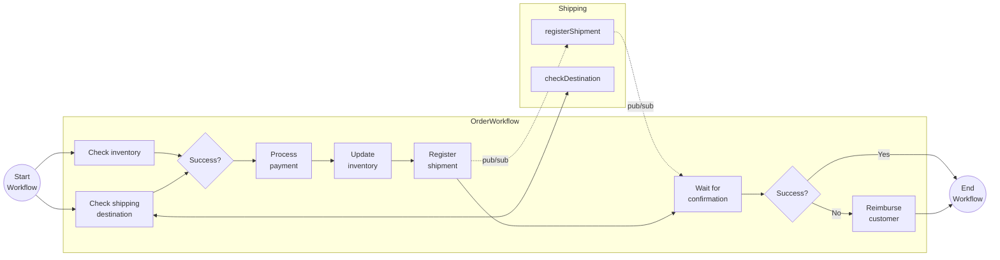

# Combined Workflow Patterns

This tutorial demonstrates how several workflow patterns can be combined in a single, more realistic, workflow. Some of the workflow activities are using other Dapr APIs, such as state management, service invocation, and Pub/Sub.

## Inspect the code

The demo consist of two applications:

- `workflow-app` is the main application that orchestrates an order process in the `OrderWorkflow`.
- `shipping-app` is a supporting service that is being called by the `OrderWorkflow`.

The `OrderWorkflow` combines task chaining, fan-out/fan-in, and waiting for external event patterns. The workflow contains a number of activities for order processing including checking inventory, register shipment, process payment and more with a final order status being returned with the results of the order. It uses compensating logic in case the shipment fails to get registered and the customer needs to be reimbursed for the payment.



## Run the tutorial

1. Use a terminal to navigate to the `tutorials/workflow/java/combined-patterns` folder.
2. Build and run the `workflow-app` project using Maven.

    ```bash
    cd workflow-app
    mvn clean -Dspring-boot.run.arguments="--reuse=true" spring-boot:test-run
    ```

3. In a separate terminal, build and run the `shipping-app` project using Maven. 

    ```bash
    cd shipping-app
    mvn clean -Dspring-boot.run.arguments="--reuse=true" spring-boot:test-run
    ```

**Note**: notice that you are using the `reuse=true` property to make sure that both applications connect to the same infrastructure instead of creating its own. This is using [Testcontainers](https://www.testcontainers.com), check the []`reuse` functionality documentation here](https://java.testcontainers.org/features/reuse/), as you might need to enable this feature. 

4. Use the POST request in the [`order-workflow.http`](./order-workflow.http) file to start the workflow, or use this cURL command:

    ```bash
    curl -i --request POST \
    --url http://localhost:8080/start \
    --header 'content-type: application/json' \
    --data '{"id": "b0d38481-5547-411e-ae7b-255761cce17a","orderItem" : {"productId": "RBD001","productName": "Rubber Duck","quantity": 10,"totalPrice": 15.00},"customerInfo" : {"id" : "Customer1","country" : "The Netherlands"}}'
    ```

    The input for the workflow is an `Order` object:

    ```json
    {
        "id": "{{orderId}}",
        "orderItem" : {
            "productId": "RBD001",
            "productName": "Rubber Duck",
            "quantity": 10,
            "totalPrice": 15.00
        },
        "customerInfo" : {
            "id" : "Customer1",
            "country" : "The Netherlands"
        }
    }
    ```

    The app logs should come from both services executing all activities as follows:

    ```text
    i.d.s.w.WorkflowAppRestController        : Received order: Order[id=b0d38481-5547-411e-ae7b-255761cce17a, orderItem=OrderItem[productId=RBD001, productName=Rubber Duck, quantity=10, totalPrice=15.00], customerInfo=CustomerInfo[id=Customer1, country=The Netherlands]]
    s.w.w.a.CheckShippingDestinationActivity : io.dapr.springboot.workflowapp.workflow.activities.CheckShippingDestinationActivity : Checking Shipping Destination for Order: b0d38481-5547-411e-ae7b-255761cce17a
    i.d.s.w.w.a.CheckInventoryActivity       : io.dapr.springboot.workflowapp.workflow.activities.CheckInventoryActivity : Received input: OrderItem[productId=RBD001, productName=Rubber Duck, quantity=10, totalPrice=15.00]
    i.d.s.w.w.a.ProcessPaymentActivity       : io.dapr.springboot.workflowapp.workflow.activities.ProcessPaymentActivity : Process Order Item Payment: OrderItem[productId=RBD001, productName=Rubber Duck, quantity=10, totalPrice=15.00]
    i.d.s.w.w.a.UpdateInventoryActivity      : io.dapr.springboot.workflowapp.workflow.activities.UpdateInventoryActivity : Received input: OrderItem[productId=RBD001, productName=Rubber Duck, quantity=10, totalPrice=15.00]
    i.d.s.w.w.a.RegisterShipmentActivity     : io.dapr.springboot.workflowapp.workflow.activities.RegisterShipmentActivity : RegisterShipmentActivity for OrderItem: Order[id=b0d38481-5547-411e-ae7b-255761cce17a, orderItem=OrderItem[productId=RBD001, productName=Rubber Duck, quantity=10, totalPrice=15.00], customerInfo=CustomerInfo[id=Customer1, country=The Netherlands]]
    i.d.s.w.WorkflowAppRestController        : Shipment registered for order ShipmentRegistrationStatus[orderId=b0d38481-5547-411e-ae7b-255761cce17a, isSuccess=true, message=]

    
    ```

5. Use the GET request in the [`order-workflow.http`](./order-workflow.http) file to get the status of the workflow, or use this cURL command:

    ```bash
    curl --request GET --url "http://localhost:8080/output?instanceId=b0d38481-5547-411e-ae7b-255761cce17a"
    ```

    The expected serialized output of the workflow is:

    ```txt
    {"isSuccess":true,"message":"Order b0d38481-5547-411e-ae7b-255761cce17a processed successfully."}
    ```

    *The Order ID is generated when making the request and is different each time.*

6. Stop both applications by pressing `Ctrl+C` in each terminal. 
