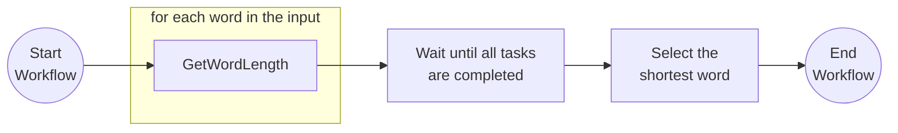

# Fan-out/Fan-in

This tutorial demonstrates how to author a workflow where multiple independent tasks can be scheduled and executed simultaneously. The workflow can either wait until all tasks are completed to proceed, or continue when the fastest task is completed. For more information about the fan-out/fan-in pattern see the [Dapr docs](https://docs.dapr.io/developing-applications/building-blocks/workflow/workflow-patterns/#fan-outfan-in).

## Inspect the code

Open the [`FanOutFanInWorkflow.java`](src/main/java/io/dapr/springboot/examples/fanoutfanin/FanOutFanInWorkflow.java) file in the `tutorials/workflow/java/fan-out-fan-in/src/main/java/io/dapr/springboot/examples/fanoutfanin` folder. This file contains the definition for the workflow.



## Run the tutorial

1. Use a terminal to navigate to the `tutorials/workflow/java/fan-out-fan-in` folder.
2. Build and run the project using Maven.

    ```bash
    mvn spring-boot:test-run
    ```

3. Use the POST request in the [`fanoutfanin.http`](./fanoutfanin.http) file to start the workflow, or use this cURL command:

    ```bash
    curl -i --request POST \
    --url http://localhost:8080/start \
    --header 'content-type: application/json' \
    --data '["which","word","is","the","shortest"]'
    ```

    The input for the workflow is an array of strings:

    ```json
    [
        "which",
        "word",
        "is",
        "the",
        "shortest"
    ]
    ```

    The expected app logs are as follows:

    ```text
    io.dapr.workflows.WorkflowContext        : Starting Workflow: io.dapr.springboot.examples.fanoutfanin.FanOutFanInWorkflow
    i.d.s.e.f.GetWordLengthActivity          : io.dapr.springboot.examples.fanoutfanin.GetWordLengthActivity : Received input: which
    i.d.s.e.f.GetWordLengthActivity          : io.dapr.springboot.examples.fanoutfanin.GetWordLengthActivity : Received input: the
    i.d.s.e.f.GetWordLengthActivity          : io.dapr.springboot.examples.fanoutfanin.GetWordLengthActivity : Received input: shortest
    i.d.s.e.f.GetWordLengthActivity          : io.dapr.springboot.examples.fanoutfanin.GetWordLengthActivity : Received input: word
    i.d.s.e.f.GetWordLengthActivity          : io.dapr.springboot.examples.fanoutfanin.GetWordLengthActivity : Received input: is
    ```

    > Note that the order of the logs may vary.

4. Use the GET request in the [`fanoutfanin.http`](./fanoutfanin.http) file to get the status of the workflow, or use this cURL command:

    ```bash
    curl --request GET --url http://localhost:8080/output
    ```

5. The expected serialized output of the workflow is an array with two strings:

    ```txt
    "["is"]"
    ```

6. Stop the application by pressing `Ctrl+C`.
