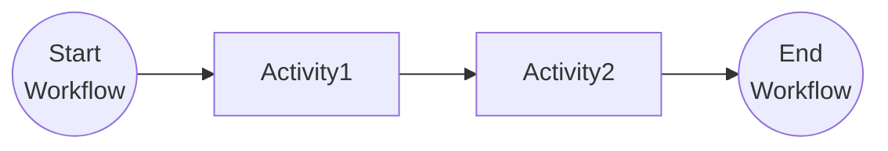

# Workflow Basics

This tutorial covers the fundamentals of authoring Dapr Workflows. For more information about the fundamentals of Dapr Workflows, see the [Dapr docs](https://docs.dapr.io/developing-applications/building-blocks/workflow/workflow-features-concepts/).

## Inspect the code

Open the [`BasicWorkflow.java`](src/main/java/io/dapr/springboot/examples/basic/BasicWorkflow.java) file in the `tutorials/workflow/java/task-chaining/src/main/java/io/dapr/springboot/examples/wfp/chain` folder. This file contains the definition for the workflow.

The workflow consists of two activities: `Activity1` and `Activity2`, which are called in sequence, where the result of Activity1 is used as an input for Activity2. You can find the Activity definitions in the `activities` folder.




## Run the tutorial

1. Use a terminal to navigate to the `tutorials/workflow/java/fundamentals` folder.
2. Build and run the project using Maven.

    ```bash
    mvn spring-boot:test-run
    ```

3. Use the POST request in the [`fundamentals.http`](./fundamentals.http) file to start the workflow, or use this cURL command:

    ```bash
    curl -i --request POST "http://localhost:8080/start?input=One"
    ```

   The input for the workflow is a string with the value `This`. The expected app logs are as follows:

    ```text
    i.d.springboot.examples.basic.Activity1  : io.dapr.springboot.examples.basic.Activity1 : Received input: One
    i.d.springboot.examples.basic.Activity2  : io.dapr.springboot.examples.basic.Activity2 : Received input: One Two
    ```

5. Use the GET request in the [`fundamentals.http`](./fundamentals.http) file to get the status of the workflow, or use this cURL command:

    ```bash
    curl --request GET --url http://localhost:8080/output
    ```
   
6. The expected serialized output of the workflow is:

    ```txt
    One Two Three
    ```

6. Stop the application by pressing `Ctrl+C`.
