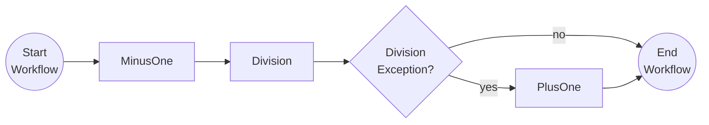

# Resiliency & Compensation

This tutorial demonstrates how to improve resiliency when activities are executed and how to include compensation actions when activities return an error. For more on workflow resiliency read the [Dapr docs](https://docs.dapr.io/developing-applications/building-blocks/workflow/workflow-features-concepts/#retry-policies).

## Inspect the code

Open the [`ResiliencyAndCompensationWorkflow.java`](src/main/java/io/dapr/springboot/examples/resiliency/ResiliencyAndCompensationWorkflow.java) file in the `tutorials/workflow/java/resiliency-and-compensation/src/main/java/io/dapr/springboot/examples/resiliency/` folder. This file contains the definition for the workflow. This workflow implements an activity retry policy on all the associated activities and compensating logic if an activity throws an exception.



## Run the tutorial

1. Use a terminal to navigate to the `tutorials/workflow/java/resiliency-and-compensation` folder.
2. Build and run the project using Maven.

    ```bash
    mvn spring-boot:test-run
    ```


3. Use the POST request in the [`resiliency-compensation.http`](./resiliency-compensation.http) file to start the workflow with a workflow input value of `1`, or use this cURL command:

    ```bash
    curl -i --request POST \
    --url http://localhost:8080/start/1
    ```

    When the workflow input is `1`, the `MinusOne` activity will subtract `1` resulting in a `0`. This value is passed to the `Division` activity, which will throw an error because the divisor is `0`. The `Division` activity will be retried three times but all will fail the same way as the divisor has not changed. Finally the compensation action `PlusOne` will be executed, increasing the value back to `1` before returning the result.
    
    The app logs should output the following:

    ```txt
   i.d.s.e.resiliency.MinusOneActivity      : io.dapr.springboot.examples.resiliency.MinusOneActivity: Received input:  1
   i.d.s.e.resiliency.DivisionActivity      : io.dapr.springboot.examples.resiliency.DivisionActivity : Received divisor: 0
   i.d.s.e.resiliency.DivisionActivity      : io.dapr.springboot.examples.resiliency.DivisionActivity : Received divisor: 0
   i.d.s.e.resiliency.DivisionActivity      : io.dapr.springboot.examples.resiliency.DivisionActivity : Received divisor: 0
   i.d.s.e.resiliency.PlusOneActivity       : io.dapr.springboot.examples.resiliency.PlusOneActivity: Received input:  0
    ```

4. Use the GET request in the [`resiliency-compensation.http`](./resiliency-compensation.http) file to get the status of the workflow, or use this cURL command:

    ```bash
    curl --request GET --url http://localhost:8080/output
    ```

    Since `1` is used as the input, the expected output of the workflow is:

    ```txt
    "1"
    ```


5. Stop the application by pressing `Ctrl+C`.
