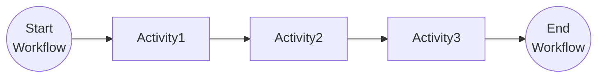

# Task Chaining Pattern

This tutorial demonstrates how to chain multiple tasks together as a sequence in a workflow. For more information about the task chaining pattern see the [Dapr docs](https://docs.dapr.io/developing-applications/building-blocks/workflow/workflow-patterns/#task-chaining).

## Inspect the code

Open the `ChainingWorkflow.java` file in the `tutorials/workflow/java/task-chaining/src/main/java/io/dapr/springboot/examples/wfp/chain` folder. This file contains the definition for the workflow.




## Run the tutorial

1. Use a terminal to navigate to the `tutorials/workflow/java/task-chaining` folder.
2. Build and run the project using Maven.

    ```bash
    mvn spring-boot:test-run
    ```

3Use the POST request in the [`chaining.http`](./chaining.http) file to start the workflow, or use this cURL command:

    ```bash
    curl -i --request POST http://localhost:8080/start
    ```

   The input for the workflow is a string with the value `This`. The expected app logs are as follows:

    ```text
    == APP - chaining == Activity1: Received input: This.
    == APP - chaining == Activity2: Received input: This is.
    == APP - chaining == Activity3: Received input: This is task.
    ```

5. Use the GET request in the [`chaining.http`](./chaining.http) file to get the status of the workflow, or use this cURL command:

    ```bash
    curl --request GET --url http://localhost:<DAPR_PORT>/v1.0/workflows/dapr/<INSTANCEID>
    ```

   Where `<INSTANCEID>` is the workflow instance ID you received in the `Location` header in the previous step.
   Where `<DAPR_PORT>` can be obtained by looking at the port mappings created by Testcontainers when running the application. 
   You can find this by running `docker ps` and looking at the port-mappings 
   ```bash
   CONTAINER ID   IMAGE                               COMMAND                  CREATED          STATUS          PORTS                                                                     NAMES
   bc19a46794e1   daprio/daprd:1.15.4                 "./daprd --app-id wo…"   48 seconds ago   Up 48 seconds   0.0.0.0:61693->3500/tcp, 0.0.0.0:61694->50001/tcp
   ```
   For this example: `61693` which was mapped to the Dapr port `3500` (`0.0.0.0:61693->3500/tcp`).
6. The expected serialized output of the workflow is:

    ```txt
    "\"This is task chaining\""
    ```

6. Stop the application by pressing `Ctrl+C`.
