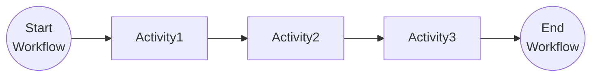

# Task Chaining Pattern

This tutorial demonstrates how to chain multiple tasks together as a sequence in a workflow. For more information about the task chaining pattern see the [Dapr docs](https://docs.dapr.io/developing-applications/building-blocks/workflow/workflow-patterns/#task-chaining).

## Inspect the code

Open the [`ChainingWorkflow.java`](src/main/java/io/dapr/springboot/examples/chain/ChainingWorkflow.java) file in the `tutorials/workflow/java/task-chaining/src/main/java/io/dapr/springboot/examples/chain` folder. This file contains the definition for the workflow.




## Run the tutorial

1. Use a terminal to navigate to the `tutorials/workflow/java/task-chaining` folder.
2. Build and run the project using Maven.

    ```bash
    mvn spring-boot:test-run
    ```

3. Use the POST request in the [`chaining.http`](./chaining.http) file to start the workflow, or use this cURL command:

    ```bash
    curl -i --request POST http://localhost:8080/start
    ```

   The input for the workflow is a string with the value `This`. The expected app logs are as follows:

    ```text
    == APP - chaining == Activity1: Received input: This.
    == APP - chaining == Activity2: Received input: This is.
    == APP - chaining == Activity3: Received input: This is task.
    ```

4. Use the GET request in the [`chaining.http`](./chaining.http) file to get the status of the workflow, or use this cURL command:

    ```bash
    curl --request GET --url http://localhost:8080/output
    ```
   
5. The expected serialized output of the workflow is:

    ```txt
    This is task chaining
    ```

6. Stop the application by pressing `Ctrl+C`.
