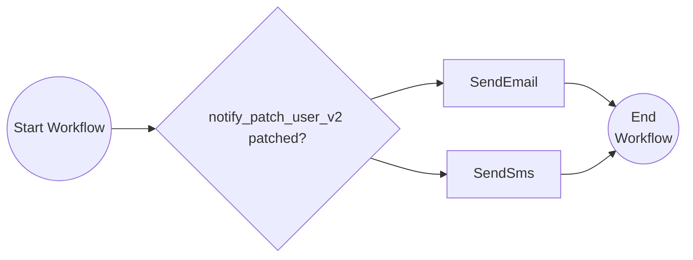
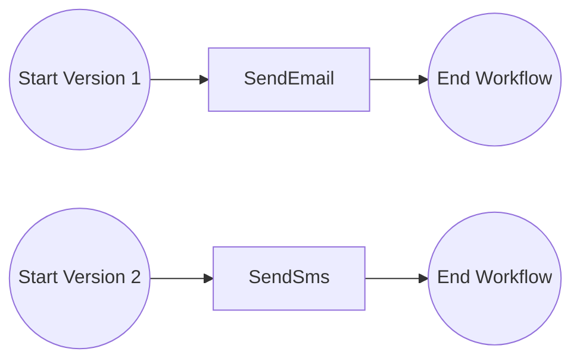

# Versioning Workflows

This tutorial demonstrates how to version your workflows. For more information about workflow versioning see the [Dapr docs](https://docs.dapr.io/developing-applications/building-blocks/workflow/workflow-features-concepts/#versioning).

## Inspect the patching workflow code

Open the `PatchedWorkflow.java` file in the `src/main/java/io/dapr/springboot/examples/versioning` folder.
This file contains the definition for the workflow.



The workflow starts by evaluating whether the `notify_patch_user_v2` patch is patched. 
If it is, the workflow will continue to the `SendSms` activity. 
If it is not, the workflow will continue to the `SendEmail` activity.

## Inspect the named versioned workflow code

Also open the `NamedWorkflow.java` file in the `src/main/java/io/dapr/springboot/examples/versioning` folder. 
This file contains the definition for the named versioned workflow.



In this case, two versions of the workflow are defined. 
The first version starts with the `SendEmail` activity and the second version starts with the `SendSms` activity.

The workflow engine will always execute the latest version of the workflow.
Older versions of the workflow will only be executed for workflows started with such version.


## Run the tutorial

1. Use a terminal to navigate to the `tutorials/workflow/java/versioning` folder.

2. Run the application using Maven with the required environment variables:

    ```bash
    WORKFLOW_PATCHED_ENABLED=false WORKFLOW_V2_ENABLED=true mvn spring-boot:test-run
    ```

## Environment Variables

The application uses environment variables to control which workflow implementations are registered:

### `WORKFLOW_V2_ENABLED`

Controls the **named versioned workflow** (`NamedWorkflow`):

| Value | Effect |
|-------|--------|
| `false` | Registers only **v1** as the latest version (uses `SendEmail` activity) |
| `true` | Registers **v1** as non-latest AND **v2** as the latest version (v2 uses `SendSms` activity) |

This simulates deploying a new version of a workflow while keeping the old version available for in-flight workflow instances.

### `WORKFLOW_PATCHED_ENABLED`

Controls the **patched workflow** (`PatchedWorkflow`):

| Value | Effect |
|-------|--------|
| `false` | Registers the **original** workflow (always calls `SendEmail`) |
| `true` | Registers the **patched** workflow (checks `ctx.isPatched()` to decide between `SendSms` or `SendEmail`) |

This demonstrates the patching pattern where a single workflow definition can handle both old and new behavior based on runtime patch detection.

## Testing the workflows

1. Use the POST request in the [`versioning.http`](./versioning.http) file to start the workflow, or use this cURL command:

    ```bash
    curl -i --request POST http://localhost:8080/start
    ```

4. Use the GET request in the [`versioning.http`](./versioning.http) file to get the output of the workflow, or use this cURL command:

    ```bash
    curl -i --request GET http://localhost:8080/output
    ```

5. For the patched workflow variant, use these commands:

    ```bash
    curl -i --request POST http://localhost:8080/start-patch
    curl -i --request GET http://localhost:8080/output-patch
    ```

6. Stop the application by pressing `Ctrl+C`.
