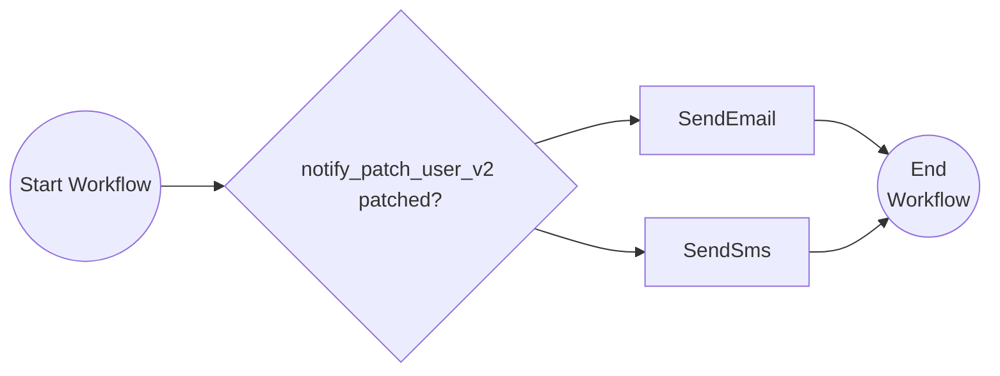
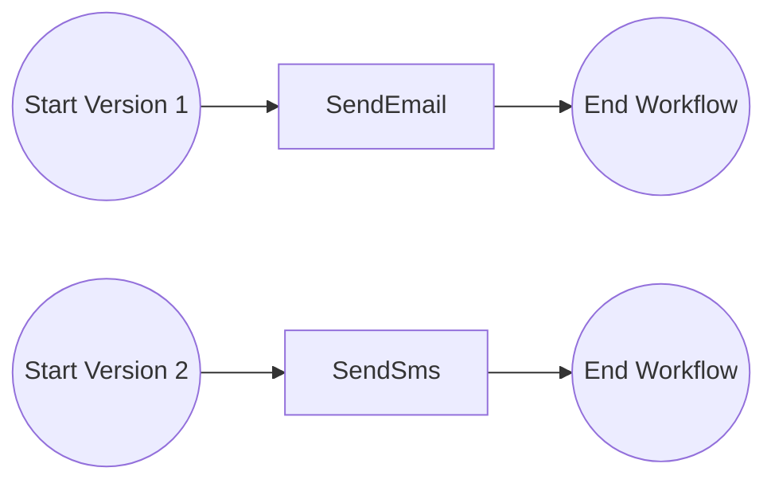

# Versioning Workflows

This tutorial demonstrates two strategies for versioning your workflows. For more information about workflow versioning, see the [Dapr docs](https://docs.dapr.io/developing-applications/building-blocks/workflow/workflow-features-concepts/#versioning).

When you need to change a workflow that already has in-flight instances, you can't simply swap out the logic — those running instances must replay their history deterministically. Dapr provides two approaches depending on how significant the change is:

1. **Patching** — for small, incremental changes. You modify the existing workflow definition in place and use `ctx.isPatched()` to branch between old and new behavior.
2. **Named versioning** — for larger changes. You register explicit named versions of the workflow side-by-side, letting the engine run old instances on the old version while new instances pick up the latest.

A common migration path is to start with patching for quick fixes, then eventually cut over to a full named version once the scope of changes warrants it.

---

## Strategy 1: Patching (for small changes)

Open the `PatchedWorkflow.java` file in `src/main/java/io/dapr/springboot/examples/versioning`.

The original workflow always sends an email. After patching, it checks `ctx.isPatched("notify_patch_user_v2")` to decide whether to send an SMS instead — without breaking any in-flight instances that were started before the patch:



- **Original** (`WORKFLOW_PATCHED_ENABLED=false`): always calls `SendEmail`.
- **Patched** (`WORKFLOW_PATCHED_ENABLED=true`): calls `SendSms` for new instances; existing instances that haven't reached the patch point yet fall through to `SendEmail`.

### Run the patched workflow

1. Navigate to the `tutorials/workflow/java/versioning` folder.

2. Start the **original** workflow (before the patch):

    ```bash
    WORKFLOW_PATCHED_ENABLED=false WORKFLOW_V2_ENABLED=false mvn spring-boot:test-run
    ```

3. Start a workflow instance and check the output:

    ```bash
    curl -i --request POST http://localhost:8080/start-patch
    curl -i --request GET http://localhost:8080/output-patch
    ```

    The output should show that `SendEmail` was called.

4. Stop the application (`Ctrl+C`), then restart with the patch applied:

    ```bash
    WORKFLOW_PATCHED_ENABLED=true WORKFLOW_V2_ENABLED=false mvn spring-boot:test-run
    ```

5. Start a new workflow instance and check the output:

    ```bash
    curl -i --request POST http://localhost:8080/start-patch
    curl -i --request GET http://localhost:8080/output-patch
    ```

    The output should now show that `SendSms` was called.

6. Stop the application (`Ctrl+C`).

---

## Strategy 2: Named versioning (for larger changes)

Once your changes grow beyond a small patch — or you want a clean separation between versions — you can register explicit named versions. Open `NamedWorkflow.java` in `src/main/java/io/dapr/springboot/examples/versioning`.

Two versions of the workflow are defined. The engine always routes new instances to the latest version, while older in-flight instances continue running on the version they were started with:



- **v1** (`WORKFLOW_V2_ENABLED=false`): only v1 is registered as the latest; uses `SendEmail`.
- **v2** (`WORKFLOW_V2_ENABLED=true`): v1 is kept for in-flight instances (non-latest), and v2 is registered as the latest; uses `SendSms`.

### Run the named versioned workflow

1. Navigate to the `tutorials/workflow/java/versioning` folder.

2. Start the application with only **v1**:

    ```bash
    WORKFLOW_PATCHED_ENABLED=false WORKFLOW_V2_ENABLED=false mvn spring-boot:test-run
    ```

3. Start a workflow instance and check the output:

    ```bash
    curl -i --request POST http://localhost:8080/start
    curl -i --request GET http://localhost:8080/output
    ```

    The output should show that `SendEmail` was called (v1 behavior).

4. Stop the application (`Ctrl+C`), then restart with **v2** enabled:

    ```bash
    WORKFLOW_PATCHED_ENABLED=false WORKFLOW_V2_ENABLED=true mvn spring-boot:test-run
    ```

5. Start a new workflow instance and check the output:

    ```bash
    curl -i --request POST http://localhost:8080/start
    curl -i --request GET http://localhost:8080/output
    ```

    The output should now show that `SendSms` was called (v2 behavior).

6. Stop the application (`Ctrl+C`).

---

## Environment Variables Reference

| Variable | Value | Effect |
|----------|-------|--------|
| `WORKFLOW_PATCHED_ENABLED` | `false` | Registers the **original** patched workflow (`SendEmail` always) |
| `WORKFLOW_PATCHED_ENABLED` | `true` | Registers the **patched** workflow (`ctx.isPatched()` decides `SendSms` vs `SendEmail`) |
| `WORKFLOW_V2_ENABLED` | `false` | Registers only **v1** as latest (`SendEmail`) |
| `WORKFLOW_V2_ENABLED` | `true` | Registers **v1** as non-latest and **v2** as latest (`SendSms`) |
