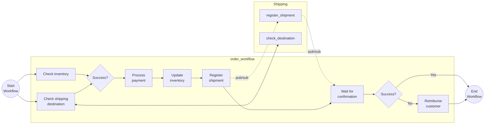

# Combined Workflow Patterns

This tutorial demonstrates how several workflow patterns can be combined in a single, more realistic, workflow. Some of the workflow activities are using other Dapr APIs, such as state management, service invocation, and Pub/Sub.

## Inspect the code

The demo consist of two applications:

- `workflow_app` is the main application that orchestrates an order process in the `order_workflow`.
- `shipping_app` is a supporting service that is being called by the `order_workflow`.

The `order_workflow` combines task chaining, fan-out/fan-in, and waiting for external event patterns. The workflow contains a number of activities for order processing including checking inventory, register shipment, process payment and more with a final order status being returned with the results of the order. It uses compensating logic in case the shipment fails to get registered and the customer needs to be reimbursed for the payment.



## Run the tutorial

1. Use a terminal to navigate to the `tutorials/workflow/python/combined-patterns` folder.
2. Install the dependencies using pip:

    ```bash
    cd workflow_app
    pip3 install -r requirements.txt
    cd ..
    cd shipping_app
    pip3 install -r requirements.txt
    cd ..
    ```

3. Use the Dapr CLI to run the Dapr Multi-App run file. This starts both applications `order-workflow` and `shipping` with the Dapr components in the [resources](./resources) folder.

    <!-- STEP
    name: Run multi app run template
    expected_stdout_lines:
    - 'Started Dapr with app id "order-workflow"'
    - 'Started Dapr with app id "shipping"'
    expected_stderr_lines:
    working_dir: .
    output_match_mode: substring
    background: true
    sleep: 15
    timeout_seconds: 30
    -->
    ```bash
    dapr run -f .
    ```
    <!-- END_STEP -->

4. Use the POST request in the [`order-workflow.http`](./order-workflow.http) file to start the workflow, or use this cURL command:

    ```bash
    curl -i --request POST \
    --url http://localhost:5260/start \
    --header 'content-type: application/json' \
    --data '{"id": "b0d38481-5547-411e-ae7b-255761cce17a","order_item" : {"product_id": "RBD001","product_name": "Rubber Duck","quantity": 10,"total_price": 15.00},"customer_info" : {"id" : "Customer1","country" : "The Netherlands"}}'
    ```

    The input for the workflow is an `Order` object:

    ```json
    {
        "id": "b0d38481-5547-411e-ae7b-255761cce17a",
        "order_item" : {
            "product_id": "RBD001",
            "product_name": "Rubber Duck",
            "quantity": 10,
            "total_price": 15.00
        },
        "customer_info" : {
            "id" : "Customer1",
            "country" : "The Netherlands"
        }
    }
    ```

    The app logs should come from both services executing all activities as follows:

    ```text
    == APP - order-workflow == start: Received input: id='b0d38481-5547-411e-ae7b-255761cce17a' order_item=OrderItem(product_id='RBD001', product_name='Rubber Duck', quantity=10, total_price=15.0) customer_info=CustomerInfo(id='Customer1', country='The Netherlands')
    == APP - order-workflow == order_workflow: Received order id: b0d38481-5547-411e-ae7b-255761cce17a.
    == APP - order-workflow == check_shipping_destination: Received input: id='Customer1' country='The Netherlands'.
    == APP - order-workflow == check_inventory: Received input: product_id='RBD001' product_name='Rubber Duck' quantity=10 total_price=15.0.
    == APP - order-workflow == get_inventory_item: product_id='RBD001' product_name='Rubber Duck' quantity=50
    == APP - shipping == checkDestination: Received input: id='Customer1' country='The Netherlands'.
    == APP - order-workflow == process_payment: Received input: id='b0d38481-5547-411e-ae7b-255761cce17a' order_item=OrderItem(product_id='RBD001', product_name='Rubber Duck', quantity=10, total_price=15.0) customer_info=CustomerInfo(id='Customer1', country='The Netherlands').
    == APP - order-workflow == order_workflow: Payment result: is_success=True.
    == APP - order-workflow == update_inventory: Received input: product_id='RBD001' product_name='Rubber Duck' quantity=10 total_price=15.0.
    == APP - order-workflow == get_inventory_item: product_id='RBD001' product_name='Rubber Duck' quantity=50
    == APP - order-workflow == register_shipment: Received input: id='b0d38481-5547-411e-ae7b-255761cce17a' order_item=OrderItem(product_id='RBD001', product_name='Rubber Duck', quantity=10, total_price=15.0) customer_info=CustomerInfo(id='Customer1', country='The Netherlands').
    == APP - shipping == registerShipment: Received input: id='b0d38481-5547-411e-ae7b-255761cce17a' order_item=OrderItem(product_id='RBD001', product_name='Rubber Duck', quantity=10, total_price=15.0) customer_info=CustomerInfo(id='Customer1', country='The Netherlands').
    == APP - order-workflow == shipmentRegistered: Received input: order_id='b0d38481-5547-411e-ae7b-255761cce17a' is_success=True message=None.
    ```

5. Use the GET request in the [`order-workflow.http`](./order-workflow.http) file to get the status of the workflow, or use this cURL command:

    ```bash
    curl --request GET --url http://localhost:3560/v1.0/workflows/dapr/b0d38481-5547-411e-ae7b-255761cce17a
    ```

    The expected serialized output of the workflow is:

    ```txt
    {\"is_success\":true,\"message\":\"Order b0d38481-5547-411e-ae7b-255761cce17a processed successfully.\"}"
    ```

    *If the order-workflow.http is used, the order_id is generated when making the request and is different each time.*

6. Stop the Dapr Multi-App run process by pressing `Ctrl+C`.
