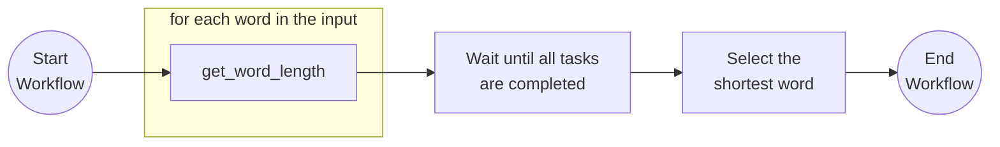

# Fan-out/Fan-in

This tutorial demonstrates how to author a workflow where multiple independent tasks can be scheduled and executed simultaneously. The workflow can either wait until all tasks are completed to proceed, or continue when the fastest task is completed. For more information about the fan-out/fan-in pattern see the [Dapr docs](https://docs.dapr.io/developing-applications/building-blocks/workflow/workflow-patterns/#fan-outfan-in).

## Inspect the code

Open the `fanoutfanin_workflow.py` file in the `tutorials/workflow/python/fan-out-fan-in/fan_out_fan_in` folder. This file contains the definition for the workflow.



## Run the tutorial

1. Use a terminal to navigate to the `tutorials/workflow/python/fan-out-fan-in/fan_out_fan_in` folder.
2. Install the dependencies using pip:

    ```bash
    pip3 install -r requirements.txt
    ```

3. Navigate back one level to the `fan-out-fan-in` folder and use the Dapr CLI to run the Dapr Multi-App run file

    <!-- STEP
    name: Run multi app run template
    expected_stdout_lines:
    - 'Started Dapr with app id "fanoutfanin"'
    expected_stderr_lines:
    working_dir: .
    output_match_mode: substring
    background: true
    sleep: 15
    timeout_seconds: 30
    -->
    ```bash
    dapr run -f .
    ```
    <!-- END_STEP -->

4. Use the POST request in the [`fanoutfanin.http`](./fanoutfanin.http) file to start the workflow, or use this cURL command:

    ```bash
    curl -i --request POST \
    --url http://localhost:5256/start \
    --header 'content-type: application/json' \
    --data '["which","word","is","the","shortest"]'
    ```

    The input for the workflow is an array of strings:

    ```json
    [
        "which",
        "word",
        "is",
        "the",
        "shortest"
    ]
    ```

    The expected app logs are as follows:

    ```text
    == APP - fanoutfanin == get_word_length: Received input: word.
    == APP - fanoutfanin == get_word_length: Received input: is.
    == APP - fanoutfanin == get_word_length: Received input: the.
    == APP - fanoutfanin == get_word_length: Received input: shortest.
    == APP - fanoutfanin == get_word_length: Received input: which.
    ```

    > Note that the order of the logs may vary.

5. Use the GET request in the [`fanoutfanin.http`](./fanoutfanin.http) file to get the status of the workflow, or use this cURL command:

    ```bash
    curl --request GET --url http://localhost:3556/v1.0/workflows/dapr/<INSTANCEID>
    ```

    Where `<INSTANCEID>` is the workflow instance ID you received in the `instance_id` property in the previous step.

    The expected serialized output of the workflow is:

    ```txt
    "\"is\""
    ```

6. Stop the Dapr Multi-App run process by pressing `Ctrl+C`.
