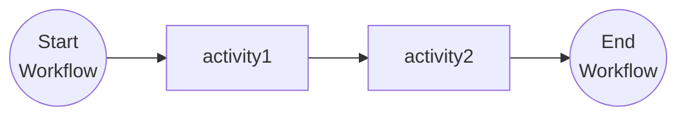

# Workflow Basics

This tutorial covers the fundamentals of authoring Dapr Workflows. For more information about the fundamentals of Dapr Workflows, see the [Dapr docs](https://docs.dapr.io/developing-applications/building-blocks/workflow/workflow-features-concepts/).

## Inspect the code

Open the `basic_workflow.py` file in the `tutorials/workflow/python/fundamentals/basic` folder. This file contains the definition for the workflow.

The workflow consists of two activities: `activity1` and `activity2`, which are called in sequence, where the result of `activity1` is used as an input for `activity2`. You can find the activity definitions below the workflow definition.



## Run the tutorial

1. Use a terminal to navigate to the `tutorials/workflow/python/fundamentals/basics` folder.
2. Install the dependencies using pip:

    ```bash
    pip3 install -r requirements.txt
    ```

3. Navigate one level back to the `fundamentals` folder and use the Dapr CLI to run the Dapr Multi-App run file

    <!-- STEP
    name: Run multi app run template
    expected_stdout_lines:
    - 'Started Dapr with app id "basic"'
    expected_stderr_lines:
    working_dir: .
    output_match_mode: substring
    background: true
    sleep: 15
    timeout_seconds: 30
    -->
    ```bash
    dapr run -f .
    ```
    <!-- END_STEP -->

4. Use the POST request in the [`fundamentals.http`](./fundamentals.http) file to start the workflow, or use this cURL command:

    ```bash
    curl -i --request POST http://localhost:5254/start/One
    ```

    Note the `instance_id` property in the response. This property contains the workflow instance ID. You can use this ID to get the status of the workflow instance you just started.

    The input for the workflow is a string with the value `One`. The expected app logs are as follows:

    ```text
    == APP - basic == activity1: Received input: One.
    == APP - basic == activity2: Received input: One Two.
    ```

5. Use the GET request in the [`fundamentals.http`](./fundamentals.http) file to get the status of the workflow, or use this cURL command:

    ```bash
    curl --request GET --url http://localhost:3554/v1.0/workflows/dapr/<INSTANCEID>
    ```

    Where `<INSTANCEID>` is the workflow instance ID you received in the `instance_id` property in the previous step.

    The expected serialized output of the workflow is:

    ```txt
    "\"One Two Three\""
    ```

6. Stop the Dapr Multi-App run process by pressing `Ctrl+C`.
