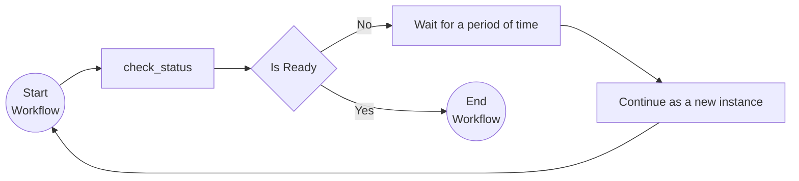

# Monitor Pattern

This tutorial demonstrates how to run a workflow in a loop. This can be used for recurring tasks that need to be executed on a certain frequency (e.g. a clean-up job that runs every hour). For more information on the monitor pattern see the [Dapr docs](https://docs.dapr.io/developing-applications/building-blocks/workflow/workflow-patterns/#monitor).

## Inspect the code

Open the `monitor_workflow.py` file in the `tutorials/workflow/python/monitor-pattern/monitor` folder. This file contains the definition for the workflow that calls the `check_status` activity to checks to see if a fictional resource is ready.  The `check_status` activity uses a random number generator to simulate the status of the resource. If the status is not ready, the workflow will wait for one second and is continued as a new instance.



## Run the tutorial

1. Use a terminal to navigate to the `tutorials/workflow/python/monitor-pattern/monitor` folder.
2. Install the dependencies using pip:

    ```bash
    pip3 install -r requirements.txt
    ```

3. Navigate one level up to the `monitor-pattern` folder and use the Dapr CLI to run the Dapr Multi-App run file

    <!-- STEP
    name: Run multi app run template
    expected_stdout_lines:
    - 'Started Dapr with app id "monitor"'
    expected_stderr_lines:
    working_dir: .
    output_match_mode: substring
    background: true
    sleep: 15
    timeout_seconds: 30
    -->
    ```bash
    dapr run -f .
    ```
    <!-- END_STEP -->

4. Use the POST request in the [`monitor.http`](./monitor.http) file to start the workflow, or use this cURL command:

    ```bash
    curl -i --request POST http://localhost:5257/start/0
    ```

    The input for the workflow is an integer with the value `0`.

    The expected app logs are as follows:

    ```text
    == APP - monitor == CheckStatus: Received input: 0.
    == APP - monitor == CheckStatus: Received input: 1.
    == APP - monitor == CheckStatus: Received input: 2.
    == APP - monitor == CheckStatus: Received input: 3.
    ```

    *Note that the number of app log statements can vary due to the randomization in the `CheckStatus` activity.*

5. Use the GET request in the [`monitor.http`](./monitor.http) file to get the status of the workflow, or use this cURL command:

    ```bash
    curl --request GET --url http://localhost:3557/v1.0/workflows/dapr/<INSTANCEID>
    ```

    Where `<INSTANCEID>` is the workflow instance ID you received in the `Location` header in the previous step.

    The expected serialized output of the workflow is:

    ```txt
    "\"Status is healthy after checking 3 times.\""
    ```

    *The actual number of checks can vary since some randomization is used in the `CheckStatus` activity.*

6. Stop the Dapr Multi-App run process by pressing `Ctrl+C`.
