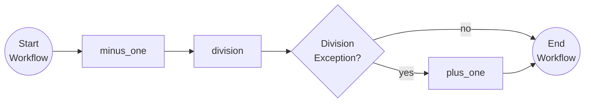

# Resiliency & Compensation

This tutorial demonstrates how to improve resiliency when activities are executed and how to include compensation actions when activities return an error. For more on workflow resiliency read the [Dapr docs](https://docs.dapr.io/developing-applications/building-blocks/workflow/workflow-features-concepts/#retry-policies).

## Inspect the code

Open the `resiliency_and_compensation_workflow.py` file in the `tutorials/workflow/python/resiliency-and-compensation/resiliency_and_compensation` folder. This file contains the definition for the workflow. This workflow implements an activity retry policy on all the associated activities and compensating logic if an activity throws an exception.



## Run the tutorial

1. Use a terminal to navigate to the `tutorials/workflow/python/resiliency-and-compensation/resiliency_and_compensation` folder.
2. Install the dependencies using pip:

    ```bash
    pip3 install -r requirements.txt
    ```

3. Navigate one folder back to `resiliency-and-compensation` and use the Dapr CLI to run the Dapr Multi-App run file

    <!-- STEP
    name: Run multi app run template
    expected_stdout_lines:
    - 'Started Dapr with app id "resiliency"'
    expected_stderr_lines:
    working_dir: .
    output_match_mode: substring
    background: true
    sleep: 15
    timeout_seconds: 30
    -->
    ```bash
    dapr run -f .
    ```
    <!-- END_STEP -->

4. Use the POST request in the [`resiliency-compensation.http`](./resiliency-compensation.http) file to start the workflow with a workflow input value of `1`, or use this cURL command:

    ```bash
    curl -i --request POST \
    --url http://localhost:5264/start/1
    ```

    When the workflow input is `1`, the `minus_one` activity will subtract `1` resulting in a `0`. This value is passed to the `division` activity, which will throw an error because the divisor is `0`. The `division` activity will be retried three times but all will fail the same way as the divisor has not changed. Finally the compensation action `plus_one` will be executed, increasing the value back to `1` before returning the result.

    The app logs should output the following:

    ```txt
    == APP - resiliency == minus_one: Received input: 1.
    == APP - resiliency == division: Received divisor: 0.
    == APP - resiliency == division: Received divisor: 0.
    == APP - resiliency == division: Received divisor: 0.
    == APP - resiliency == plus_one: Received input: 0.
    ```

5. Use the GET request in the [`resiliency-compensation.http`](./resiliency-compensation.http) file to get the status of the workflow, or use this cURL command:

    ```bash
    curl --request GET --url http://localhost:3564/v1.0/workflows/dapr/<INSTANCEID>
    ```

    Where `<INSTANCEID>` is the workflow instance ID you received in the `instance_id` property in the previous step.

    Since `1` is used as the input, the expected serialized output of the workflow is:

    ```txt
    "1"
    ```

    The expected serialized custom status field of the workflow output is:

    ```txt
    "\"Compensated minus_one activity with plus_one activity.\""
    ```

6. Stop the Dapr Multi-App run process by pressing `Ctrl+C`.
