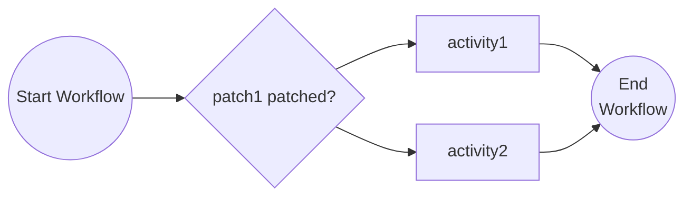
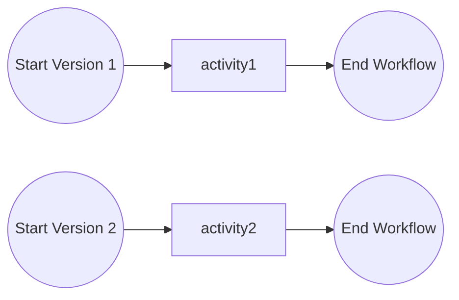

# Versioning Workflows

This tutorial demonstrates how to version your workflows. For more information about workflow versioning see the [Dapr docs](https://docs.dapr.io/developing-applications/building-blocks/workflow/workflow-features-concepts/#versioning).

## Inspect the patching workflow code

Open the `patching_workflow.py` file in the `tutorials/workflow/python/versioning/versioning` folder. This file contains the definition for the workflow.



The workflow starts by evaluating whether the `patch1` patch is patched. If it is, the workflow will continue to the `activity1` activity. If it is not, the workflow will continue to the `activity2` activity.

## Inspect the named versioned workflow code

Also open the `named_versioned_workflow.py` file in the `tutorials/workflow/python/versioning/versioning` folder. This file contains the definition for the named versioned workflow.



In this case, two versions of the workflow are defined. The first version starts with the `activity1` activity and the second version starts with the `activity2` activity.

The wokflow engine will always execute the latest version of the workflow. Older versions of the workflow will be only executed for workflows that were started with such version.


## Run the tutorial

1. Use a terminal to navigate to the `tutorials/workflow/python/versioning/versioning` folder.
2. Install the dependencies using pip:

    ```bash
    pip3 install -r requirements.txt
    ```

3. Navigate back one level to the `versioning` folder and use the Dapr CLI to run the Dapr Multi-App run file

    <!-- STEP
    name: Run multi app run template
    expected_stdout_lines:
    - 'Started Dapr with app id "versioning"'
    expected_stderr_lines:
    working_dir: .
    output_match_mode: substring
    background: true
    sleep: 15
    timeout_seconds: 30
    -->
    ```bash
    dapr run -f .
    ```
    <!-- END_STEP -->

4. Use the POST request in the [`versioning.http`](./versioning.http) file to start the workflow, or use this cURL command:

    ```bash
    curl -i --request POST http://localhost:5263/start
    ```

    The input for the workflow is a string with the value `This`. The expected app logs are as follows:

    ```text
    == APP - versioning == activity1: Received input: This.
    == APP - versioning == activity2: Received input: This is.
    == APP - versioning == activity3: Received input: This is task.
    ```

5. Use the GET request in the [`versioning.http`](./versioning.http) file to get the status of the workflow, or use this cURL command:

    ```bash
    curl --request GET --url http://localhost:3561/v1.0/workflows/dapr/<INSTANCEID>
    ```

    Where `<INSTANCEID>` is the workflow instance ID you received in the `instance_id` property in the previous step.

    The expected serialized output of the workflow is:

    ```txt
    "\"This is task versioning\""
    ```

6. Stop the Dapr Multi-App run process by pressing `Ctrl+C`.
