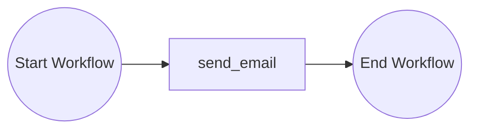
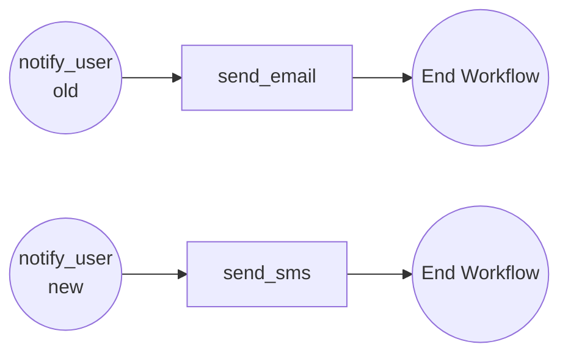
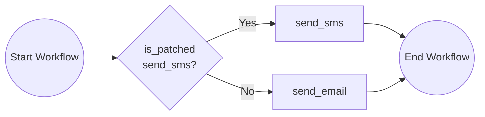

# Versioning Workflows

This tutorial demonstrates how to version your workflows. For more information about workflow versioning see the [Dapr docs](https://docs.dapr.io/developing-applications/building-blocks/workflow/workflow-features-concepts/#versioning).

This tutorial uses a scenario where a `notify_user` workflow initially sends an email to users. The workflow is then updated to send an SMS instead. Two versioning strategies are demonstrated: **named versions** and **patching**.

## Inspect the original workflow

Open the `before.py` file in the `tutorials/workflow/python/versioning/versioning` folder. This file contains the original workflow definition that sends an email to notify a user.



## Inspect the named versioned workflow

Review the `after_named_version.py` file. This file shows how to create a new workflow version using named versions. A new version of the workflow (`notify_user_new`) is created that calls the `send_sms` activity, while the original version is kept as `notify_user` for any workflow instances that might already be running.



The workflow engine will always execute the latest version of the workflow when new instances are started. Older versions will only be executed for workflows that were already in-flight when the update was deployed.

## Inspect the patching workflow

Review the `after_patching.py` file. This file shows how to create a new workflow version using patching. The `ctx.is_patched("send_sms")` check determines whether the workflow should execute the new `send_sms` activity or the original `send_email` activity based on if the patch `send_sms` is applied.



New workflow instances will execute the patched code path (`send_sms`) since the workflow has already had a patch applied, while already started, in-flight workflows will continue using the original code path (`send_email`).

## Run the tutorial

1. Use a terminal to navigate to the `tutorials/workflow/python/versioning/versioning` folder.
2. Install the dependencies using pip:

    ```bash
    pip3 install -r requirements.txt
    ```

3. Navigate back one level to the `versioning` folder. By default, the `dapr.yaml` file is set to run `before.py`:

    ```yaml
    command: ["python3", "before.py"]
    ```

   To try a versioned workflow, change the `command` field in this file to one of the following, depending on which version you'd like to run:

    - For the named version example (`after_named_version.py`):
      ```yaml
      command: ["python3", "after_named_version.py"]
      ```
    - For the patching version example (`after_patching.py`):
      ```yaml
      command: ["python3", "after_patching.py"]
      ```

   Make sure to save the file after making your changes.

4. Use the Dapr CLI to run the application:

    ```bash
    dapr run -f .
    ```

5. Use the POST request in the [`versioning.http`](./versioning.http) file to start the workflow, or use this cURL command:

    ```bash
    curl -i --request POST http://localhost:5263/start
    ```

    When running `before.py`, the expected app logs are:

    ```text
    send_email: Received input: user_id.
    ```

    When running `after_named_version.py` or `after_patching.py`, the expected app logs change from `send_email` to `send_sms` and are:

    ```text
    send_sms: Received input: user_id.
    ```

6. Use the GET request in the [`versioning.http`](./versioning.http) file to get the status of the workflow, or use this cURL command:

    ```bash
    curl --request GET --url http://localhost:3561/v1.0/workflows/dapr/<INSTANCEID>
    ```

    Where `<INSTANCEID>` is the workflow instance ID you received in the `instance_id` property in the previous step.

7. Stop the Dapr Multi-App run process by pressing `Ctrl+C`.
