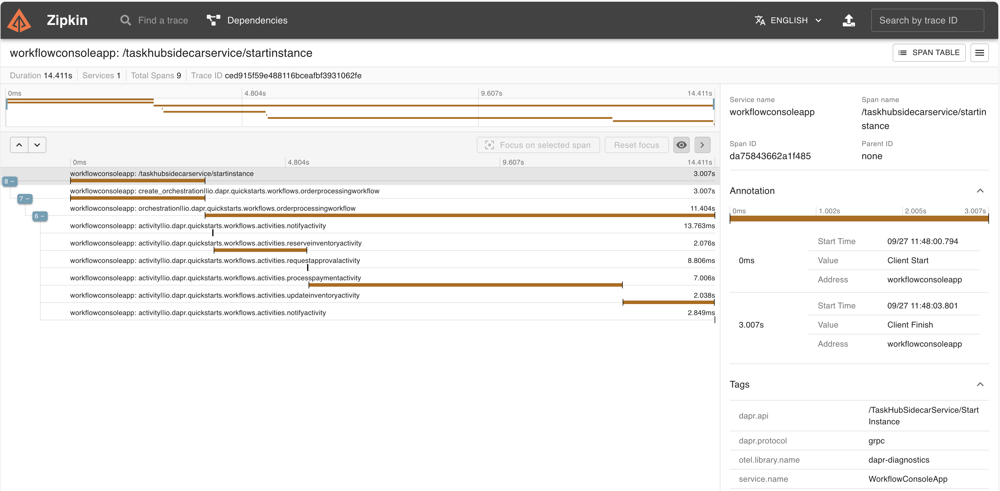

# Dapr workflows

In this quickstart, you'll create a simple console application to demonstrate Dapr's workflow programming model and saga pattern support. The console app starts and manages the lifecycle of a workflow that stores and retrieves data in a state store.

This quickstart includes one project:

- Java console app `order-processor-saga` 

The quickstart contains 1 workflow to simulate purchasing items from a store, and 6 unique activities within the workflow. These 6 activities are as follows:

- NotifyActivity: This activity utilizes a logger to print out messages throughout the workflow. These messages notify the user when there is insufficient inventory, their payment couldn't be processed, and more.
- ReserveInventoryActivity: This activity checks the state store to ensure that there is enough inventory present for purchase.
- RequestApprovalActivity: This activity requests approval for orders over a certain threshold
- ProcessPaymentActivity: This activity is responsible for processing and authorizing the payment.
- UpdateInventoryActivity: This activity updates the state store with the new remaining inventory value.
- DistributionActivity: This activity starts the distribution. In this quickstart, it will allways be failed to trigger saga compensation.

### Run the order processor workflow with multi-app-run

1. Open a new terminal window and navigate to `order-processor` directory: 

<!-- STEP
name: Install Java dependencies
-->

```bash
cd ./order-processor-saga
mvn clean install
cd ..
```

<!-- END_STEP -->
2. Run the console app with Dapr: 

<!-- STEP
name: Run order-processor service
expected_stdout_lines:
  - 'Compensated inventory for order'
  - '== APP - SagaConsoleApp == there are now 100 cars left in stock'
  - 'Compensated payment for request ID'
  - '== APP - SagaConsoleApp == workflow instance completed'
expected_stderr_lines:
output_match_mode: substring
background: true
sleep: 15
timeout_seconds: 120
-->
    
```bash
dapr run -f .
```

<!-- END_STEP -->

3. Expected output


```
== APP - SagaConsoleApp == *** Welcome to the Dapr saga console app sample!
== APP - SagaConsoleApp == *** Using this app, you can place orders that start workflows.
== APP - SagaConsoleApp == Start workflow runtime
== APP - SagaConsoleApp == Oct 24, 2023 7:00:56 AM com.microsoft.durabletask.DurableTaskGrpcWorker startAndBlock
== APP - SagaConsoleApp == INFO: Durable Task worker is connecting to sidecar at 127.0.0.1:33907.
== APP - SagaConsoleApp == ==========Begin the purchase of item:==========
== APP - SagaConsoleApp == Starting order workflow, purchasing 10 of cars
== APP - SagaConsoleApp == scheduled new workflow instance of OrderProcessingWorkflow with instance ID: 48a551c1-a8ac-4622-ab28-ae89647066f3
== APP - SagaConsoleApp == [Thread-0] INFO io.dapr.workflows.WorkflowContext - Starting Workflow: io.dapr.quickstarts.saga.OrderProcessingWorkflow
== APP - SagaConsoleApp == [Thread-0] INFO io.dapr.workflows.WorkflowContext - Instance ID(order ID): 48a551c1-a8ac-4622-ab28-ae89647066f3
== APP - SagaConsoleApp == [Thread-0] INFO io.dapr.workflows.WorkflowContext - Current Orchestration Time: 2023-10-24T07:01:00.264Z
== APP - SagaConsoleApp == [Thread-0] INFO io.dapr.workflows.WorkflowContext - Received Order: OrderPayload [itemName=cars, totalCost=150000, quantity=10]
== APP - SagaConsoleApp == [Thread-0] INFO io.dapr.quickstarts.saga.activities.NotifyActivity - Received Order: OrderPayload [itemName=cars, totalCost=150000, quantity=10]
== APP - SagaConsoleApp == workflow instance 48a551c1-a8ac-4622-ab28-ae89647066f3 started
== APP - SagaConsoleApp == [Thread-0] INFO io.dapr.quickstarts.saga.activities.ReserveInventoryActivity - Reserving inventory for order '48a551c1-a8ac-4622-ab28-ae89647066f3' of 10 cars
== APP - SagaConsoleApp == [Thread-0] INFO io.dapr.quickstarts.saga.activities.ReserveInventoryActivity - There are 100 cars available for purchase
== APP - SagaConsoleApp == [Thread-0] INFO io.dapr.quickstarts.saga.activities.ReserveInventoryActivity - Reserved inventory for order '48a551c1-a8ac-4622-ab28-ae89647066f3' of 10 cars
== APP - SagaConsoleApp == [Thread-0] INFO io.dapr.quickstarts.saga.activities.RequestApprovalActivity - Requesting approval for order: OrderPayload [itemName=cars, totalCost=150000, quantity=10]
== APP - SagaConsoleApp == [Thread-0] INFO io.dapr.quickstarts.saga.activities.RequestApprovalActivity - Approved requesting approval for order: OrderPayload [itemName=cars, totalCost=150000, quantity=10]
== APP - SagaConsoleApp == [Thread-0] INFO io.dapr.quickstarts.saga.activities.ProcessPaymentActivity - Processing payment: 48a551c1-a8ac-4622-ab28-ae89647066f3 for 10 cars at $150000
== APP - SagaConsoleApp == [Thread-0] INFO io.dapr.quickstarts.saga.activities.ProcessPaymentActivity - Payment for request ID '48a551c1-a8ac-4622-ab28-ae89647066f3' processed successfully
== APP - SagaConsoleApp == [Thread-0] INFO io.dapr.quickstarts.saga.activities.UpdateInventoryActivity - Updating inventory for order '48a551c1-a8ac-4622-ab28-ae89647066f3' of 10 cars
== APP - SagaConsoleApp == [Thread-0] INFO io.dapr.quickstarts.saga.activities.UpdateInventoryActivity - Updated inventory for order '48a551c1-a8ac-4622-ab28-ae89647066f3': there are now 90 cars left in stock
== APP - SagaConsoleApp == there are now 90 cars left in stock
== APP - SagaConsoleApp == [Thread-0] INFO io.dapr.quickstarts.saga.activities.UpdateInventoryActivity - Compensating inventory for order '48a551c1-a8ac-4622-ab28-ae89647066f3' of 10 cars
== APP - SagaConsoleApp == [Thread-0] INFO io.dapr.quickstarts.saga.activities.UpdateInventoryActivity - Compensated inventory for order '48a551c1-a8ac-4622-ab28-ae89647066f3': there are now 100 cars left in stock
== APP - SagaConsoleApp == there are now 100 cars left in stock
== APP - SagaConsoleApp == [Thread-0] INFO io.dapr.quickstarts.saga.activities.ProcessPaymentActivity - Compensating payment for request ID '48a551c1-a8ac-4622-ab28-ae89647066f3' at $150000
== APP - SagaConsoleApp == workflow instance completed, out is: {"processed":false,"compensated":true}
```

### View workflow output with Zipkin

For a more detailed view of the workflow activities (duration, progress etc.), try using Zipkin.

1. Launch Zipkin container - The [openzipkin/zipkin](https://hub.docker.com/r/openzipkin/zipkin/) docker container is launched on running `dapr init`. Check to make sure the container is running. If it's not, launch the Zipkin docker container with the following command.

```bash
docker run -d -p 9411:9411 openzipkin/zipkin
```

2. View Traces in Zipkin UI - In your browser go to http://localhost:9411 to view the workflow trace spans in the Zipkin web UI. The order-processor workflow should be viewable with the following output in the Zipkin web UI. 



### What happened? 

When you ran `dapr run --app-id WorkflowConsoleApp --resources-path ../../../components/ --dapr-grpc-port 50001 -- java -jar target/OrderProcessingService-0.0.1-SNAPSHOT.jar io.dapr.quickstarts.workflows.WorkflowConsoleApp`

1. A unique order ID for the workflow is generated (in the above example, `95d33f7c-3af8-4960-ba11-4ecea83b0509`) and the workflow is scheduled.
2. The `NotifyActivity` workflow activity sends a notification saying an order for 10 cars has been received.
3. The `ReserveInventoryActivity` workflow activity checks the inventory data, determines if you can supply the ordered item, and responds with the number of cars in stock.
4. Your workflow starts and notifies you of its status.
5. The `RequestApprovalActivity` workflow activity requests approval for order `95d33f7c-3af8-4960-ba11-4ecea83b0509`
6. The `ProcessPaymentActivity` workflow activity begins processing payment for order `95d33f7c-3af8-4960-ba11-4ecea83b0509` and confirms if successful.
7. The `UpdateInventoryActivity` workflow activity updates the inventory with the current available cars after the order has been processed.
8. The `DistributionActivity` workflow activity failed (to trigger saga compensation).
9. Saga compensation is triggered and compensated for `ProcessPaymentActivity` and `UpdateInventoryActivity`
10. The workflow terminates as completed with processed=false and compensated=true.

