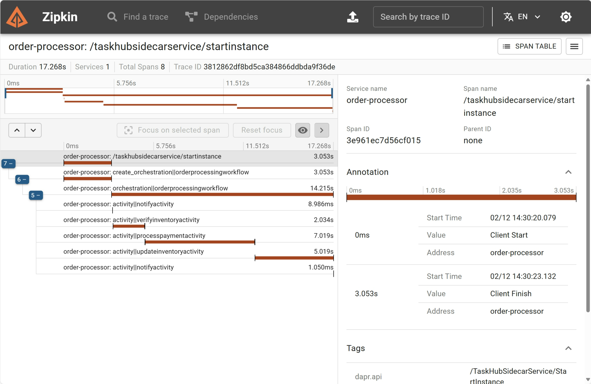

# Dapr workflows

In this quickstart, you'll run a console application to demonstrate Dapr's workflow programming model and the workflow management API. The console app starts and manages the lifecycle of a workflow that stores and retrieves data in a state store.

This quickstart includes one project:

- .NET console app `order-processor` 

The quickstart contains 1 workflow to simulate purchasing items from a store, and 5 unique activities within the workflow. These 5 activities are as follows:

- NotifyActivity: This activity utilizes a logger to print out messages throughout the workflow. These messages notify the user when there is insufficient inventory, their payment couldn't be processed, and more.
- VerifyInventoryActivity: This activity checks the state store to ensure that there is enough inventory present for purchase.
- RequestApprovalActivity: This activity is responsible requesting approval to purchase the order items in case the total cost is above a certain threshold.
- ProcessPaymentActivity: This activity is responsible for processing and authorizing the payment.
- UpdateInventoryActivity: This activity removes the requested items from the state store and updates the store with the new remaining inventory value.

### Run the order processor workflow

1. Open a new terminal window and navigate to `order-processor` directory: 

<!-- STEP
name: Install Dotnet dependencies
-->

```bash
cd ./order-processor
dotnet restore
dotnet build
```

<!-- END_STEP -->
2. Run the console app with Dapr. Note that you may need to run `cd ..` to move the working directory up one to 
'/workflows/csharp/sdk': 

<!-- STEP
name: Run order-processor service
expected_stdout_lines:
  - "== APP - order-processor ==       There are: 10 Cars available for purchase"
  - "== APP - order-processor == Workflow Status: Completed"
expected_stderr_lines:
output_match_mode: substring
background: true
sleep: 15
timeout_seconds: 120
-->
    
```bash
dapr run -f .
```

<!-- END_STEP -->

3. Expected output

```
== APP - order-processor == Starting workflow 571a6e25 purchasing 1 Cars
== APP - order-processor == info: Microsoft.DurableTask.Client.Grpc.GrpcDurableTaskClient[40]
== APP - order-processor ==       Scheduling new OrderProcessingWorkflow orchestration with instance ID '571a6e25' and 45 bytes of input data.
== APP - order-processor == info: System.Net.Http.HttpClient.Default.LogicalHandler[100]
== APP - order-processor ==       Start processing HTTP request POST http://localhost:37355/TaskHubSidecarService/StartInstance
== APP - order-processor == info: System.Net.Http.HttpClient.Default.ClientHandler[100]
== APP - order-processor ==       Sending HTTP request POST http://localhost:37355/TaskHubSidecarService/StartInstance
== APP - order-processor == info: System.Net.Http.HttpClient.Default.ClientHandler[101]
== APP - order-processor ==       Received HTTP response headers after 3045.9209ms - 200
== APP - order-processor == info: System.Net.Http.HttpClient.Default.LogicalHandler[101]
== APP - order-processor ==       End processing HTTP request after 3046.0945ms - 200
== APP - order-processor == info: System.Net.Http.HttpClient.Default.ClientHandler[101]
== APP - order-processor ==       Received HTTP response headers after 3016.1346ms - 200
== APP - order-processor == info: System.Net.Http.HttpClient.Default.LogicalHandler[101]
== APP - order-processor ==       End processing HTTP request after 3016.3572ms - 200
== APP - order-processor == info: Microsoft.DurableTask.Client.Grpc.GrpcDurableTaskClient[42]
== APP - order-processor ==       Waiting for instance '571a6e25' to start.
== APP - order-processor == info: System.Net.Http.HttpClient.Default.LogicalHandler[100]
== APP - order-processor ==       Start processing HTTP request POST http://localhost:37355/TaskHubSidecarService/WaitForInstanceStart
== APP - order-processor == info: System.Net.Http.HttpClient.Default.ClientHandler[100]
== APP - order-processor ==       Sending HTTP request POST http://localhost:37355/TaskHubSidecarService/WaitForInstanceStart
== APP - order-processor == info: System.Net.Http.HttpClient.Default.LogicalHandler[100]
== APP - order-processor ==       Start processing HTTP request POST http://localhost:37355/TaskHubSidecarService/CompleteOrchestratorTask
== APP - order-processor == info: System.Net.Http.HttpClient.Default.ClientHandler[100]
== APP - order-processor ==       Sending HTTP request POST http://localhost:37355/TaskHubSidecarService/CompleteOrchestratorTask
== APP - order-processor == info: System.Net.Http.HttpClient.Default.ClientHandler[101]
== APP - order-processor ==       Received HTTP response headers after 2.9095ms - 200
== APP - order-processor == info: System.Net.Http.HttpClient.Default.LogicalHandler[101]
== APP - order-processor ==       End processing HTTP request after 3.0445ms - 200
== APP - order-processor == info: System.Net.Http.HttpClient.Default.ClientHandler[101]
== APP - order-processor ==       Received HTTP response headers after 99.446ms - 200
== APP - order-processor == info: System.Net.Http.HttpClient.Default.LogicalHandler[101]
== APP - order-processor ==       End processing HTTP request after 99.5407ms - 200
== APP - order-processor == Your workflow has started. Here is the status of the workflow: Running
== APP - order-processor == info: Microsoft.DurableTask.Client.Grpc.GrpcDurableTaskClient[43]
== APP - order-processor ==       Waiting for instance '571a6e25' to complete, fail, or terminate.
== APP - order-processor == info: System.Net.Http.HttpClient.Default.LogicalHandler[100]
== APP - order-processor ==       Start processing HTTP request POST http://localhost:37355/TaskHubSidecarService/WaitForInstanceCompletion
== APP - order-processor == info: System.Net.Http.HttpClient.Default.ClientHandler[100]
== APP - order-processor ==       Sending HTTP request POST http://localhost:37355/TaskHubSidecarService/WaitForInstanceCompletion
== APP - order-processor == info: WorkflowConsoleApp.Activities.NotifyActivity[1985924262]
== APP - order-processor ==       Presenting notification Notification { Message = Received order 571a6e25 for 1 Cars at $5000 }
== APP - order-processor == info: System.Net.Http.HttpClient.Default.LogicalHandler[100]
== APP - order-processor ==       Start processing HTTP request POST http://localhost:37355/TaskHubSidecarService/CompleteActivityTask
== APP - order-processor == info: System.Net.Http.HttpClient.Default.ClientHandler[100]
== APP - order-processor ==       Sending HTTP request POST http://localhost:37355/TaskHubSidecarService/CompleteActivityTask
== APP - order-processor == info: System.Net.Http.HttpClient.Default.ClientHandler[101]
== APP - order-processor ==       Received HTTP response headers after 1.6785ms - 200
== APP - order-processor == info: System.Net.Http.HttpClient.Default.LogicalHandler[101]
== APP - order-processor ==       End processing HTTP request after 1.7869ms - 200
== APP - order-processor == info: WorkflowConsoleApp.Workflows.OrderProcessingWorkflow[2013970020]
== APP - order-processor ==       Received request ID '571a6e25' for 1 Cars at $5000
== APP - order-processor == info: System.Net.Http.HttpClient.Default.LogicalHandler[100]
== APP - order-processor ==       Start processing HTTP request POST http://localhost:37355/TaskHubSidecarService/CompleteOrchestratorTask
== APP - order-processor == info: System.Net.Http.HttpClient.Default.ClientHandler[100]
== APP - order-processor ==       Sending HTTP request POST http://localhost:37355/TaskHubSidecarService/CompleteOrchestratorTask
== APP - order-processor == info: System.Net.Http.HttpClient.Default.ClientHandler[101]
== APP - order-processor ==       Received HTTP response headers after 1.1947ms - 200
== APP - order-processor == info: System.Net.Http.HttpClient.Default.LogicalHandler[101]
== APP - order-processor ==       End processing HTTP request after 1.3293ms - 200
== APP - order-processor == info: WorkflowConsoleApp.Activities.VerifyInventoryActivity[1478802116]
== APP - order-processor ==       Reserving inventory for order request ID '571a6e25' of 1 Cars
== APP - order-processor == info: WorkflowConsoleApp.Activities.VerifyInventoryActivity[1130866279]
== APP - order-processor ==       There are: 10 Cars available for purchase
== APP - order-processor == info: System.Net.Http.HttpClient.Default.LogicalHandler[100]
== APP - order-processor ==       Start processing HTTP request POST http://localhost:37355/TaskHubSidecarService/CompleteActivityTask
== APP - order-processor == info: System.Net.Http.HttpClient.Default.ClientHandler[100]
== APP - order-processor ==       Sending HTTP request POST http://localhost:37355/TaskHubSidecarService/CompleteActivityTask
== APP - order-processor == info: System.Net.Http.HttpClient.Default.ClientHandler[101]
== APP - order-processor ==       Received HTTP response headers after 1.8534ms - 200
== APP - order-processor == info: System.Net.Http.HttpClient.Default.LogicalHandler[101]
== APP - order-processor ==       End processing HTTP request after 2.0077ms - 200
== APP - order-processor == info: WorkflowConsoleApp.Workflows.OrderProcessingWorkflow[1162731597]
== APP - order-processor ==       Checked inventory for request ID 'InventoryRequest { RequestId = 571a6e25, ItemName = Cars, Quantity = 1 }'
== APP - order-processor == info: System.Net.Http.HttpClient.Default.LogicalHandler[100]
== APP - order-processor ==       Start processing HTTP request POST http://localhost:37355/TaskHubSidecarService/CompleteOrchestratorTask
== APP - order-processor == info: System.Net.Http.HttpClient.Default.ClientHandler[100]
== APP - order-processor ==       Sending HTTP request POST http://localhost:37355/TaskHubSidecarService/CompleteOrchestratorTask
== APP - order-processor == info: System.Net.Http.HttpClient.Default.ClientHandler[101]
== APP - order-processor ==       Received HTTP response headers after 1.1851ms - 200
== APP - order-processor == info: System.Net.Http.HttpClient.Default.LogicalHandler[101]
== APP - order-processor ==       End processing HTTP request after 1.3742ms - 200
== APP - order-processor == info: WorkflowConsoleApp.Activities.ProcessPaymentActivity[340284070]
== APP - order-processor ==       Processing payment: request ID '571a6e25' for 1 Cars at $5000
== APP - order-processor == info: WorkflowConsoleApp.Activities.ProcessPaymentActivity[1851315765]
== APP - order-processor ==       Payment for request ID '571a6e25' processed successfully
== APP - order-processor == info: System.Net.Http.HttpClient.Default.LogicalHandler[100]
== APP - order-processor ==       Start processing HTTP request POST http://localhost:37355/TaskHubSidecarService/CompleteActivityTask
== APP - order-processor == info: System.Net.Http.HttpClient.Default.ClientHandler[100]
== APP - order-processor ==       Sending HTTP request POST http://localhost:37355/TaskHubSidecarService/CompleteActivityTask
== APP - order-processor == info: System.Net.Http.HttpClient.Default.ClientHandler[101]
== APP - order-processor ==       Received HTTP response headers after 0.8249ms - 200
== APP - order-processor == info: System.Net.Http.HttpClient.Default.LogicalHandler[101]
== APP - order-processor ==       End processing HTTP request after 0.9595ms - 200
== APP - order-processor == info: WorkflowConsoleApp.Workflows.OrderProcessingWorkflow[340284070]
== APP - order-processor ==       Processed payment request as there's sufficient inventory to proceed: PaymentRequest { RequestId = 571a6e25, ItemBeingPurchased = Cars, Amount = 1, Currency = 5000 }
== APP - order-processor == info: System.Net.Http.HttpClient.Default.LogicalHandler[100]
== APP - order-processor ==       Start processing HTTP request POST http://localhost:37355/TaskHubSidecarService/CompleteOrchestratorTask
== APP - order-processor == info: System.Net.Http.HttpClient.Default.ClientHandler[100]
== APP - order-processor ==       Sending HTTP request POST http://localhost:37355/TaskHubSidecarService/CompleteOrchestratorTask
== APP - order-processor == info: System.Net.Http.HttpClient.Default.ClientHandler[101]
== APP - order-processor ==       Received HTTP response headers after 0.4457ms - 200
== APP - order-processor == info: System.Net.Http.HttpClient.Default.LogicalHandler[101]
== APP - order-processor ==       End processing HTTP request after 0.5267ms - 200
== APP - order-processor == info: WorkflowConsoleApp.Activities.UpdateInventoryActivity[2144991393]
== APP - order-processor ==       Checking inventory for request ID '571a6e25' for 1 Cars
== APP - order-processor == info: WorkflowConsoleApp.Activities.UpdateInventoryActivity[1901852920]
== APP - order-processor ==       There are now 9 Cars left in stock
== APP - order-processor == info: System.Net.Http.HttpClient.Default.LogicalHandler[100]
== APP - order-processor ==       Start processing HTTP request POST http://localhost:37355/TaskHubSidecarService/CompleteActivityTask
== APP - order-processor == info: System.Net.Http.HttpClient.Default.ClientHandler[100]
== APP - order-processor ==       Sending HTTP request POST http://localhost:37355/TaskHubSidecarService/CompleteActivityTask
== APP - order-processor == info: System.Net.Http.HttpClient.Default.ClientHandler[101]
== APP - order-processor ==       Received HTTP response headers after 0.6012ms - 200
== APP - order-processor == info: System.Net.Http.HttpClient.Default.LogicalHandler[101]
== APP - order-processor ==       End processing HTTP request after 0.7097ms - 200
== APP - order-processor == info: WorkflowConsoleApp.Workflows.OrderProcessingWorkflow[96138418]
== APP - order-processor ==       Updating available inventory for PaymentRequest { RequestId = 571a6e25, ItemBeingPurchased = Cars, Amount = 1, Currency = 5000 }
== APP - order-processor == info: System.Net.Http.HttpClient.Default.LogicalHandler[100]
== APP - order-processor ==       Start processing HTTP request POST http://localhost:37355/TaskHubSidecarService/CompleteOrchestratorTask
== APP - order-processor == info: System.Net.Http.HttpClient.Default.ClientHandler[100]
== APP - order-processor ==       Sending HTTP request POST http://localhost:37355/TaskHubSidecarService/CompleteOrchestratorTask
== APP - order-processor == info: System.Net.Http.HttpClient.Default.ClientHandler[101]
== APP - order-processor ==       Received HTTP response headers after 0.469ms - 200
== APP - order-processor == info: System.Net.Http.HttpClient.Default.LogicalHandler[101]
== APP - order-processor ==       End processing HTTP request after 0.5431ms - 200
== APP - order-processor == info: WorkflowConsoleApp.Activities.NotifyActivity[1985924262]
== APP - order-processor ==       Presenting notification Notification { Message = Order 571a6e25 has completed! }
== APP - order-processor == info: System.Net.Http.HttpClient.Default.LogicalHandler[100]
== APP - order-processor ==       Start processing HTTP request POST http://localhost:37355/TaskHubSidecarService/CompleteActivityTask
== APP - order-processor == info: System.Net.Http.HttpClient.Default.ClientHandler[100]
== APP - order-processor ==       Sending HTTP request POST http://localhost:37355/TaskHubSidecarService/CompleteActivityTask
== APP - order-processor == info: System.Net.Http.HttpClient.Default.ClientHandler[101]
== APP - order-processor ==       Received HTTP response headers after 0.494ms - 200
== APP - order-processor == info: System.Net.Http.HttpClient.Default.LogicalHandler[101]
== APP - order-processor ==       End processing HTTP request after 0.5685ms - 200
== APP - order-processor == info: WorkflowConsoleApp.Workflows.OrderProcessingWorkflow[510392223]
== APP - order-processor ==       Order 571a6e25 has completed
== APP - order-processor == info: System.Net.Http.HttpClient.Default.LogicalHandler[100]
== APP - order-processor ==       Start processing HTTP request POST http://localhost:37355/TaskHubSidecarService/CompleteOrchestratorTask
== APP - order-processor == info: System.Net.Http.HttpClient.Default.ClientHandler[100]
== APP - order-processor ==       Sending HTTP request POST http://localhost:37355/TaskHubSidecarService/CompleteOrchestratorTask
== APP - order-processor == info: System.Net.Http.HttpClient.Default.ClientHandler[101]
== APP - order-processor ==       Received HTTP response headers after 1.6353ms - 200
== APP - order-processor == info: System.Net.Http.HttpClient.Default.LogicalHandler[101]
== APP - order-processor ==       End processing HTTP request after 1.7546ms - 200
== APP - order-processor == info: System.Net.Http.HttpClient.Default.ClientHandler[101]
== APP - order-processor ==       Received HTTP response headers after 15807.213ms - 200
== APP - order-processor == info: System.Net.Http.HttpClient.Default.LogicalHandler[101]
== APP - order-processor ==       End processing HTTP request after 15807.3675ms - 200
== APP - order-processor == Workflow Status: Completed
```

4. Stop Dapr workflow with CTRL-C or:

```sh
dapr stop -f .
```

### View workflow output with Zipkin

For a more detailed view of the workflow activities (duration, progress etc.), try using Zipkin.

1. Launch Zipkin container - The [openzipkin/zipkin](https://hub.docker.com/r/openzipkin/zipkin/) docker container is launched on running `dapr init`. Check to make sure the container is running. If it's not, launch the Zipkin docker container with the following command.

```bash
docker run -d -p 9411:9411 openzipkin/zipkin
```

2. View Traces in Zipkin UI - In your browser go to http://localhost:9411 to view the workflow trace spans in the Zipkin web UI. The order-processor workflow should be viewable with the following output in the Zipkin web UI. 



### What happened? 

When you ran `dapr run -f .`:

1. An OrderPayload is made containing one car.
2. A unique order ID for the workflow is generated (in the above example, `571a6e25`) and the workflow is scheduled.
3. The `NotifyActivity` workflow activity sends a notification saying an order for one car has been received.
4. The `VerifyInventoryActivity` workflow activity checks the inventory data, determines if you can supply the ordered item, and responds with the number of cars in stock. The inventory is sufficient so the workflow continues.
5. The total cost of the order is 5000, so the workflow will not call the `RequestApprovalActivity` activity.
6. The `ProcessPaymentActivity` workflow activity begins processing payment for order `571a6e25` and confirms if successful.
7. The `UpdateInventoryActivity` workflow activity updates the inventory with the current available cars after the order has been processed.
8. The `NotifyActivity` workflow activity sends a notification saying that order `571a6e25` has completed.
9. The workflow terminates as completed and the OrderResult is set to processed.

> **Note:** This quickstart uses an OrderPayload of one car with a total cost of $5000. Since the total order cost is not over 5000, the workflow will not call the `RequestApprovalActivity` activity nor wait for an approval event. Since the quickstart is a console application, it can't accept incoming events easily. If you want to test this scenario, convert the console app to a service and use the [raise event API](https://v1-15.docs.dapr.io/reference/api/workflow_api/#raise-event-request) via HTTP/gRPC or via the Dapr Workflow client to send an event to the workflow instance.