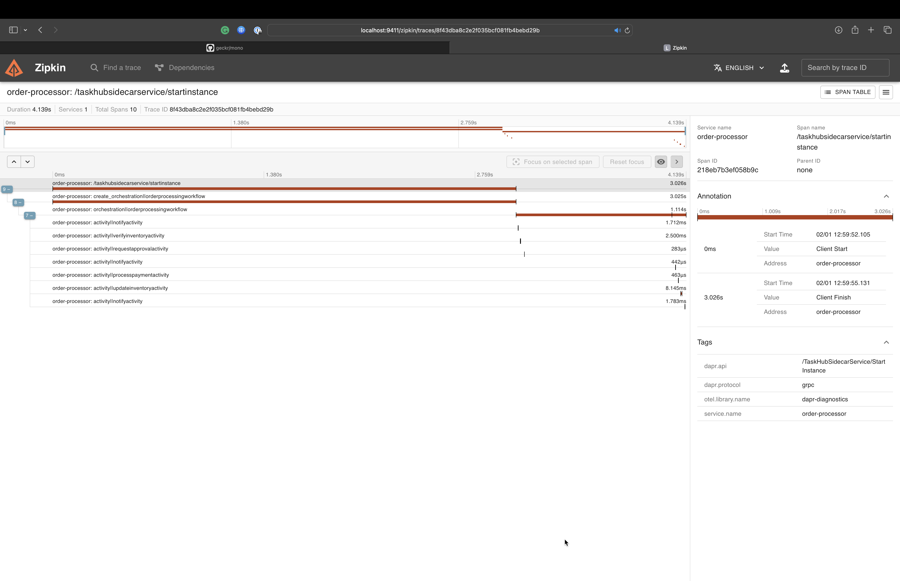

# Dapr workflows

In this quickstart, you'll create a simple console application to demonstrate Dapr's workflow programming model and the workflow authoring client. The console app 
starts and manages an order processing workflow.
The workflow management API provided by the Dapr client can also be used interchangeably with minor adjustments

This quickstart includes one project:

- Go app `order-processor` 

The quickstart contains 1 workflow (OrderProcessingWorkflow) which simulates purchasing items from a store, and 5 unique activities within the workflow. These 5 
activities are as follows:

- NotifyActivity: This activity utilizes a logger to print out messages throughout the workflow. These messages notify the user when there is insufficient 
§inventory, their payment couldn't be processed, and more.
- VerifyInventoryActivity: This activity checks the state store to ensure that there is enough inventory present for purchase.
- RequestApprovalActivity: This activity seeks approval from a manager, if payment is greater than 5000 USD.
- ProcessPaymentActivity: This activity is responsible for processing and authorizing the payment.
- UpdateInventoryActivity: This activity removes the requested items from the state store and updates the store with the new remaining inventory value.

### Run the order processor workflow

1. Open a new terminal window and navigate to `order-processor` directory.
2. Run the console app with Dapr: 
<!-- STEP
name: Running this example
expected_stdout_lines:
  - "for 1 cars - $5000"
  - "There are 10 cars available for purchase"
  - "There are now 9 cars left in stock"
  - "workflow status: COMPLETED"
output_match_mode: substring
background: false
timeout_seconds: 120
sleep: 30
-->

```sh
dapr run -f .
```

<!-- END_STEP -->

3. Expected output

```
== APP - order-processor == *** Welcome to the Dapr Workflow console app sample!
== APP - order-processor == *** Using this app, you can place orders that start workflows.
== APP - order-processor == dapr client initializing for: 127.0.0.1:46533
== APP - order-processor == INFO: 2025/02/13 13:18:33 connecting work item listener stream
== APP - order-processor == 2025/02/13 13:18:33 work item listener started
== APP - order-processor == INFO: 2025/02/13 13:18:33 starting background processor
== APP - order-processor == adding base stock item: paperclip
== APP - order-processor == adding base stock item: cars
== APP - order-processor == adding base stock item: computers
== APP - order-processor == ==========Begin the purchase of item:==========
== APP - order-processor == NotifyActivity: Received order b4cb2687-1af0-4f8d-9659-eb6389c07ade for 1 cars - $5000
== APP - order-processor == VerifyInventoryActivity: Verifying inventory for order b4cb2687-1af0-4f8d-9659-eb6389c07ade of 1 cars
== APP - order-processor == VerifyInventoryActivity: There are 10 cars available for purchase
== APP - order-processor == ProcessPaymentActivity: b4cb2687-1af0-4f8d-9659-eb6389c07ade for 1 - cars (5000USD)
== APP - order-processor == UpdateInventoryActivity: Checking Inventory for order b4cb2687-1af0-4f8d-9659-eb6389c07ade for 1 * cars
== APP - order-processor == UpdateInventoryActivity: There are now 9 cars left in stock
== APP - order-processor == NotifyActivity: Order b4cb2687-1af0-4f8d-9659-eb6389c07ade has completed!
== APP - order-processor == workflow status: COMPLETED
== APP - order-processor == Purchase of item is complete
```

4. Stop Dapr workflow with CTRL-C or:

```sh
dapr stop -f .
```

### View workflow output with Zipkin

For a more detailed view of the workflow activities (duration, progress etc.), try using Zipkin.

1. View Traces in Zipkin UI - In your browser go to http://localhost:9411 to view the workflow trace spans in the Zipkin web UI. The order-processor workflow 
should be viewable with the following output in the Zipkin web UI. Note: the [openzipkin/zipkin](https://hub.docker.com/r/openzipkin/zipkin/) docker container is 
launched on running `dapr init`.



### What happened? 

When you ran the above comands:

1. An OrderPayload is made containing one car.
2. A unique order ID for the workflow is generated (in the above example, `b4cb2687-1af0-4f8d-9659-eb6389c07ade`) and the workflow is scheduled.
3. The `NotifyActivity` workflow activity sends a notification saying an order for 10 cars has been received.
4. The `VerifyInventoryActivity` workflow activity checks the inventory data, determines if you can supply the ordered item, and responds with the number of cars in stock.
5. The total cost of the order is 5000, so the workflow will not call the `RequestApprovalActivity` activity.
6. The `ProcessPaymentActivity` workflow activity begins processing payment for order `b4cb2687-1af0-4f8d-9659-eb6389c07ade` and confirms if successful.
7. The `UpdateInventoryActivity` workflow activity updates the inventory with the current available cars after the order has been processed.
8. The `NotifyActivity` workflow activity sends a notification saying that order `b4cb2687-1af0-4f8d-9659-eb6389c07ade` has completed.
9. The workflow terminates as completed and the OrderResult is set to processed.

> **Note:** This quickstart uses an OrderPayload of one car with a total cost of $5000. Since the total order cost is not over 5000, the workflow will not call the `RequestApprovalActivity` activity nor wait for an approval event. Since the quickstart is a console application, it can't accept incoming events easily. If you want to test this scenario, convert the console app to a service and use the `DaprWorkflowClient` to send an event to the workflow.