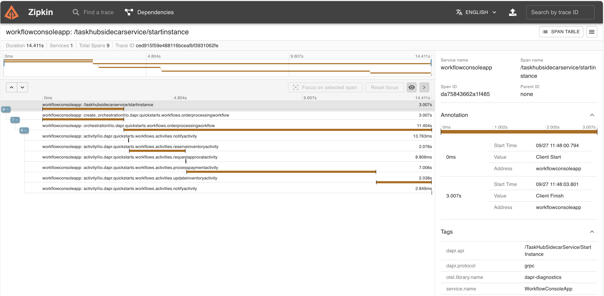

# Dapr workflows

In this quickstart, you'll run console application to demonstrate Dapr's workflow programming model and the workflow management API. The console app starts and manages the lifecycle of a workflow that stores and retrieves data in a state store.

This quickstart includes one project:

- Java console app `order-processor` 

The quickstart contains 1 workflow to simulate purchasing items from a store, and 5 unique activities within the workflow. These 5 activities are as follows:

- NotifyActivity: This activity utilizes a logger to print out messages throughout the workflow. These messages notify the user when there is insufficient inventory, their payment couldn't be processed, and more.
- VerifyInventoryActivity: This activity checks the state store to ensure that there is enough inventory present for purchase.
- RequestApprovalActivity: This activity requests approval for orders over a certain threshold.
- ProcessPaymentActivity: This activity is responsible for processing and authorizing the payment.
- UpdateInventoryActivity: This activity updates the state store with the new remaining inventory value.

### Run the order processor workflow with multi-app-run

1. Open a new terminal window and navigate to `order-processor` directory: 

<!-- STEP
name: Install Java dependencies
-->

```bash
cd ./order-processor
mvn clean install
cd ..
```

<!-- END_STEP -->
2. Run the console app with Dapr: 

<!-- STEP
name: Run order-processor service
expected_stdout_lines:
  - '== APP - order-processor == there are now 9 cars left in stock'
  - '== APP - order-processor == Workflow instance completed, out is: {"processed":true}'
expected_stderr_lines:
output_match_mode: substring
background: true
sleep: 15
timeout_seconds: 120
-->
    
```bash
dapr run -f .
```

<!-- END_STEP -->

3. Expected output

```
== APP - order-processor == *** Welcome to the Dapr Workflow console app sample!
== APP - order-processor == *** Using this app, you can place orders that start workflows.
== APP - order-processor == [main] INFO io.dapr.workflows.runtime.WorkflowRuntimeBuilder - Registered Workflow: OrderProcessingWorkflow
== APP - order-processor == [main] INFO io.dapr.workflows.runtime.WorkflowRuntimeBuilder - Registered Activity: NotifyActivity
== APP - order-processor == [main] INFO io.dapr.workflows.runtime.WorkflowRuntimeBuilder - Registered Activity: ProcessPaymentActivity
== APP - order-processor == [main] INFO io.dapr.workflows.runtime.WorkflowRuntimeBuilder - Registered Activity: RequestApprovalActivity
== APP - order-processor == [main] INFO io.dapr.workflows.runtime.WorkflowRuntimeBuilder - Registered Activity: VerifyInventoryActivity
== APP - order-processor == [main] INFO io.dapr.workflows.runtime.WorkflowRuntimeBuilder - Registered Activity: UpdateInventoryActivity
== APP - order-processor == [main] INFO io.dapr.workflows.runtime.WorkflowRuntimeBuilder - List of registered workflows: [io.dapr.quickstarts.workflows.OrderProcessingWorkflow]
== APP - order-processor == [main] INFO io.dapr.workflows.runtime.WorkflowRuntimeBuilder - List of registered activites: [io.dapr.quickstarts.workflows.activities.NotifyActivity, io.dapr.quickstarts.workflows.activities.UpdateInventoryActivity, io.dapr.quickstarts.workflows.activities.ProcessPaymentActivity, io.dapr.quickstarts.workflows.activities.RequestApprovalActivity, io.dapr.quickstarts.workflows.activities.VerifyInventoryActivity]
== APP - order-processor == [main] INFO io.dapr.workflows.runtime.WorkflowRuntimeBuilder - Successfully built dapr workflow runtime
== APP - order-processor == Start workflow runtime
== APP - order-processor == Feb 12, 2025 2:44:13 PM com.microsoft.durabletask.DurableTaskGrpcWorker startAndBlock
== APP - order-processor == INFO: Durable Task worker is connecting to sidecar at 127.0.0.1:39261.
== APP - order-processor == ==========Begin the purchase of item:==========
== APP - order-processor == Starting order workflow, purchasing 1 of cars
== APP - order-processor == scheduled new workflow instance of OrderProcessingWorkflow with instance ID: d1bf548b-c854-44af-978e-90c61ed88e3c
== APP - order-processor == [Thread-0] INFO io.dapr.workflows.WorkflowContext - Starting Workflow: io.dapr.quickstarts.workflows.OrderProcessingWorkflow
== APP - order-processor == [Thread-0] INFO io.dapr.workflows.WorkflowContext - Instance ID(order ID): d1bf548b-c854-44af-978e-90c61ed88e3c
== APP - order-processor == [Thread-0] INFO io.dapr.workflows.WorkflowContext - Current Orchestration Time: 2025-02-12T14:44:18.154Z
== APP - order-processor == [Thread-0] INFO io.dapr.workflows.WorkflowContext - Received Order: OrderPayload [itemName=cars, totalCost=5000, quantity=1]
== APP - order-processor == [Thread-0] INFO io.dapr.quickstarts.workflows.activities.NotifyActivity - Received Order: OrderPayload [itemName=cars, totalCost=5000, quantity=1]
== APP - order-processor == workflow instance d1bf548b-c854-44af-978e-90c61ed88e3c started
== APP - order-processor == [Thread-0] INFO io.dapr.quickstarts.workflows.activities.VerifyInventoryActivity - Verifying inventory for order 'd1bf548b-c854-44af-978e-90c61ed88e3c' of 1 cars
== APP - order-processor == [Thread-0] INFO io.dapr.quickstarts.workflows.activities.VerifyInventoryActivity - There are 10 cars available for purchase
== APP - order-processor == [Thread-0] INFO io.dapr.quickstarts.workflows.activities.VerifyInventoryActivity - Verified inventory for order 'd1bf548b-c854-44af-978e-90c61ed88e3c' of 1 cars
== APP - order-processor == [Thread-0] INFO io.dapr.quickstarts.workflows.activities.ProcessPaymentActivity - Processing payment: d1bf548b-c854-44af-978e-90c61ed88e3c for 1 cars at $5000
== APP - order-processor == [Thread-0] INFO io.dapr.quickstarts.workflows.activities.ProcessPaymentActivity - Payment for request ID 'd1bf548b-c854-44af-978e-90c61ed88e3c' processed successfully
== APP - order-processor == [Thread-0] INFO io.dapr.quickstarts.workflows.activities.UpdateInventoryActivity - Updating inventory for order 'd1bf548b-c854-44af-978e-90c61ed88e3c' of 1 cars
== APP - order-processor == [Thread-0] INFO io.dapr.quickstarts.workflows.activities.UpdateInventoryActivity - Updated inventory for order 'd1bf548b-c854-44af-978e-90c61ed88e3c': there are now 9 cars left in stock
== APP - order-processor == there are now 9 cars left in stock
== APP - order-processor == [Thread-0] INFO io.dapr.quickstarts.workflows.activities.NotifyActivity - Order completed! : d1bf548b-c854-44af-978e-90c61ed88e3c
== APP - order-processor == Workflow instance completed, out is: {"processed":true}
```

4. Stop Dapr workflow with CTRL-C or:

```sh
dapr stop -f .
```

### View workflow output with Zipkin

For a more detailed view of the workflow activities (duration, progress etc.), try using Zipkin.

1. Launch Zipkin container - The [openzipkin/zipkin](https://hub.docker.com/r/openzipkin/zipkin/) docker container is launched on running `dapr init`. Check to make sure the container is running. If it's not, launch the Zipkin docker container with the following command.

```bash
docker run -d -p 9411:9411 openzipkin/zipkin
```

2. View Traces in Zipkin UI - In your browser go to http://localhost:9411 to view the workflow trace spans in the Zipkin web UI. The order-processor workflow should be viewable with the following output in the Zipkin web UI. 



### What happened? 

When you ran `dapr run -f .`:

1. An OrderPayload is made containing one car.
2. A unique order ID for the workflow is generated (in the above example, `d1bf548b-c854-44af-978e-90c61ed88e3c`) and the workflow is scheduled.
3. The `NotifyActivity` workflow activity sends a notification saying an order for one car has been received.
4. The `VertifyInventoryActivity` workflow activity checks the inventory data, determines if you can supply the ordered item, and responds with the number of cars in stock. The inventory is sufficient so the workflow continues.
5. The total cost of the order is 5000, so the workflow will not call the `RequestApprovalActivity` activity.
6. The `ProcessPaymentActivity` workflow activity begins processing payment for order `d1bf548b-c854-44af-978e-90c61ed88e3c` and confirms if successful.
7. The `UpdateInventoryActivity` workflow activity updates the inventory with the current available cars after the order has been processed.
8. The `NotifyActivity` workflow activity sends a notification saying that order `d1bf548b-c854-44af-978e-90c61ed88e3c` has completed.
9. The workflow terminates as completed and the orderResult is set to processed.

> **Note:** This quickstart uses an OrderPayload of one car with a total cost of $5000. Since the total order cost is not over 5000, the workflow will not call the `RequestApprovalActivity` activity nor wait for an approval event. Since the quickstart is a console application, it can't accept incoming events easily. If you want to test this scenario, convert the console app to a service and use the [raise event API](https://docs.dapr.io/reference/api/workflow_api/#raise-event-request) via HTTP/gRPC or via the Dapr Workflow client to send an event to the workflow instance.
