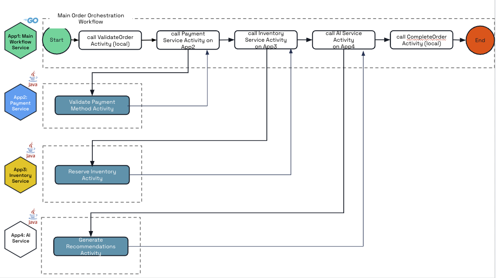

# Multi-App E-commerce Workflow Demo

This demo showcases a realistic e-commerce order processing scenario using Dapr's multi-application workflow capabilities. The scenario demonstrates how a Go application can orchestrate complex business processes across multiple Java services, including AI-powered recommendations.

## Architecture



The demo consists of four applications working together:

1. **Go Order Orchestrator** - Main workflow coordinator
2. **Java Payment Service** - Payment processing
3. **Java Inventory Service** - Inventory management and reservation
4. **Java AI Recommendation Service** - AI-powered product recommendations

## Prerequisites

- Dapr CLI installed and initialized (`dapr init`)
- Go installed
- Java and Maven installed

## Quick Start

### 1. Build All Services

```bash
make build
```

### 2. Run All Services

#### Option A: Run with Multi-App Configuration (Recommended)

```bash
dapr run -f dapr.yaml
```

#### Option B: Run in Separate Terminals

**Terminal 1 - Go Order Orchestrator:**
```bash
make run-go
```

**Terminal 2 - Java Payment Service:**
```bash
make run-payment
```

**Terminal 3 - Java Inventory Service:**
```bash
make run-inventory
```

**Terminal 4 - Java AI Recommendation Service:**
```bash
make run-ai
```

### 3. Test the Workflow

Send a POST request to start the workflow:

```bash
curl -X POST http://localhost:50001/start-workflow
```

## Service Ports

- **Go Order Orchestrator**: 50001 (Dapr HTTP: 3505)
- **Java Payment Service**: 50002 (Dapr HTTP: 3506)
- **Java Inventory Service**: 50003 (Dapr HTTP: 3507)
- **Java AI Recommendation Service**: 50004 (Dapr HTTP: 3508)

## Development

### Building Individual Services

```bash
# Go Order Orchestrator
cd go/order-orchestrator
go mod tidy
go run .

# Java Payment Service
cd java/payment-service
mvn clean package
java -jar target/payment-service-1.0.0.jar

# Java Inventory Service
cd java/inventory-service
mvn clean package
java -jar target/inventory-service-1.0.0.jar

# Java AI Recommendation Service
cd java/ai-recommendation-service
mvn clean package
java -jar target/ai-recommendation-service-1.0.0.jar
```

### Testing

```bash
make test
```

### Cleanup

```bash
make clean
```

## Related Resources

- [Multi-Application Workflows Documentation](https://docs.dapr.io/developing-applications/building-blocks/workflow/workflow-multi-app/)
- [Multi-Application Java Workflows Example](https://github.com/dapr/java-sdk/tree/master/examples/src/main/java/io/dapr/examples/workflows/multiapp)
- [Multi-Application Spring Boot Workflows Example](https://github.com/dapr/java-sdk/tree/master/spring-boot-examples/workflows/multi-app)
